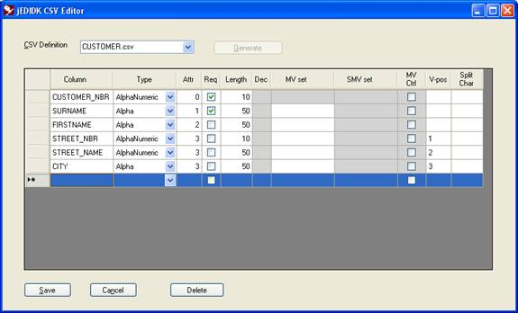
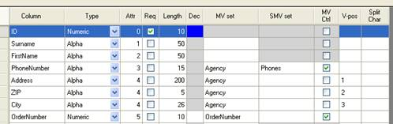

# Creating CSV Files  

<PageHeader />  

## JEDI_CSV.exe

The JEDI_CSV utility can be used to create or fine tune CSV definitions (after being generated by jCreateCSV).  

Let’s look at a CSV definition in the JEDI_CSV designer:

  

The grid columns in the designer map to the CSV as follows:  

| <!----> | <!----> |  
| --- | --- |  
| Column             | Column |
| Type and Dec       | Type |
| Attr               | Attr |
| Req                | NotNull |
| Length             | Length |
| MV set and SMV set | MVAssoc |
| MV Ctrl            | ControlMV |
| V-pos              | SplitMVPos  |
| Split Char         | SplitChar |

### MV Set and SMV Set

These 2 fields define multi-value and sub-value groups. The values entered in these fields form the nested table names. e.g.



In the above example we have 2 multi-value associations: Agency and OrderNumber. Agency in turn has a sub-value set: Phones. If the primary table was CUSTOMER and the table separator is # (which is the default but can be customised in jEDIdrivers.ini) you would end up with the following tables:

CUSTOMER
CUSTOMER#AGENCY
CUSTOMER#AGENCY#PHONES
CUSTOMER#ORDERNUMBER

In the resulting CSV the multi-value/sub-value fields would look like this:

```
004 PhoneNumber,3,15,A,Agency|Phones,1,,,,
005 Address,4,200,A,Agency|Phones,1,,,,
006 ZIP,4,5,A,Agency,,,,,
007 City,4,26,A,Agency,,,,,
008 OrderNumber,5,10,N,OrderNumber,1,,,,
```

### Generate button

Under the covers, the Generate button executes a command line tool: jCreateCSV.exe. It assumes there is a data file by the same name as the CSV name (without the .csv suffix). This utility can be run from a regular command line (either jSHELL or other shell/environment that accepts jBASE commands) and is covered in the next section. The default options for jCreateCSV (when using the Generate button) are configurable in the jEDIdrivers.ini.

### jCreateCSV

This utility has the following syntax:

#### Syntax

```
jCreateCSV file_name comma_separated_file {prefix_chars} {options}
```

Where options:

| <!----> | <!----> |  
| --- | --- |  
| -D{type}     | Dictionary type if using dictionaries to build the driver. Valid types are:<br>J for jDC<br>P or U for Prime/Unidata<br>A option - appended to J - for A types only |
| -I           | Ignore duplicates
| -O           | Overwrite previous file |
| -N           | Use numeric dictionaries starting at 0 (Column headings will be used as identifiers) |
| -Pphrase     | Use 'phrase' as the list of dictionaries |
| -W           | Use 'W'ide char types for OLESQL |
| prefix_chars | Leading characters to strip from dictionary when creating column names in comma separated file |

jCreateCSV also recognizes jDC ([jBASE extended dictionary](../../../files/extended-dictionary/README.md)) definitions which include details such as associated multi-value names.

To specify the above options for jCreateCSV within the JEDI_CSV gui please refer to the [jEDIdrivers.ini](./../jedidrivers/README.md) section of the knowledgebase.

#### Dictionary Specifications  

The purpose of jCreateCSV is to derive a field definition in a CSV using the content of a dictionary. The following logic is used when transforming a dictionary to a field definition:

1. The key to the dictionary is used for the column name (unless the N option is used in which case the column headings are used)
2. The attribute is used for the attribute definition unless a correlative/function has been specified in the dictionary in which case if the correlative references another dictionary or attribute then that attribute will be used (see the examples section later).
3. The conversion field (attribute 7) is used to derive the field type:
   - D{…}        Date
   - MT{S}       Time
   - M{…}        Numeric/decimal
4. The correlative field (attribute 8) can be used for:
    a. Split fields (using the G conversion method)
    b. V-pos (using Tfilename;Xmvpos;;attr)
5. The justification – specifically R – is used to specify Numeric.
6. Finally the length is used as expected.

#### Extended Dictionaries

The jBASE extended dictionary is one way of improving the resulting CSV. Refer to the EDICT specification for details.

jCreateCSV uses the following in precedence over the default dictionary:

1. EDict_ColumnName
2. EDict_Length
3. EDict_DataType
4. EDict_MVGroupName
5. EDict_SVGroupName
6. EDict_Nullable

The Edict_DataType is recognised as follows:

| <!----> | <!----> |  
| --- | --- |
| EDict_DT_STRING      | A{N} |
| EDict_DT_UINT32      | N    |
| EDict_DT_INT32       | N    |
| EDict_DT_DATE        | D    |
| EDict_DT_TIME        | T    |
| EDict_DT_SCALEDINT32 | N    |
| EDict_DT_DECIMAL     | N    |
| EDict_DT_LONGDECIMAL | N    |

#### Prime/Unidata Dictionaries

The following is the expected layout for Prime/Unidata dictionary:

| <!----> | <!----> |  
| --- | --- |
| 1   | TYPE     |
| 2   | ATTR     |
| 3   | CONV     |
| 4   | LABEL    |
| 5   | FMT      |
| 6   | MV.FLAG  |
| 7   | ASSOC.MV |                |
| 8   | ASSOC/SMV (non standard) |

The dictionary key is used for the column name.

The TYPE is used as a filter primarily in that D types are used for straight forward attribute-to-column translations. I or V type dictionaries are used for specific conversions (where ATTR is the function):

1. FIELD    - Compound field (SplitChar)
2. EXTRACT  - V-pos

For FIELD the value being operated in the dictionary is assumed to be another (D-type) dictionary.

For EXTRACT the value can be @RECORD or another (D-type) dictionary.

The MV.FLAG – if not null – should be either M (multi-value) or MS (sub-value). In both cases the relative associated name is derived from the column name if the intended field (i.e. ASSOC.MV, ASSOC.SMV) is null. CONV and FMT are used as per regular dictionaries.

#### Examples

| <!----> | <!----> |  
| --- | --- |
| CUSTOMER_NBR |  LAST_UPD_DATE |
| 1. A | 1. A    |
| 2. 0 | 2. 7    |
| …    | …       |  
|      | 7. D2/  |
| 9. R | 9. R    |
| 10. 5 | 10. 12 |

. . .

| <!----> | <!----> |  
| --- | --- |
| COMPOUND1 |  COMPOUND2 |
| 1. A   | 1. A   |
| 2. 8   | 2. 8   |
| …      | …       |
| 7. G*1 | 7. G1*1 |
| …      | …       |
| 9. L   | 9. L    |
| 10. 10 | 10. 10  |

. . .

| <!----> | <!----> |  
| --- | --- |
| MVPOS1           | MVPOS2 |
| 1. A             | 1. A |
| 2. 0             | 2. 0 |
| …                | …    |
| 8. Tmyfile;X1;;9 | 8. Tmyfile;X2;;9<br>(Translate back to the same file:<br> Multi-Value 2, Attribute 9) |
| 9. L             | 9. L |
| 10. 10           | 10. 10 |

. . .

| <!----> | <!----> |  
| --- | --- |
| SURNAME | PHONE |
| 1. D    | 1. D          |
| 2. 1    | 2. 2          |
| …       | …             |
| 5. 30L  | 5. 30L        |
|         | 6. M          |
|         | 7. PHONE_NBRS |

. . .

| <!----> | <!----> |  
| --- | --- |
| POSITIONAL1 | EXTENDED_DATE |
| 1. V | 1. A |
| 2. EXTRACT(@RECORD,2,1) | 2. 2   |
|                         | 3. Last Accessed |
| …                       | …      |
| 5. 10L                  | 7. D2/ |
|                         | …      |
|                         | 9. R   |
|                         | 10. 12 |
|                         | …      |
|                         | 30. JBASE_EDICT_START |
|                         | 31. 123 (Date type. See [Appendix B)](./../extended-dictionary/README.md) |
|                         | … |
|                         | 34. LastAccessed (Overriding column name) |
|                         | 35. ACCESSDATES (MV set name) |
|                         | …  |
|                         | 46. JBASE_EDICT_END |

Back to [jEDIJDK](./../README.md)

<PageFooter />
