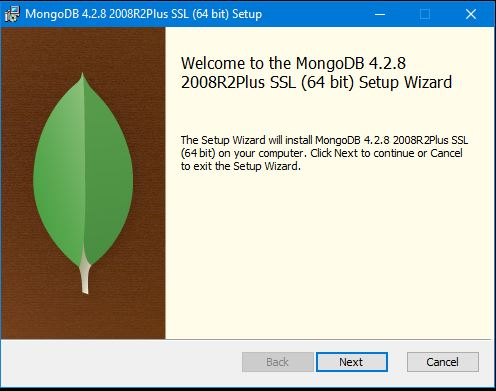
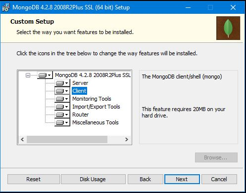
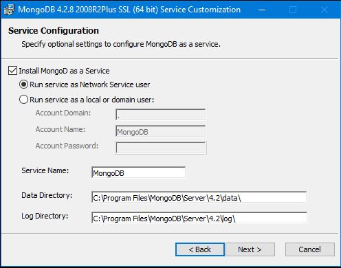
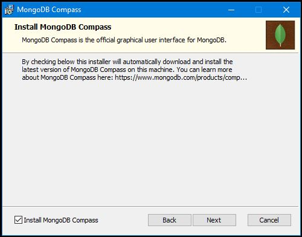
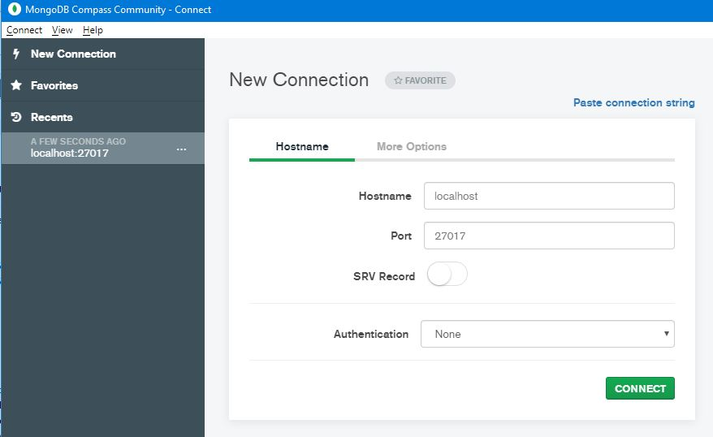
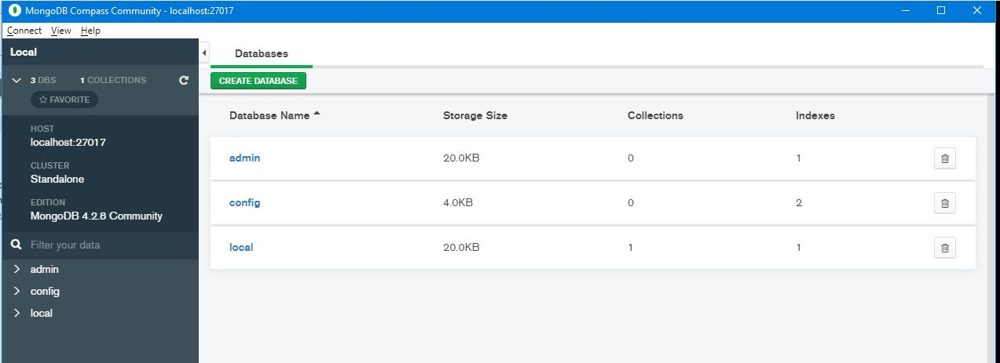
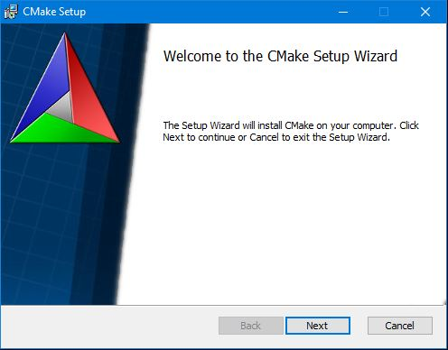
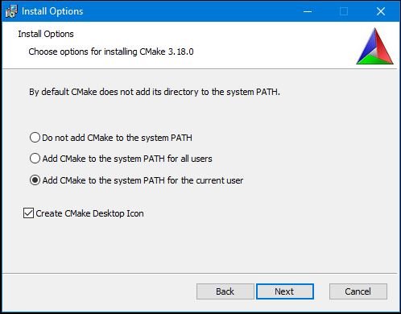

# Building and installing the Mongo DB jEDI driver on Windows

<PageHeader />

Downoad the Mong DB Community Edition from the [Mongo Web Site](https://www.mongodb.com/try/download/community?tck=docs_server).

Install Mongo DB:



Normally a full install should be performed, but it is possible to perform a custom setup:



Run as a Windows Service:



You may also wish to install the Mongo DB Compass GUI client:



With Mongo DB installed, it should now be possible to connect via the Compass Client:





In order to build the Mong C libraries necessary for the jEDI, "cmake" must first be [downloaded](https://github.com/Kitware/CMake/releases/download/v3.18.0/cmake-3.18.0-win64-x64.msi) and installed:





Download the latest [Mongo DB C Driver](https://github.com/mongodb/mongo-c-driver/releases/download/1.16.2/mongo-c-driver-1.16.2.tar.gz)

If you have WIndows Sub-system for Linux (WSL) installed, you could use it to unzip the tarball:

```
mikestre@VM-DB-jBASE:~$ cd /mnt
mikestre@VM-DB-jBASE:/mnt$ cd c
mikestre@VM-DB-jBASE:/mnt/c$ cd Temp
mikestre@VM-DB-jBASE:/mnt/c/Temp$ cd Install/
mikestre@VM-DB-jBASE:/mnt/c/Temp/Install$ tar xvf mongo-c-driver-1.16.2.tar.gz
```

## Note

>Make sure that there are "User - Modify" permissions on the folder where you are "unzipping" the tarball

```
mikestre@VM-DB-jBASE:/mnt/c/Temp/Install$ ls -la
total 6728
drwxrwxrwx 1 mikestre mikestre     512 Jul 17 16:17 .
drwxrwxrwx 1 mikestre mikestre     512 Jul 17 15:59 ..
drwxrwxrwx 1 mikestre mikestre     512 Feb 25 05:43 mongo-c-driver-1.16.2
-rwxrwxrwx 1 mikestre mikestre 6888287 Jul 17 15:59 mongo-c-driver-1.16.2.tar.gz
```

In order for the published documentation to work correctly, the contents of the "mongo-c-driver-1.16.2" folder should be moved to "C:\monggo-c-driver".

Using an Administrator Command Prompt or a Visual Studio MSBuild Command Prompt, also run "As Administrator":

```
C:\mongo-c-driver>cd src

C:\mongo-c-driver\src>cd libbson

C:\mongo-c-driver\src\libbson>cmake -DCMAKE_INSTALL_PREFIX=C:\libmongoc -G "Visual Studio 15" .
-- Selecting Windows SDK version 10.0.17134.0 to target Windows 10.0.19041.
-- The C compiler identification is MSVC 19.16.27041.0
-- Detecting C compiler ABI info
-- Detecting C compiler ABI info - done
-- Check for working C compiler: C:/Program Files (x86)/Microsoft Visual Studio/2017/BuildTools/VC/Tools/MSVC/14.16.27023/bin/Hostx86/x86/cl.exe - skipped
-- Detecting C compile features
-- Detecting C compile features - done
libbson version (from VERSION_CURRENT file): 1.16.2
-- Check if the system is big endian

.. snip ..

C:\mongo-c-driver\src\libbson>cd ..\..

C:\mongo-c-driver>cd cmake-build

C:\mongo-c-driver\cmake-build>cmake -G "Visual Studio 15 Win64" -DCMAKE_INSTALL_PREFIX=C:/mongo-c-driver -DCMAKE_PREFIX_PATH=C:/mongo-c-driver" -DENABLE_SASL=OFF ..r" ..
-- Selecting Windows SDK version 10.0.17134.0 to target Windows 10.0.19041.
-- The C compiler identification is ;MSVC 19.16.27041.0
-- Detecting C compiler ABI info
-- Detecting C compiler ABI info - done
-- Check for working C compiler: C:/Program Files (x86)/Microsoft Visual Studio/2017/BuildTools/VC/Tools/MSVC/14.16.27023/bin/Hostx86/x64/cl.exe - skipped
-- Detecting C compile features
-- Detecting C compile features - done
-- No CMAKE_BUILD_TYPE selected, defaulting to RelWithDebInfo
file VERSION_CURRENT contained BUILD_VERSION 1.16.2
  -- Using bundled libbson
libbson version (from VERSION_CURRENT file): 1.16.2
-- Check if the system is big endian
-- Searching 16 bit integercd sr    

.. snip ..

-- Configuring done
-- Generating done
-- Build files have been written to: C:/mongo-c-driver/cmake-build
```

Attempt to build:

```
C:\mongo-c-driver\cmake-build>msbuild.exe ALL_BUILD.vcxproj
```

It is possible that the "C:\mongo-c-driver\src\libbson\src\bson\bson-config.h" file may need to be modified at line 132

```C
/*
 * Define to 1 if you want extra aligned types in libbson
 */
#define BSON_EXTRA_ALIGN 1        /* Add a miissing "1" here !  */
#if BSON_EXTRA_ALIGN != 1
# undef BSON_EXTRA_ALIGN
#endif
```

## To be completed

[Back to Mongo](./../README.md)

<PageFooter />
