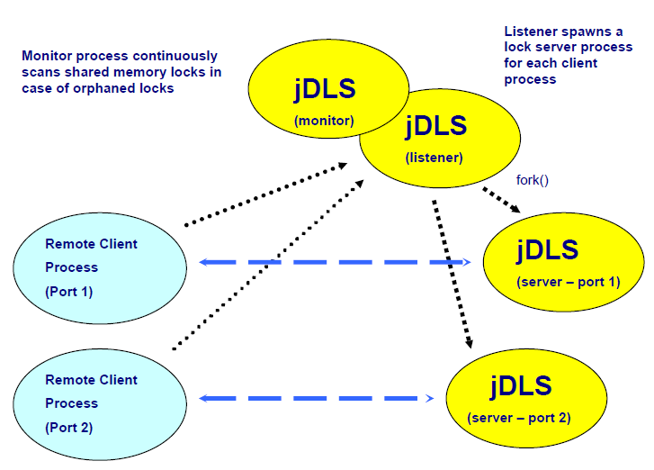

# Introduction to Distributed Locking

<PageHeader />

**Tags:**
<badge text='manager' vertical='middle' />

This document provides a user guide for the deployment and configuration of the jBASE Distributed lock service for a Multiple Application Server environment.

The Distributed lock service is provided as an integral component of the jBASE 4.1.5 release. It is not available on releases prior to jBASE 4.1.5.

## Overview

Although jBASE applications have been successfully deployed over Multiple Applications Servers certain idiosyncrasies related to operating systems, performance and recovery of file locks over networked file systems have prompted the requirement to provide an alternative lock strategy for Multiple Application Server deployment. As such the jBASE Distributed lock service is now offered as an alternative mechanism, to the networked file system, by which locks can be propagate between servers.

The Distributed lock service simply extends the existing lock mechanisms already available within jBASE by the provision of a distributed lock interface.

The Distributed lock service can be deployed as a service executing on a dedicated server or, as is more likely, deployed on one or two of the Application Servers in the Multiple Application Server configuration.

The Distributed lock service is provided via a daemon process executing on Linux/Unix systems or as an installable service for the Windows platform. The Distributed lock service can be initiated using either the lower case form of the executable, ‘jdls’, or the jBASE capitalized convention for process daemons, jDLS, (jBASE Distributed Lock Service).

The Distributed lock service also supersedes the jRLA, (jBASE Record Lock Arbiter), which provided the shared memory lock mechanism for record locks. Linux/Unix system boot scripts should be modified to initialise the lock mechanism using the jDLS rather than the jRLA executable.

Client processes on the Application Servers are configured to connect to the distributed lock service in order to request a lock be taken, request the status of a lock or request locks be released. Once initialized the client remains connected to the distributed lock service for the remainder of the life of the client process, with all lock requests issued and acknowledged through the same connection.

The connection comprises of a TCPIP socket, which uses a network byte oriented structure to pass specific lock only information. The information for example being lock type, client port number, client process id, client thread id, etc. No application data is passed over the network and hence there is no requirement for message encryption. The use of the TCP protocol is deliberate such that any break in network service can be detected quickly and if enabled, resilience activated

Once initialized the jBASE Distributed Lock Service process undertakes two distinct operations:

The first operation is to initialize the Shared memory lock table and then continuously monitor the lock table for orphaned locks and tidy up as required. This operation was formerly undertaken by the jRLA daemon process and effectively remains exactly the same.

The second operation is to initialize a socket listener for connecting clients who wish to take locks on the local system. This operation is started as a second process on Linux and Unix system and as an additional thread on Windows. The distributed lock listener continuously listens for client connections, when a client connection is detected a separate independent process is started that will handle all the lock requirements for the connecting client process.

Each lock server/service process once started runs as a single thread within its own process space and is completely independent from any other lock server/service process as well as the daemon listener process. This enables the lock listener service to be stopped without impacting existing lock server processes and also ensures any potential lock server process failure does not impact other already executing client processes.

This approach provides for a robust, scalable and easily extendable implementation, which avoids many of the complications and restrictions involved with multi threaded servers such as forked threads, signal handling and error recovery.

The one to one process relationship ensures that locks can be handled by either of the currently available locking strategies, i.e. Shared memory locks or OS file locks and that locks can be easily identified to point of origin and the release of locks will be automatic in the event of a problem with the client process or client Application Server failure.

Although the Distributed Lock Service can be deployed on dedicated servers the more usual configuration is to deploy the Lock Service on one or two of the Application Servers in the Multiple Application Server environment. Quite often a mix of Application Servers are used whereby the most powerful Application Server is used for core processes and other Application Servers used for online processing such as enquires, etc.  In this case it is more efficient to configure the main Application Server with the Distributed lock service for the other Application Servers and use local lock processing rather than Distributed locking for the core processes. The local processes will automatically detect this configuration, such that all local lock requests will automatically use the same lock mechanism as the Distributed Lock service, whereby local and distributed locks become seamlessly integrated.

## Distributed Lock Service Deployment

Once the servers that will provide the distributed lock service have been determined the service should be configured and deployed as follows:

The jBASE software should be installed local to the distributed lock server and JBCRELEASEDIR and JBCGLOBALDIR environment variables configured for the user id by which the lock service will execute. In the case of a standalone lock server no license installation is required as the Distributed lock service is unlicensed.

Once the jBASE release is installed and configured then the Distributed Lock Service can be initialized and started in background.

The full set of options for the Distributed lock service can be displayed using the –h option on the jDLS command line.  However specific option combinations for the Distributed Lock Service daemon are as follows:

## Command Syntax

```
jdls -i {-bPTAD} {-sr,g} {-tnn}
jdls -k {-AD}
jdls -K {-o}
```

## Options

| Option | Description |
| --- | --- |
| -A | Arbiter only, do not start/stop distributed listener |
| -b | Run in the Background (Normal mode of operation) |
| -D | Distributed listener only, do not start/stop lock monitor |
| -i | Initialise shared memory. |
| -k | Kill the Shared memory Lock Monitor and/or Listener |
| -snn,mm | Set Shared memory lock table size to 'nn' record locks over 'mm' groups |
| -tnn | Set tidy up period to nn minutes |
| -K | Kill the IPC resources , shared memory and semaphores |
| -P | Port based locks used (default is process id based locks) |
| -T | Time stamp all shared memory locks |

### Server Deployment Examples

```
jDLS –ibs13000,50
```

This command initializes the jDLS to start both the jDLS Shared memory lock monitor service and the jDLS Distributed lock listener service in background. The shared memory will be configured to provide 13000 locks with 50 locks per group. The lock table algorithm will actually use the next prime number for the number of groups to provide a better spread of locks over the groups and so in this case configure the shared lock table with 13150 locks in 263 groups with 50 locks per group.

```
jDLS –ibD
```

This command instructs the jDLS to initialize ONLY the jDLS Distributed lock listener service. Unless the jDLS Shared memory lock monitor/arbiter service had been previously started then OS file locks will be used for the default lock mechanism for both distributed locks and local process locks.

```
jDLS  -kD
```

This command will stop ONLY the jDLS Distributed lock listener service. If active the jDLS Shared memory lock monitor/arbiter service will be unaffected.

```
jDLS –k
```

This command will stop both the jDLS Distributed lock listener and the jDLS Shared memory lock monitor/arbiter service.

```
jDLS –K
```

This command will remove the IPCS resource. Note all processes must be disconnected and the effective user id for the command must have adequate permissions to remove the resource.

Note some command line options are not applicable to Windows as the jDLS executable runs in background as a Windows Service. See the jdls –h command display on Windows for list of available options.

### Installing jDLS as a Windows Service

The jBASE Distributed Lock Service should be installed as a Windows Service when used on the Windows operating system.

Along with other jBASE services, the jBASE Distributed Lock Service can be installed using the jBASE jServControl command from the Windows console command line.

```
jServControl –v –s manual –p%JBCRELEASEDIR%\bin\jDLS.exe jDLS install
```

Once installed the service can then be stopped or started using Windows Services panel.

Alternatively the service can also be stopped or started from the command line, via the jBASE jServControl command.

```
jServControl –v jDLS start | stop
```

To remove the service, use the jServControl command.

```
jServControl –v jDLS remove
```

All jBASE processes must be disconnected before stopping and removing the jDLS service.

## Client Distributed Lock Deployment

To configure the client system to use the Distributed Lock Service, each client user must be configured with the JDLS environment variable. This variable should be set in the users profile prior to program execution.

To be properly effective ALL users of the same database must be configured with exactly the same Distributed Lock Service parameters, otherwise locks will NOT be correctly respected and data inconsistencies may occur.

The following basic options can be specified in the JDLS environment variable:

### Command Example

```
JDLS={SERVER=Hostname{, Port}}{,SERVER2=Hostname{, Port}}
```

| <!----> | <!----> |
| --- | --- |
| SERVER | Specifies the primary lock service specification |
| SERVER2 | Specifies the secondary lock service specification for resilience. |
| Hostname | is either the DNS hostname or the dotted IP address of the system where the jBASE Distributed Lock Service is executing. |
| Port | is the socket port number  (default 50002) on which the jBASE Distributed Lock Service is listening. |

NOTE: The above specifications are completely optional as denoted by the braces, although SERVER2 specification has no meaning without specification of SERVER. If SERVER is not specified but the JDLS environment is set then the configuration will default to ‘localhost’ and port 50002.

#### Option Details

#### WAIT

The WAIT option can be used to control the action of distributed lock retries. If the WAIT option is configured then the client will wait for acknowledgement that the lock request has been completed without any interim communication, (see “distributed lock retries”). With this option set the default acknowledgement timeout period is not used. This option is not recommended as processes may wait a considerable time in the case of lock contention without update to the lock status of the process.

#### TIMEOUT=Seconds

The TIMEOUT option can be used to override the timeout period, within which any distributed lock request must be acknowledged. The default timeout period is set for thirty seconds. This period allows for multiple retries for the lock on the server system, as such should only be adjusted upward.

#### BINARY

The BINARY option can be used to intercept all binary type locks, i.e. locks other than record locks and redirect them to the Distributed Lock Service. Locks that would normally be taken on the local system will be intercepted and redirected to the Distributed Lock Service, such that they can be propagated and hence respected across multiple systems. This option should not be required except when using jBASE Hash files over NFS and/or File and Execution Locks.

#### OSLOCKS

The OSLOCKS option can be used to force all record locks to be routed via the OS file lock path such that OS file locks are taken on the Distributed Lock Service Server by default rather than using the configured lock mechanism on the lock server.

#### LOCK=EXTERNAL|INTERNAL|ALL

The LOCK option can be used to differentiate the interception of locks for internal or external lock handlers. The default is for ALL locks both internal and external to be intercepted and redirected to the Distributed Lock Service. However certain external database drivers may require their own lock functions be invoked, in which case LOCK option should be set to INTERNAL. RDBMS drivers use INTERNAL locking and hence the default configuration or INTERNAL value will redirect all record locks required for the application irrespective of the underlying RDBMS locking schemes.

#### VERBOSE | TRACE=Tracefile

The TRACE option will override the VERBOSE option such that Distributed Lock trace information will be redirected from standard error to the specified trace file. These options are intended for debugging and problem analysis only.

The JDLS client connection configuration can be tested using the –C option to the jDLS executable at the command line.

```
jDLS –Cteststring
```

If the Distributed Lock Service cannot be reached the process will time out and display the following error message:

Client: Using host 'localhost', service '50002'

Client: Unable to allocate socket

If the Distributed Lock Service cannot be reached for a lock request the process will time out and exit with the following message:

Client: unable to connect to distributed lock service, locks not enabled

Client: connection failed for host ‘10.44.1.56’, service '50002', error Connection refused

## jBASE Distributed Lock Service process flow



Locks are taken either in the shard memory lock table or via local OS file locks.

## Lock Mechanisms

There are two types of lock mechanism that can be implemented on the lock server used for the jDLS, jBASE Distributed Lock Service. One being shared memory locking the other being OS file locks.

When starting the jDLS service the default is to use the shared memory lock mechanism. The jDLS service initialisation, by default, will start both the jDLS Shared memory lock monitor service and the jDLS Distributed lock listener service.

The jDLS Shared memory lock monitor will create a shared memory structure for the locks, which is then used for inter process communication of lock information by both jDLS lock server processes, which acquire locks on behalf of remote jBASE client processes and also local jBASE processes executing on the same system as the jDLS Lock Service. If the shared memory lock area is already allocated then the shared memory lock group structure cannot be changed and any lock configuration options specified on the jDLS command line ignored.

The default lock mechanism can be force to be OS file locks by inhibiting the initialisation of the jDLS Shared memory lock monitor process. If the jDLS Shared memory lock monitor service is not initialised then the default lock mechanism will be OS file locks.

### OS Lock Mechanism

To initialize the lock service without the jDLS Shared memory lock monitor, start the lock service using the –D option. This option causes only the jDLS Distributed lock listener service to be initialized and as such the default lock mechanism will be OS file locks.

```
jDLS -ibD
```

When the jDLS Distributed lock service is active but using the OS file lock mechanism, all record locks are taken on lock files created in the /tmp/jbase subdirectory for Unix systems or the %SYSTEMROOT%\jbase subdirectory for Windows. The file name of the lock file represents an 8 digit hexadecimal value of the inode and device numbers of the original file or pseudo file.

```
/tmp/jbase/jlock_xxxxxxxx_yyyyyyyy
```

Where ‘xxxxxxxx’ is the hexadecimal value of the inode and ‘yyyyyyyy’ is the hexadecimal value of the device.

Note: When the jDLS Distributed lock service is active and a physical file is used, rather than pseudo MD/VOC entries, then the device number is defaulted to a value of –1. The reason for defaulting the device number to a value of –1 is because the device number allocated to the mounted NFS partition can vary on each of the Multiple Application Servers.

To initialize the lock service to use jDLS Shared memory locking simply use the –ib options (initialize services and run in background) on the jDLS command line. This is the default configuration for jDLS when run as a Windows Service.

```
 jDLS -ib
```

### Shared Memory Lock Mechanism

The shared memory lock monitor process is essentially the same as the eld jRLA program, in that its sole function is to periodically examine the state of the shared memory lock table and look for orphaned locks. Orphaned locks can occur when a process exits prematurely without being able to wrap up correctly and release associated locks. These premature processes exits can be due to resource allocation, program failure or because the process has been deliberately interrupted by a fatal signal (usually signal 9) from another process. The default tidy up period is set at five minutes.

The Shared Memory Lock Monitor will scan all the locks in the shared memory lock table on a tidy up and when a suspected orphaned lock is discovered, the lock is thoroughly checked against the process identifier to ensure that the associated process is no longer in existence; if that is the case then the lock is released, as such locks left behind by processes will automatically be cleaned up every five minutes.

It should not be necessary to clean up locks taken by remote client, which exit prematurely, as the lock server process handling locks on behalf of the client should automatically handle the lock release on detection of communication failure with the client process.

The shared memory lock table is currently only used for record locks as group locks or other binary locks are taken as OS file locks on the physical files or pseudo files in /tmp/jbase\_lock or %SYSTEMROOT\jbase\_lock directories.

The Shared Memory Lock Monitor can be stopped and restarted, (using the –k and –ib options together with the –A option on the jDLS command line), without interfering with the Distributed Lock Listener service or the currently active lock sever processes working on behalf of remote clients. However this action is not recommended, and should only be used in extreme circumstances, as the preferred locking mechanism should be chosen prior to any local or remote client connection and the Distributed Lock Service initialized accordingly

## Distributed Lock Information

Although the lock mechanisms keeps track of outstanding locks taken by processes, or even threads in the case of the shared memory lock table, this information is relatively limited and usually insufficient to easily determine lock ownership.

In the case of OS file locks all that is retrieval is the process id of the process, which has taken the lock and maybe the device and inode of the file or stub file. The shared memory mechanism provides additional independent information in the lock table such as port number, record key and thread id. Unfortunately the record key alone is not usually enough for lock diagnosis and additional information such as the file/table information is also usually required. Finding the filename associated with an inode may not be simple for some platforms and in later Multiple Application Servers implementations, which will not use stub files this information will be unavailable.

The only process that knows the application file/table name and other associated information is usually the client process, as this was the process that opened or referenced the file/table and obtained the variable on which to take or release locks.

As such when using distributed locking, the internal client lock and file/table information is periodically written out to a native file using the port number for the process.  This port information is written to the JBCRELEASEDIR/proc/info directory of the lock server system.

In the case of remote clients the information is sent to the associated lock server processes, which in turn write the data, with appended statistics, into the info directory on behalf of the client process.

In the case of local processes executing on the same system as the jDLS lock service, these processes write their lock and file information directly into the JBCRELEASEDIR/proc/info directory.

This information can then be retrieved, interpreted and displayed by the lock and file utilities, such as SHOW-ITEM-LOCKS and LIST-OPEN-FILES.

This procedure is also a change to the ‘polling’ procedure done by the utilities that would otherwise occur when not using jDLS, as it is not possible to use shared memory between Multiple Application Servers.

The client or local processes only write out lock information when the lock information has changed and the process is either initialized, blocking on a lock, no longer waiting on a blocked lock, about to get input or about to sleep. As such the lock information can only be used to provide a snapshot of the lock or open file status for the Multiple Application Server processes at any one point in time. The lock information is deleted on process exit however should a process exit abnormally this lock information may persist.

## Utilities

There is essentially one utility program, although referenced by other program names, which is used to display record lock information, namely SHOW-ITEM-LOCKS.

The jDLS executable can also be used directly to display the shared memory lock table information, but is unable to display associated file/table name information.

### SHOW-ITEM-LOCKS

The SHOW-ITEM-LOCK utility has been modified to include the IP address of the port when displaying information. The utility has also been modified to obtain the lock information for each port from the JBCRELEASEDIR/proc/info directory when either the jDLS Lock Service is deemed active on the system or the client JDLS environment variable is configured, thus enabling the utility to be executed from a remote client system.

NOTE: the filename, etc fields have been modified/truncated to fit this document.

```
show-item-locks information retrieved from process information entries generated in JBCRELEASEDIR/proc/info directory on host 10.44.1.56

IPADDR    PORT   PID   FILENAME        RECORD KEY   LOCK#          PORT/-PID
0.0.0.0    2      15071 ac/FBNK.ACCOUNT 32549        0x58ba67d8,W       ---
10.44.1.55 1000   15031 ac/FBNK.ACCOUNT 33537        0x0df361bc,W       ---
127.0.0.1  4      15112 ac/FBNK.ACCOUNT USD163170001 0x6bc61286,W       ---
```

Where:

Port 2 is a local process on the same system as the jDLS server and hence has a dotted address of 0. This process (pid 15071) takes locks directly on the same server.

Port 1000 is a remote client (on system 10.44.1.56) with the JDLS environment variable configured as JDLS=SERVER=10.44.1.56. The client process is communicating with the lock service (jDLS) on the lock server system (10.44.1.56) and has an associated lock server process (15031). The dotted host address of the client system, (10.44.1.55), is displayed by show-item-locks. The jDLS lock server process (pid 15031) has taken the lock on record key 33537 on behalf of the remote client on port 1000 executing on the remote system, (10.44.1.55).

Port 4 is another local process on the same system as the active jDLS server but has also been configured with a JDLS environment variable. This time the variable is set to use the default configuration and as such this process is using the reserved loop back local host address of 127.0.0.1.

### jDLS –dvL

In the above case the shared memory lock mechanism was deployed as the default locking mechanism.  As such the shared memory lock table information can also be displayed using the –dvL command line options to the jDLS executable.

Execution of the jDLS command with –dvL option on system 10.44.1.56.

```
jDLS –dvL
Lock monitor at pid:      14960 - Active
Lock listener at pid:     14961 - Active
Program started:     Thu Apr 27 17:28:17 2006
Time last ran:       Thu Apr 27 18:26:30 2006 Time last tidied up: Thu Apr 27 18:23:50 2006
Lock retries:        0
Tidy-up time:        5 minutes
Locking mechanism:   IPC semaphores based on THREAD id
Tidy-up operations:  0
Semaphore IDs:       1441792,  1474561
Memory:              6624 bytes used , 128544 bytes free
CPU Usage:           0.09 usr , 0.09 sys

Record locks outstanding
Group value      pid     type  port i-node   dev queued ipaddr      key
89    0x0df361bc 15031   WRITE 1000 01483651 -1  None   10.44.1.55  33537
161   0x6bc61286 15112   WRITE 4    01483651 –1  None   127.0.0.1   USD163170001 189   0x58ba67d8 15071   WRITE 2    01483651 -1  None   0.0.0.0     32549
Record locks:        13150 locks maximum in 263 groups of 50 locks/group
                     3 locks currently in use
                     1 is max. locks found in one group
```

This display shows similar information to the show-item-lock utility however the file name information is not held within the shared memory lock table, only the associated inode, also note the device information is defaulted to minus one as the values for the devices for the mounted file partitions can vary between application servers and hence cannot be used.

Additional information regarding the process and status of the Distributed Lock Monitor and the Distributed Lock Listener processes is displayed along with the time the Lock service was started.  For the Windows platform the process numbers for the two function would be the same as the Lock Monitor and the Lock Listener run as different threads within the same process.

### Lock Server processes

In the previous example of three locks the following lock service processes are in use on the lock server system (10.44.1.56).

```
ps –ef | grep jdls
locks 14960 1 0 17:28 ? 00:00:00 jdls -ib
locks 14961 14960 0 17:28 ? 00:00:00 jdls -ib
locks 15031 14961 0 17:29 ? 00:00:00 jdls -ib
locks 15112 14961 0 17:41 ? 00:00:00 jdls -ib
```

Where:

The lock service has been started as user ‘locks’.

Process 14960 is executing as the Distributed Shared Memory Lock Monitor.

Process 14961 is executing as Distributed Lock Listener Service.

Process 15031 is executing on behalf of Port 1000 on client 10.44.1.55.

Process 15112 is executing on behalf of Port 4 on local host 10.44.1.56.

As can be seen from the utility displays, Port 2 is executing on the same local system as the distributed lock service, (10.44.1.56), on process 15071 and taking locks directly in the shared memory lock table.

```
 ps –ef | grep 15071
 betatest 15071 15064  0 17:30 pts/2    00:00:00 ED FBNK.ACCOUNT 32549
```

This example demonstrates the integration capabilities of the Distributed Lock Service whereby the distributed lock configuration can be adjusted to take best advantage of system topology. For example a 32 CPU system mixed with a couple 4 CPU systems could be allocated to form the Application Server tier. The lock service can be configured such that Distributed Lock Service executes on the 32 CPU system such that lock intensive processing jobs like the COB, which would probably be best scheduled to run on the larger server, can run using the standard direct lock mechanisms avoiding network requirement for lock requests, whereas other online or interface processes could be enabled to process on the smaller application servers and hence configured to communicate with the Distributed Lock Service for their lock requirements.  The Distributed Lock Service is fully compatible with the existing lock mechanisms and hence the disparate systems can be fully integrated to coordinate lock activity.

## Resilience

### Client Lock Resilience

The Distributed Lock mechanism provides lock resilience by simply duplicating the original lock request to a second Distributed Lock server. The distributed lock resilience model allows for a single point of failure and two or more system configuration failures are not covered. Single point of failure coverage is normally adequate for resilience technology. Network failure between localized systems is extremely rare especially with duplicated network components.

In resilience mode the client process will issue a second lock request, to the secondary Distributed Lock server, only once the original lock request has been acknowledged as successful by the primary distributed lock server. The response of the lock requests will be compared and if the secondary response is different an error logged such that the problem can be investigated. As such the performance cost of resilience is an additional socket send and receive message per lock request.  While both primary and secondary Distributed Lock Servers continue to respond the process is executing in resilient mode.

If communication to the primary Distributed Lock server should be interrupted or lost, an error is logged and then the client process will automatically promote the secondary Distributed Lock server to take over from the original primary server and become the new primary. At this point the duplication of lock requests will cease and the process will continue to communicate only with the new primary lock server. At this point the process is also no longer resilient and any subsequent communication failure with the Distributed Lock server will result in the client process wrapping up and exiting the client system.

If communication to the secondary Distributed Lock server should fail while in resilient mode, an error message is logged and the process continues to communicate only with the primary Distributed Lock server and is hence therefore no longer resilient.

Once communication fails to one or other of the Distributed Lock servers further communication with the failed server is never attempted for the remainder of the lifetime of the process as attempting to do could cause lock confusion and undermine the lock mechanism.  All communication errors are logged to the jbase\_error\_trace.

The resilient mode should not be used with a configuration that integrates with direct local locking processes, as the local processes do not even communicate with the primary lock server let alone a secondary lock server. If resilience is required then all processes both local and remote must be configured to communicate to the same primary and secondary Distributed Lock servers via the JDLS environment variable.

### Server Lock Resilience

Client failure resilience is built into the Distributed Lock server processes, irrespective of resilience mode.

If communication with a client process fails then the distributed lock server process handling lock requests on behalf of that client will release and outstanding locks and then exit.

This procedure ensures that absent or misbehaving clients cannot continue to hold locks irrespective of the state of the client system. The release of locks in this scenario, by the distributed lock server process, only effects the local system and has no effect on any other distributed lock server executing on either another primary or secondary lock server system.

The Distributed Lock Listener service can be stopped or restarted, (using the –k and –ib options together with the –D option on the jDLS command line), without interfering with the communications of the currently connected remote clients.  Obviously new clients will be unable to connect while the Distributed Lock Listener service is not currently listening, hence these options should be used with great care.

## Recovery

Currently there is no automated procedure to recover the Distributed Lock Service on systems that have failed when using resilient mode, as the lock table or OS file locks cannot be easily re-synchronized with the current primary lock server and guarantee that all locks will be valid.

Once the failed system is recovered and the Distributed Lock service restarted, all remote client processes will need to exit and then reconnect using the JDLS environment variable configuration in order to use the original Distributed Lock Service configuration and renew communication with the restarted Distributed Lock Service.

This procedure ensures that all locks are released and retaken such that the lock table and/or OS file locks on both Distributed Lock Service systems are correctly synchronized.

[Back to Miscellaneous](./../README.md)
