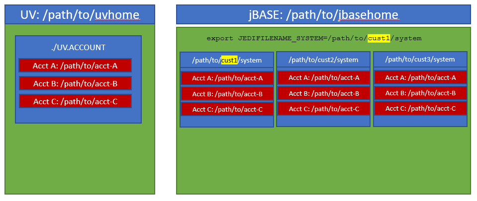

# jBASE Multi-tenancy

Introduction
============

The term “software multitenancy” refers to a software architecture in which a
single instance of software runs on a server and serves multiple tenants. A
tenant is a group of users who share a common access with specific privileges to
the software instance.

In this document, we will describe how the concept of software multitenancy is
supported by jBASE and how this architecture can be exploited by customers,
especially service providers, ISVs and SaaS providers to simplify software
deployment and to lower deployment costs.

Multitenancy is different than virtualization. 
===============================================

In a multitenant architecture, multiple customers can share the same
application, running on the same operating system, on the same machine with the
same data storage mechanism. The distinction between customers is achieved
during application design, thus customers do not share or see each other’s data.
Compare this with virtualization where components are transformed, enabling each
customer application to appear to run on a separate virtual machine.

Benefits of Multitenancy
========================

Cost Savings
------------

Multitenancy allows for cost savings over and above the basic economies of scale
achievable from consolidating IT resources into a single operation. An
application instance usually incurs a certain amount of memory and processing
overhead which can be substantial when multiplied by many customers, especially
if the customers are small. Multitenancy reduces this overhead by amortizing it
over many customers. Further cost savings may come from licensing costs of the
underlying software (such as operating systems and database management systems).
Put crudely, if you can run everything on a single software instance, you only
have to buy one [software
license](https://en.wikipedia.org/wiki/Software_license). The cost savings can
be eclipsed by the difficulty of scaling the single instance as demand grows -
increasing the performance of the instance on a single server can only be done
by buying faster hardware, such as fast CPUs, more memory, and faster disk
systems, and typically these costs grow faster than if the load was split
between multiple servers with roughly the same aggregate capacity. In addition,
development of multitenant systems is more complex, and security testing is more
stringent owing to the fact that multiple customers' data may be co-mingled.

Complexity
----------

Because of the additional customization complexity and the need to maintain
per-tenant [metadata](https://en.wikipedia.org/wiki/Metadata), multitenant
applications may require a larger development effort.

Release Management
------------------

Multitenancy simplifies the release management process. In a traditional release
management process, packages containing code and database changes are
distributed to the customer’s server(s); in the single-instance case, this would
be one server machine per customer. With the multitenant model, the package may
be installed on a single server that is shared by multiple customers or tenants.
This greatly simplifies the release management process, and the scale of effort
is no longer dependent on the number of customers.

At the same time, multitenancy increases the risks and impacts inherent in
applying a new release version. As there is a single software instance serving
multiple tenants, an update on this instance may cause downtime for all tenants
even if the update is requested and useful for only one tenant. Also, some bugs
and issues resulted from applying the new release could manifest in other
tenants' personalized view of the application. Because of possible downtime, the
moment of applying the release may be restricted depending on time usage
schedule of more than one tenant.

Issues of Multitenancy
======================

Licensing
---------

License managers should allow for simplified deployment and management.
Mechanisms should be available to control license consumption in a flexible and
simple way to allow the administrator to craft creative license consumption
policies that meet the requirements of the business.

Account Isolation
-----------------

The database environment architecture should allow the isolation of account
definitions for one tenant from the account definitions of another to ensure
that security is preserved.

Data Isolation
--------------

The database environment should allow separation of tenanted data areas by the
use of isolated account definitions and normal operating system permission
schemes.

Spooler Isolation
-----------------

The database environment should allow isolation of tenant spooler operations so
that each tenant can define and manage their spooler definitions without
exposing their spooler definitions or spooler print jobs to other tenants.

Port Number Organization
------------------------

The database environment should allow for the organization of port numbers
across the multi-tenanted instance so that users and processes from one tenant
can be grouped and organized together rather than intermingled.

Library Management
------------------

The database environment should allow for code segments that are shared across
all tenants as well as code segments that are specific to a tenant without
special object manipulation required when software updates are pushed.

Approaches to Multitenancy
==========================

jBASE Dynamic Configuration
---------------------------

jBASE has a very flexible and powerful series of configuration options that can
be deployed to form a simple, yet powerful mechanism for tenant isolation. These
include:

### Environment Variables

Environment Variable based definitions are available to most everything except
the shared memory segment. Using this approach environment variables can be used
to configure the location of the SYSTEM file, the MD, executable objects and
libraries, data file search paths, spooler location and more.

Environment variables a provide a powerful and flexible way of implementing the
definitions require to isolate tenants. However, it should be noted that
environment variables are not immutable, so it is possible for an advanced user
to manipulate the environment variable setting to escape isolation.

### jBASE License Allocation

jBASE provides mechanisms to control the extent to which licenses are consumed
in a specific scenario. It accomplishes this through environment variables and
by the use of some license configuration files, or a combination of both.

The JBCPORTNO environment variable allows the administrator to define a series
of port numbers or port ranges that can be used before the jBASE jshell (jsh) is
invoked. This allows full control of license consumption using virtually any
scheme imagined by the administrator including controlling license consumption
by userid, groupid membership (tenant id), inbound ip address or other
administrator defined schemes.

For traditional character-based sessions, the administrator may define rules
that govern the consumption of premium multi-session licenses vs. standard
single-session licenses. The environment variable JBC_MULTISESSION

Data Segregation
----------------

### jBASE Dynamic System Structure

The jBASE system is installed at a path on the machine. However, instead of the
account definition file being located with a hard-coded name and location, it
can be defined by the environment variable JEDIFILENAME_SYSTEM. This allows
jBASE to support multiple account definition files. A common use for this in the
area of multitenancy is to define a SYSTEM (aka account definition file) for
each tenant on the machine. This allows for clean segregation of accounts since
each customer tenant running on the machine may reference their own private
SYSTEM file with their own private account definitions. Additionally, this file
can be secured using permissions to prevent access and exploitation by a
non-authorized user.

As you can see below depicting jBASE, we have three customer tenants named
cust1, cust2 and cust3. At login, a user’s profile will set the environment
variable JEDIFILENAME_SYSTEM to point to the appropriate SYSTEM file for that
user based on their company association. jBASE will then respect that
environment variable setting throughout that user’s session.



Account names that live in one SYSTEM file may also exist in another SYSTEM
file. Q-pointers are resolved through the same SYSTEM file named by
JEDIFILENAME_SYSTEM so there is no danger of one tenant inadvertently Q-pointing
to an account outside of their SYSTEM file’s defined accounts.

This design makes it simpler and cleaner to consolidate systems that previously
existed on separate servers into a single multitenant machine without the need
to change account names or the Q-pointers that refer to them.

Spooler Isolation
-----------------

### The jBASE Dynamic Spooler

jBASE permits the definition of multiple spoolers that can co-reside on a single
server. The active jBASE spooler may be dynamically assigned by using a simple
environment variable.


#### Observations about the jBASE spooler

-   jBASE allows multiple spoolers to be defined and to be run simultaneously on
    the same server

-   A simple environment variable that may be set dynamically at login is all
    that is needed to specify which spooler should be used.

-   Printer queue names in one spooler definition may exist in other spooler
    definitions without conflict. This allows for identical jBASE printer queue
    names to exist in each spooler definition without conflict.

-   Currently JBCSPOOLER must be defined before launching into jBASE. There is
    no SYSTEM attribute for defining JBCSPOOLER and putting it into the dynamic
    environment option does not work at this point.

#### Conclusion

When consolidating multiple customer’s servers into a single multi-tenanted
server, it is necessary to maintain compatibility with existing printer queue /
device names. jBASE’s dynamic spooler allows a multi-tenanted deployment of
applications on a single server while preserving the printer names that are
familiar to users.

Additionally, because each jBASE spooler is separate from the other, including
hold-spool jobs and job numbers, it is much easier to allow tenants to use the
jBASE spooler utilities to observe and manage spooled jobs and hold-spool jobs
without fear that sensitive information held within the spooler could be exposed
to the wrong eyes.

#### Additional Benefits of the jBASE Dynamic Spooler

-   Allows encryption of at rest print jobs to provide both segregation as well
    as optional encryption of spooler hold jobs.

-   Full Localization support including support for custom code pages based on
    locale.

-   Both SP-ASSIGN and SETPTR style spooler directives are supported

Port Number Management
----------------------

When managing multiple tenants on a single machine, good housekeeping and
organization dictates that users and their port numbers from one tenant should
be either isolated or at least grouped together (if all tenants are configured
to share the same memory segment). jBASE supports the concept of controlling
port number assignments. This allows for port numbers for one tenant running in
the same shared memory instance of jBASE, to grouped together in a range of
ports rather than port numbers from all tenants being intermixed.

### jBASE and user port numbers

jBASE provides a mechanism for controlling and managing port numbers to allow
for logical organization of user processes into port number ranges. This feature
is dynamic and easily configured by simply using the jBASE environment variable
JBCPORTNO prior to invocation of the jsh shell process.

An example assignment of JBCPORTNO might look like this:

>   export JBCPORTNO=300,304,310,350,360-390 (Unix)  
>   set JBCPORTNO=300,304,310,350,360-390 (Windows)

In the example above, JBCPORTNO has been defined to be a set of available port
numbers. When the jsh (jBASE shell) process is invoked, jBASE will test each
defined port number or range from left to right to locate the first available
port.

Using this example, if port numbers 300, 304, 310, 350, and 360 were all in use,
jsh would obtain port 361 for its terminal session.

If all the port numbers are in use, then a suitable error message is returned.

Using this technique, the administrator may assign each tenant, group id, user
id, ip address, etc. to a specific port number range containing a finite number
of available port numbers. This not only allows the administrator to design a
sensible scheme for organizing port allocation, but it also allows the
administrator to control how many jBASE processes (e.g., licenses) may be
consumed by a tenant, group id, user id or ip address through the use of
conventional scripting techniques.

Library Management
------------------

jBASE uses environment variables to define where to locate both programs and
subroutines. Unlike other systems where you either have a single MD entry or a
couple optional catalogue areas (local and global for example) jBASE allows you
to fully define where to locate programs and libraries. This concept works
exactly typical O/S functions via environment variables. This allows you to
define a global set of programs and libraries that all tenants share and then a
set of local programs and libraries that are unique to the tenant. If a global
program or library needs to be customized for a tenant you can easily make a
local copy in the tenant area. You would then define your environment variables
to look in the Tenant area first and then the Global area.

An example might look like

```
>   ED SYSTEM client1
>   Line 25 is PATH and line 26 is JOBJECTLIST
>   25: /dbms/clients/client1/bin:/dbms/global/bin
>   26: /dbms/clients/client1/lib:/dbms/global/lib
```

This same technique can be used to bring in third party libraries such as the
Accuterm FTBP programs. Instead of compiling them into your main library you
could leave them in an Accuterm bin and lib locations and just include those
into your path.

In jBASE you direct the compiler where to “Catalog” items with the two
environment variables JBCDEV_BIN and JBCDEV_LIB. You can either set these
manually or you can use Attributes 23 and 24 of the system files. You can also
create Synonym (q-pointer) account entries with these entries preset.

### Deployment Options

Since compile code in jBASE is normal O/S Exe/Bin and Lib/So items you could
choose to deploy those items directly vs deploying source and compiling. The
only limitation to this technique is you must not recompile libraries on the
Production/Down Stream systems due to the way libraries are bundled. If you must
recompile a library in production, it is recommended to have a PATCH bin and LIB
in your paths where you can make a unique copy temporarily. This technique
allows you maintain very tight controls around changes.

Example
```
>   ED SYSTEM client1
>   Line 25 is PATH and line 26 is JOBJECTLIST
>   25: /dbms/clients/client1/bin:/dbms/patches/bin:/dbms/global/bin
>   26: /dbms/clients/client1/lib:/dbms/patches/lib:/dbms/global/lib
```

Now when you must patch you can catalog into the PATCHES location. Your original
libraries and code stay as is. You can also use this technique to selectively
deploy patches to clients by deploying the patched versions into the customers
bin and lib directories.

### Versioning

jBASE pathing also allows you to develop a versioning technique. When deploying
code you could choose to place them into a version directory. Example

```
/dbms/global/v1/bin and /dbms/global/v1/lib
```

You could then create a sym link where
```
/dbms/global/bin -> /dbms/global/v1/bin
/dbms/global/lib -> /dbms/global/lib
```
You can now maintain older versions of the code and quickly revert back by
either changing the sym link or if just a certain tenant needs to revert back
you could just manually adjust their SYSTEM file.
