# Getting started with jprof (jBASE Application Profiling)

<PageHeader />

Profiling is built in, there is no external application that needs to be installed,  it’s all right there in jBASE.

A single command starts the profiling, set the `JDIAG` environment variable and profiling is started. Then you enter your application and everything you do, every process that gets started underneath is all logged and profiled. That includes subroutines, triggers, menus, it doesn’t matter what you run. Then exit the application and unset the `JDIAG` environment variable and you are ready to view the profiling.

Profiling is done with a per user-session based concept. You enable profiling for your session and then enter your application and run the portion of the app that you want to profile. You will be profiling your session and any subroutines, triggers, executes, etc. Anything that the application runs or calls during your session will be profiled. Once that portion has completed, you will want to disable profiling on your session to limit the profiling log to just the part of the app that you want to profile.

## Starting profiling

Starting the profiling is accomplished with 1 command:

`export JDIAG=profile=long:filename=fb1.txt`  <- this creates 1 file

Typically you will want to create several files, one for each process that gets exec’d or forked.

`export JDIAG=profile=long:filename=fb1_%p.txt` <- captures the process id and creates a separate file for each process that is created during the profiling.  

`export JDIAG=profile=long:filename=fb1_%p_%t.txt` <- creates multiple files with `%p` being the pid of the process and `%t` being a time stamp.

> Note: Profiling must be started external to the jBASE environment, you need to enter jBASE with profiling already running as a result of setting `JDIAG`. Changing `JDIAG` while you are already running a jBC program will not initiate the profiling, you must initially set `JDIAG`.

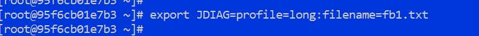

This command above says we are going to start profiling and the output is going to be in a file called _fb1.txt_.

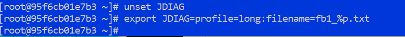

This command above says we are going to start profiling and the output is going to be in files called *fb1_%p.txt* where `%p` will be the separate process numbers that are profiled.

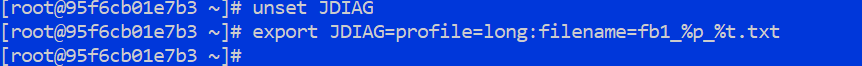

This command above says we are going to start profiling and the output is going to be in files called *fb1_%p_%.txt* where `%p` will be the separate process numbers that are profiled and `%t` will be an additional time stamp, useful when there are many processes to be profiled.

## Windows Notes

The above examples are for Linux but the concept is the same for Windows. The command to assign and unassign the `JDIAG` environment variable is slightly different using the `set` command.  

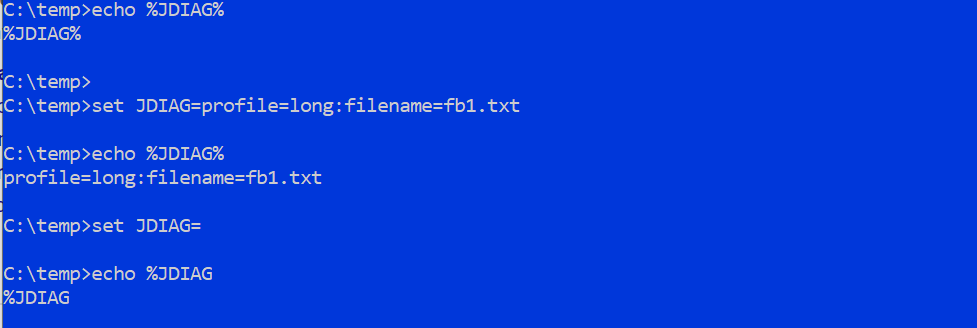

## Start the application

Once the `JDIAG` environment variable has been set you enter a command to run the application or start a jsh and run the application. Here is a snap of the steps being used to demonstrate the sequence for this test.  

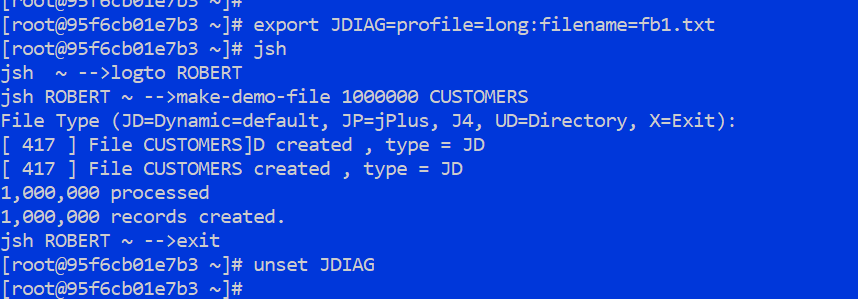

## Examining the profile

Our profiling output is in a single file called _fb1.txt_. You can cat this file to see the contents but to make more sense of it the `jprof` command is used to parse and present the profiling information. The complete syntax and options can be displayed with the `jprof -h` command.  

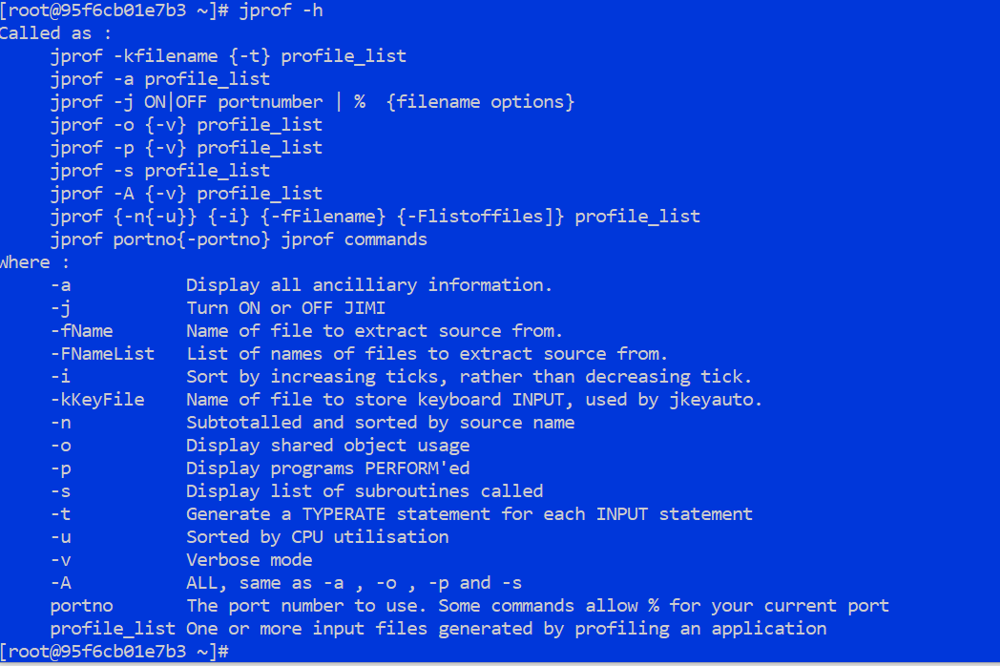

The first use of `jprof` is to display a summary of the profiling log with `jprof -a -f. fb1.txt.`

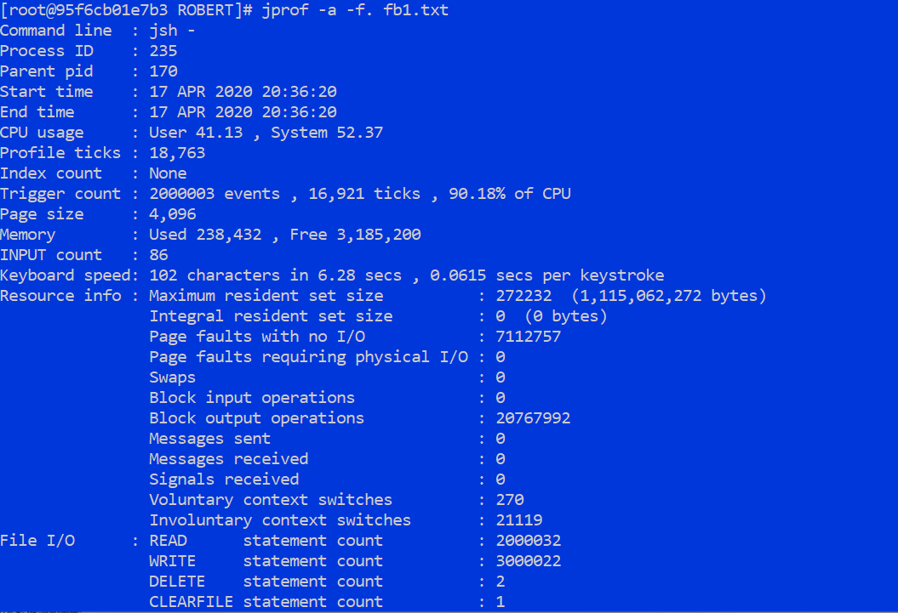

Remove the `-a` for a report sorted by line number and CPU usage: `jprof -f. fb1.txt`

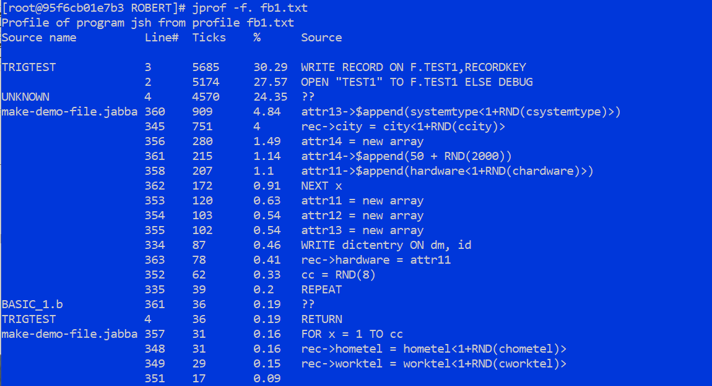

You can see above that the primary sort is on cpu usage by source code line number across all programs or subroutines that were run. It may be more informative to look at each program or subroutine individually so the next use of `jprof` would be to add the `-n` option, `jprof -n -f. fb1.txt`.

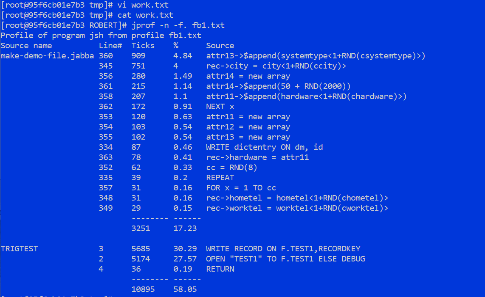

In the output above you can see the display break on each separate program module that was executed during your profile run.  
To display the subroutines that were called in the profile, use just the `-s` option: `jprof -a -s -f. fb1.txt`

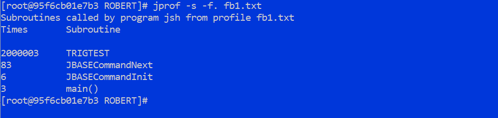

Different combinations of options will enhance the output until you find the optimal information to allow you to move forward with your performance profiling.

Profiling is mainly used to concentrate on CPU usage per process, per user, per line number of source code. Profiling can be set to concentrate instead on memory usage for resource planning and to identify if you have introduced memory inefficiencies or memory leaks in your application. Program branches can also be profiled, which will examine the flow of your program in the context of subroutine calls and executes.
Profiling can also be set to jimi mode (jBASE independent metrics information) which provides information on transactions and file I/O. The complete range of profiling environments can be displayed with the command:  
`JDIAG=help WHO`

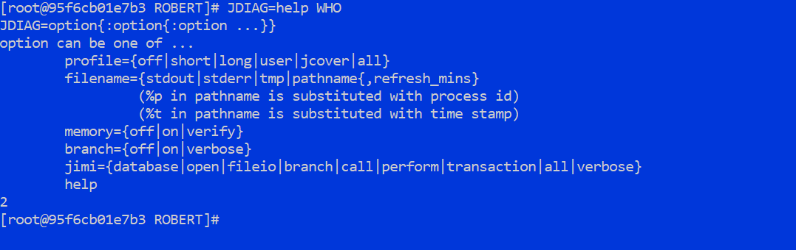

Look for future quick starts on profiling memory and the various other advanced features of jBASE profiling.
  
<PageFooter />
