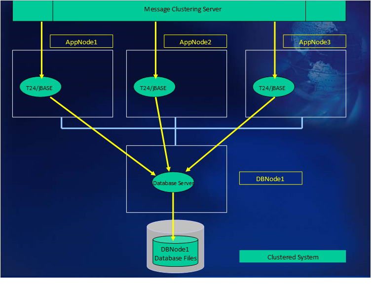

# Cluster System – multiple application servers and a single database server  

<PageHeader />

  

When clustering T24/jBASE, two (at least) configurations can be utilised:

## Multiple application servers with a jBASE database server  

With this configuration, jBASE will be the sole database server. Communication between the application server(s) and the database server will be by using jRFS within jBASE. This allows multiple application servers to have pointers/stubs as file definitions. These pointers/stubs reference files exist on the database server. jRFS mechanisms allow for the updating of the database through jRFS server processes from requests made on the application servers. The implication of this is that each application server has no direct, individual database storage but shares access to a central (jBASE) database. As there is only one database server, Transaction Journaling facilities will be available, using the same mechanisms as the Stand-Alone system above.  

## Multiple application servers with a non-jBASE database server  

This configuration uses jBASE as a gateway to another DBMS (such as Oracle or DB2).  

jBASE will handle any supported relational database connectivity (such as Oracle/DB2 etc.) through the appropriate jEDI driver. Data mapping will be achieved through the corresponding RDBMS stub file definitions. The jBASE/RDBMS stub file definitions can exist on one of various locations:
• On the Application Servers – this could (would) potentially create a locking minefield – how to communicate between the Application Servers the locked state of the database entities.
• On the Database Server (1) – Application Servers communicate over NFS mounts to RDBMS stub files defined on the Database Server. The downside of this approach is that RDBMS client components (at least) have to exist on each of the Application Servers. Also there is a problem with managing database locks. This can be achieved by inefficient application-level lock mechanisms whereby the locks are held within a central filesystem and are accessed by all Applications Servers, utilizing OS locks to manage access to the lock table.
• On the Database Server (2) – Application servers communicate using a jRFS driver to jRFS servers on the Database Server. The Database Server contains the RDBMS stub file mappings to the RDBMS, also residing on the Database server. As jRFS operates in a client-server relationship, there are no locks taken directly by any process within the Application Servers, but are taken by the jRFS server processes, on their behalf, running on the Database Server. As all the jRFS server processes run under control (for locking purposes) of a single jBASE server, there is no issue with locking between these processes. There is also likely to be a cost advantage over Database Server (1) approach, because no RDBMS components need to exist on the Application Servers.
• Transaction management (i.e. the use of TRANSTART, TRANSEND and TRANSABORT programming commands) within the Application Servers is handled within jBASE as for the Stand-Alone system.

Back to [Transaction Journaling](./../README.md)

<PageFooter />
