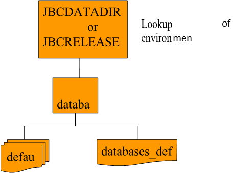

# Databases  

<PageHeader />

## Concept  

Until recently there has been no way or to manage and control subdivisions of the application – departmental control or to duplicate the application/DBMS to support more than one instance of the database – multi-customer hosting. The database grouping is achieved by the used of the JBASE_DATABASE environment variable; not specifying this will result in the user being assigned to the “default” database group. This allows the system administrator to control access to various populations of user/applications, without affecting the other users/applications.

## Departmental Control  

Users may now be assigned a target grouping or “database” when they access applications. This “database” enables finer control over which groups of users may access the database. This grouping is likely to be on a departmental or functional basis, i.e. users may be assigned to the “Sales” or “Accounts” database or even the “Administrators” database. This physical database may thus be physically or logically split by functional areas. Control of each of these areas is by the assigned “database” name. Thus it is possible to restrict access to the database to only, say, those users who are in the “Administrators” database group etc. The database could be designed such that each functional area contains files pertinent to each area and that files which are shared between functional groups are stored in a central repository, with access available to all.  

It should be stated that this “database” grouping is not intended to replace file ownership and access permissions which are normally in existence.  

## Multi-customer hosting  

An application could be replicated such that provision is made to support multiple customers each running the same application but with each having their own copy of database files. In this instance the “database” grouping could be by customer, thus allowing control over each distinct customer database.

### Configuration  

The default configuration of databases is as follows :

  

There will always be a “default” database file and a “databases_defined” file defined within the system. In order for the system to run, the environment variable “JBCRELEASEDIR” must exist in order to find where jBASE resides. This will be the default entry within the “databases_defined” file. Each defined database will contain information about where to find Transaction Journaling configuration and administration files. This will be defaulted to JBCRELEASEDIR location if not specified.

### Environment Variables

Two environment command may be used to assign a user or application to a particular database and to use a particular set of Transaction Journal files:

```bash
set JBASE_DATABASE=”dbname”
```

will assign this user/application to the specified database.

```bash
set JBCLOGCONFDIR=”path of TJ configuration”
```

### Database Control Commands  

| Command     | Options | Operation |
| ---         | ---     | ---       |
| DB-START    | -n      | Database name – “default” if not specified                      |
|             | -t      | Location of TJ configuration – defaults to $JBCRELASEDIR/config |
| DB-PAUSE    | -a      | Administrators are still allowed access to the database         |
|             | -n      | Database name – “default” if not specified                      |
|             | -r      | Read type operations are still allowed on the database          |
|             | -t      | Transactions are allowed to complete                            |
| DB-SHUTDOWN | -a      | All databases                                                   |
|             | -n      | Database name – “default” if not specified                      |
|             | -t      | Transactions are allowed to complete                            |
| DB-RESUME   | -n      | Database name – “default” if not specified                      |
| DB-REMOVE   | -n      | Database name – “default” if not specified                      |
| DB-STATUS   | -n      | Database name – “default” if not specified                      |
|             | -a      | All databases                                                   |
|             | -n      | Database name – “default” if not specified                      |
|             | -t      | Display users inside a transaction                              |
|             | -v      | Verbose mode                                                    |
|             | -w      | users currently waiting for DB-RESUME                           |
|             | -V      | Very verbose mode                                               |

Back to [Transaction Journaling](./../README.md)

<PageFooter />
