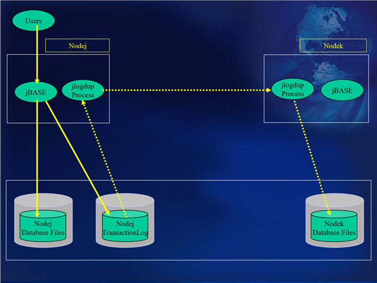

# Failsafe/Hot Standby  

<PageHeader />

The architecture depicted above shows the use of a Failsafe or Hot Standby machine. This allows for a failure of the live main machine (Nodej in this case). Unlike the previous configuration where the disk-based transaction logs are written to an external medium (tape), this configuration will enable database updates to be replayed to a standby machine, and indeed to the database on that standby machine, shortly after the update has been made (and logged) to the live machine.

## Purpose of the Hot Standby configuration  

Before describing how this configuration is set up and is managed, the role of the standby machine needs to be determined.
It is assumed that for the case of a full system reload, there is some external medium available for the operating system reload and configuration. This could also be contained on the standby machine as a system image. In the latter case, enough disk space should be available to hold this system image.  
The database is to be replicated on the standby machine, so space must be available.  
The processor/disk configuration should be fast enough on the standby machine, so as not to lag too far behind database updates on the live machine. The implication of the standby machine’s unable to cope with the database update rate, may cause the live and standby machines’ database to be unacceptably out-of-sync. – There may be too many disk-based transaction log entries on the live machine which have not been transferred via jlogup to the standby machine.  

### Hot standby machine as a fast recovery machine  

If the Hot Standby machine is to be used within a fast recovery mechanism, then the following is required:
The network between the two machines should be fast and reliable.
The database on the standby machine must be sufficiently up-to-date, with reference to the live machine, as to be acceptable.  

### Hot standby machine to be used by essential staff during system recovery  

The standby machine must have sufficient bandwidth to cope with the assigned tasks, within acceptable time frames. An example of this would be that if an assigned task were be to run End of Day processing, then the machine must be able to complete this task prior to the normal start of business the following day.
During the period when the live machine is unavailable, then the standby machine should be able to handle failures. A minimum configuration should be that Transaction Journaling should be initiated on the standby machine and the transaction log file produced should be backed up to an external medium (tape?).
Provision should be made to allow for disk-based transaction logs to be held.
Provision should be made for licensing of users on the standby machine.  

### Hot standby machine to be used as a live machine replacement during system recovery  

If the intent is that the standby machine becomes a temporary replacement for the live machine, then ideally the standby machine should be of similar configuration to the live machine.

Back to [Transaction Journaling](./../README.md)

<PageFooter />
