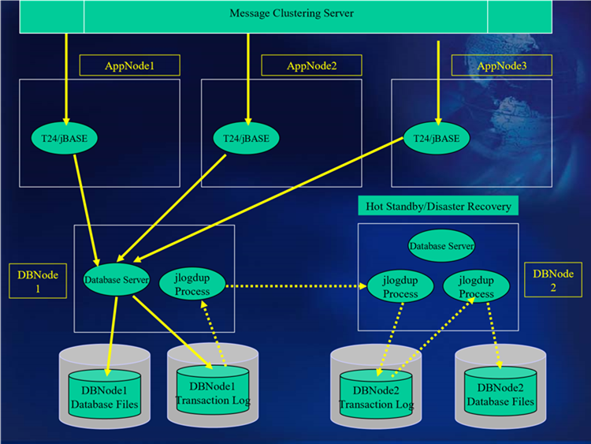

# Hot Standby database server  

<PageHeader />

## Hot standby with a jBASE database server

The Hot Standby configuration using jBASE as the database server has the same attributes as previously described in the Cluster Systems with the exception that all database updates to jBASE are duplicated to a separate server (or remote in the case of disaster recovery). The database duplication process, achieved by the jlogdup facility, would normally be an operation in addition to dumping the transaction log data to a local tape device.

## Operation of the Hot Standby Configuration  

Transaction handling will be achieved by the use of TRANSTART, TRANSEND and TRANSABORT programming commands.
• jBASE transaction journaling will be used to record all database updates.
• The Transaction journal is copied to tape (or other external medium) on a continuous basis by means of the jlogdup facility.
• A backup of the database (using jbackup) is initiated each night at 12:01 am (for example) to the tape deck /dev/rmt/0 (for example).
• Logsets should be switched automatically following the backup.
• A jlogdup process will be initiated on the database server which will, in tandem with a corresponding jlogdup server process on the standby server, transfer all transaction updates from the transaction log on the live cluster to the transaction log on the standby server.
Another jlogdup process on the standby server will take the updates from the previously transferred log files and update the database on the standby server.

## Hot standby with a non-jBASE database server  

If a backend RDBMS is configured then Hot Standby/disaster recovery is handled by the RDBMS; jBASE Transaction Logging is not used as the recovery mechanisms are handled by the RDBMS. The RDBMS recovery mechanisms are outside of the scope of this document.  

The updates contained within a transaction are cached until a TRANSABORT or TRANSEND command is executed for that transaction. No RDBMS activity takes place when the TRANSABORT command is executed, whereas the TRANSEND can result in many RDBMS interactions before success or failure is detected. The application code within jBASE/T24 is unaware of the underlying backend database.  

[Next Page](./../scripts/README.md)

Back to [Transaction Journaling](./../README.md)

<PageFooter />
