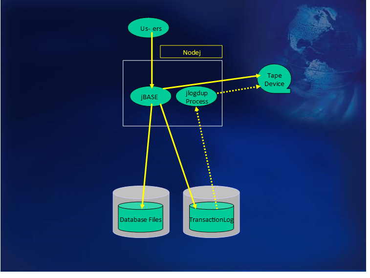
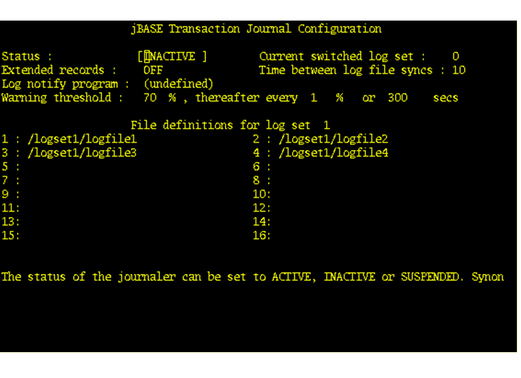
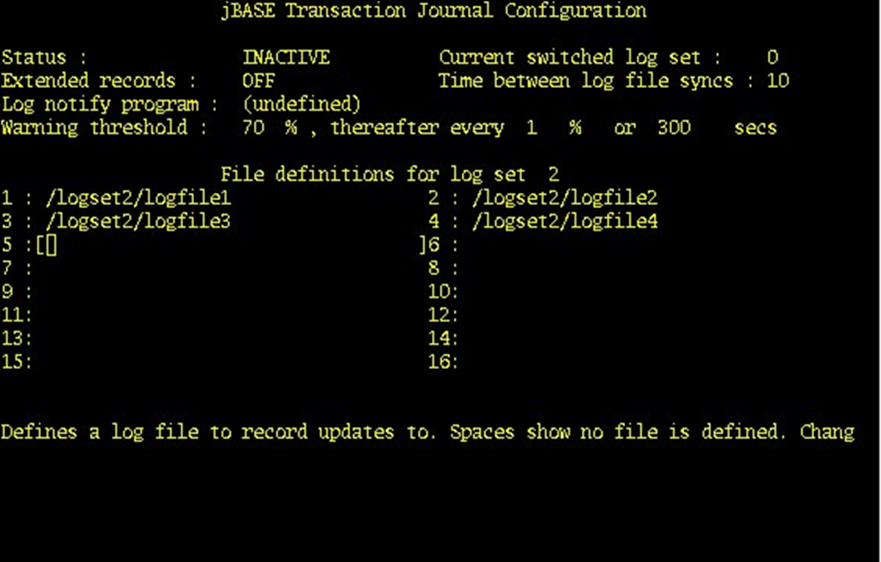

# Transaction Journaling on a single system

<PageHeader />

The diagram above represents the use of Transaction Journaling on a stand-alone system. Why would we use this kind of setup? In the event of system failure, the vast majority of processing which has taken place since the last system backup can be recovered and replayed. This is vital for those situations where the transaction cannot physically be repeated. The majority of these transactions can be replayed during system recovery when TJ is utilized.  

## Journal Configuration  

The Transaction Journal will be configured with two logsets; logset1 and logset2. Each of these logsets will occupy a separate volume partition on disk; this will allow for correct size monitoring of the logsets. The statistics of the logset usage indicated by the jlogstatus command is not at obvious at first glance. What is displayed is the proportion of the volume that has been used. Naturally, if the volume is shared by one or more logsets and/or other data files, then the percentage full will not necessarily reflect the percentage of the volume used by the transaction log. If the logset is contained within its own volume, then the figures are a fairer reflection of the TJ logset usage (albeit with certain storage overhead being present). Correct automatic invocation of the Log Nofity program relies on the accuracy of the percentages obtained.  
Also if the logsets share a volume with other data, there is the possibility that the writing to the transaction log file may abort due to lack of space within the volume. The logset volumes should be created large enough for the expected population of updates between logset switches: i.e. if the logsets are switched every night at midnight, then the logset volume should be large enough to contain all the updates for a whole day (plus contingency).

Thus the logsets are created as below:

[Next Page](./../single-system-two-decks/README.md)

Back to [Transaction Journaling](./../README.md)

<PageFooter />
