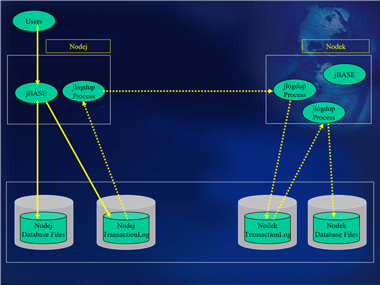

# Refinement to Hot Standby Configuration  

<PageHeader />



The configuration above shows a small, but significant refinement to the previous configuration. Essentially, the transaction log file is being replicated to Nodek, with the logrestore script showing the following change:

```
jlogdup input set=stdin output set=logset
```

Thus, all updates transferred from the transaction log file on Nodej are updated to the transaction log file on Nodek. Another jlogdup process is initiated thus:

```
jlogdup input set=current output set=database
```

this takes these updates and applies them to the database. The reason for this becomes apparent when a recovery is required. Because there is now a copy of the transaction log file on the standby machine, by interrogation of the transaction log file, it is clear which updates have been transferred from the live machine. If the jlogdup is allowed to continue until all updates in the transaction log file have been applied to the database, then the recovery position can be established far more easily than by interrogating the database.  

[Next Page](./../resilient-configurations/README.md)

Back to [Transaction Journaling](./../README.md)

<PageFooter />
