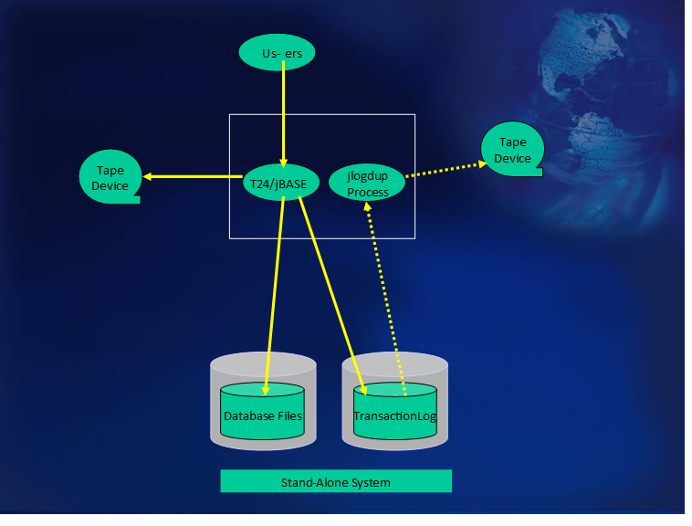

# Resilient T24/jBASE Configurations  

<PageHeader />

Each configuration which will be described adheres to those goals as identified in the Temenos Technology and Research White Paper - T24 Resilience High Availability in Failover Scenarios and the proposed new Close of Business Procedures as described in the Functional Specification Changes to Batch Operation for Global Processing Environments

## Stand-Alone System – application server and database server on one machine  



This should be the minimum standard configuration utilizing Transaction Journaling. The assumptions made here are that jBASE will be the database (native) server.
Transaction handling will be achieved by the use of the programming commands:

• [TRANSTART](./../../jbc/../../jbc/transtart/README.md)
• [TRANSEND](./../../jbc/../../jbc/transend/README.md)
• [TRANSABORT](./../../jbc/../../jbc/transabort/README.md)

Transactions which are not completed in their entirety will be completely “rolled back” by jBASE, when commanded to so do by the TRANSABORT command. Upon execution of the TRANSEND command all or none of the constituent database updates will be actioned, ensuring database consistency. Any transactional recovery will be achieved through the use of jBASE facilities.
jBASE transaction journaling will be used to record all database updates.

Transaction Journaling has been configured for example, with two logsets:  

1. /bnk/bnk.jnl/logset1
2. /bnk/bnk.jnl/logset2

where:  

**logset1** and **logset2** are links to two mounted filesystems each containing the corresponding transaction log file definitions.

TJ is then activated by a script similar to start_tj, which activates transaction logging and also the backup of the transaction logs to tape (/dev/rmt/0 in this case).
The Transaction journal is copied to tape (or other external medium) on a continuous basis by means of the jlogdup facility.
A backup of the database (using the backup_jbase script) is initiated prior to the execution of Close of Business procedures. Logsets are “switched” following the successful completion of backups.

When a backup is required, a script, based on “backup_jbase” is run.

Actions performed by this script are:  

- Disk-based transaction log file entries are still allowed to be dumped to tape. When there is no Transaction Logging activity, then all outstanding transactions have either been logged to tape or rolled back. NOTE: The time allowed for transactions to complete is dependent on application design. The end of dump activity can be checked by use of the jlogstatus command
- The transaction log file duplication process to tape is stopped.
- The logging tape is replaced by a new tape for the backup.

The command:

```bash
find /bnk -print | jbackup -v -f –c /dev/rmt/0 -s /tmp/jbstart
```

will dump all data to tape below /bnk;  

As all the transaction log data (bnk.jnl) data has already been dumped to tape prior to the backup, the exclusion of this directory would seem appropriate, by configuring the data thus:  

| Directory | Description |
| ---       | --- |
| bnk       | Main directory, object code etc. |
| bnk.run   | Initial logon point |
| bnk.data  | Data files |
| bnk.dict  | File dictionaries |
| bnk.help  | On-line help files |
| bnk.jnl   | Transaction Journal |

where bnk.jnl is not under the bnk directory structure.

## Note  

> The use of the “-c” option will allow for the dumping of index files to avoid having to rebuild indexes on a restore process.

## Note 2  

> Alternative backup mechanisms may be employed.

Once the backup has completed and verified, a new tape for tape logging replaces the last backup tape.
The logsets are switched, ready for any database updates.
Transaction logging to disk is re-enabled.
Database updates are enabled.

### System protection and benefits  

The use of Transaction Journaling in this configuration allows for the recovery of transactions up to the point of failure. This configuration provides assistance to the administrator in identifying those transactions which have not been written to tape prior to system failure. The tape (set) contains a sequential history of database updates since the last backup.  

### System recovery preparations  

The administrator must ensure that a skeleton system save is made available. This skeleton system should contain:
• The operating system and configuration (device assignments, user login information, etc).
• A licensed copy of jBASE (configured as ready-to-run)
• This skeleton system must be kept up to date. Any changes to the operating system or jBASE configurations must be reflected in this skeleton system as a standard procedure; any such changes triggering the production of a new skeleton system.  

### System recovery after failure  

If the operating system and/or jBASE is deemed corrupt or there has been a catastrophic disk failure, resulting in the loss of a disk, then the system should be reconstructed as a skeleton system as discussed above. The details of this recovery are out of the scope of this document.
Once the system has been brought to an operational state, the database needs to be brought back to a known state. The last backup set produced is recovered by the recover_jbase script. This not only restores the jBASE
database including saved indexes, but also replays all completed transactions which have been transferred to tape and initiates transaction logging to tape.  

If there has been an application/database error which has resulted in the decision to perform a complete restore of the system, it is clear that if the error can be identified to have taken place at a particular time, (whether precisely or approximately), then the whole of the transaction log should not be replayed. Using the “end=timespec” option of jlogdup will cause the transaction log replay to terminate at the specified time rather than the end of the logset. (See [jlogdup](./../utilities-jlogdup/README.md) section for valid format of timespec). The recover_jbase script will prompt for a time or assume EOS (i.e. all the transaction log is to be replayed).  

#### Warning  

>If an “end=timespec” parameter has been specified, then the time chosen may cause transactions which began before this time not to be rolled back.  
>Additional database updates pertaining to such transactions and bounded by the corresponding TRANSEND commands may exist on the transaction log file, but will not be executed.  

### Close of business procedures  

This configuration, being a jBASE-only solution will allow for on-line backups to be taken prior to Close of Business procedures.

Back to [Transaction Journaling](./../README.md)

<PageFooter />
