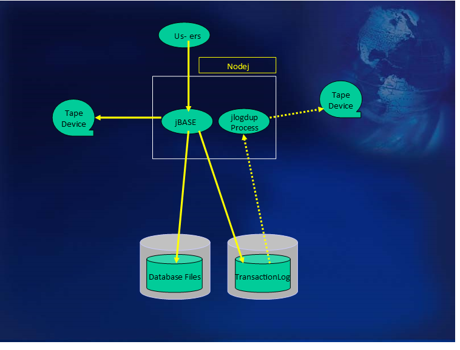

# Transaction Journaling on a single system with two tape decks  

<PageHeader />

The schematic shows the same system, except this time equipped with two tape decks. The advantages of this configuration over the previous are as follows:

- For the majority of the time during the day, there is a tape deck free for other uses; either for system or development usage.  
- This configuration allows for tape deck redundancy. If the event of a deck failure, the previous scenario can still be maintained while the tape deck is repaired or replaced.  
- The jlogdup process can be left running during the backup/verify. This is the most important advantage over the previous scenario. Any database updates which are performed during backup/verify are likely not only be logged to the disk-based transaction log file, but also to the tape. This eliminates the lag between backing up the system and ensuring that database updates are logged to an external medium.  
- The disadvantage of employing this configuration is that in the event of a system (or disk) failure, the machine has to be taken offline for the duration of the system restore process as well as the Transaction Log restore from tape. As time is money, this approach may be prohibitively costly to the organisation.  

[Next Page](./../hot-standby/README.md)

Back to [Transaction Journaling](./../README.md)

<PageFooter />
