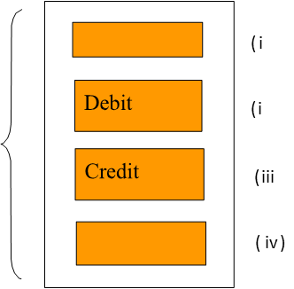
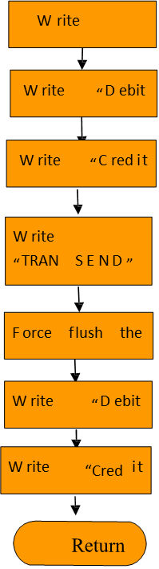

# Transactions  

<PageHeader />

Database transactions are a group of logically related file updates. These updates are intended to be processed as a whole. In order to maintain database consistency, all of the updates within a transaction must occur or none of them.
For instance, assume there is a standing instruction where in the bank needs to debit customer A’s account with USD500 and credit customer B’s account on account of house rent payable by A to B. This has to happen on the 1st day of each month. In the above-mentioned transaction, two important tasks need to be carried out.
One is a debit to Customer A’s account with $500 Another is a credit to customer B’s account with $500
It is vital that both the above-mentioned tasks happen or none of them to happen. If either of them only happens, it would lead to database inconsistency.

## Transaction Boundaries and Locking

Updates within a transaction block normally require database locks to be taken to prevent inconsistencies arising from different users simultaneously updating the same record. It is clear that if these locks are held for an extended time, then access to the database may be impaired. It is vital, then, that locks are only held when about to write to the database and certainly not when waiting for user input.  

## Transaction Processing within Transaction Journaling  

As indicated earlier a transaction is a group of logically related updates to jBASE files. Take the banking example and introduce transaction boundary markers:

(i) The jBC command - “TRANSTART ….” when executed by the jBC runtime system causes a “TRANSTART” record to be placed in the transactional cache for this user.
(ii) & (iii) “WRITE” records containing not only the record data, but details about the origin of the updates (see Viewing the Transaction Journal in a later section. These journal records are cached following the “TRANSTART” record.
(iv) The jBC command - “TRANSEND …” causes the process to enter the “COMMIT” phase of execution. Up to this point no data has been written either to the Transaction Journal or to the database. The following procedure is then followed:

Back to [Transaction Journaling](./../README.md)

<PageFooter />
