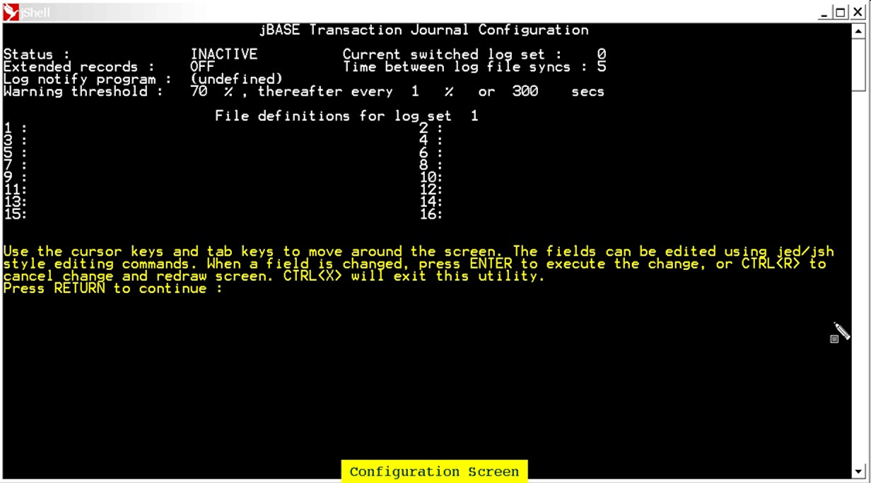

# jlogadmin  

<PageHeader />

The jlogadmin command allows for the administration of the jBASE Transaction Journal. The jlogadmin command will enabled for interactive usage when invoked by the super-user/Administrator; execution by other users being restricted to read-only. All administration tasks contained within the jlogadmin utility can also be invoked from the command line, using jlogadmin, with optional parameters.
When the jlogadmin command is executed interactively, navigation to the next field is by using the tab key or cursor-down key and to the previous field by the cursor-up key. Each field can be modified using the same editor type commands as available in jsh. Changes to a particular field are effected by the <Enter> key and CTRL-X is used to exit from interactive mode.

## Interactive Configuration

### Interactive Display  

The first execution of jlogadmin will display the following screen:  



## Description of Fields  

### Status

Specifies the current transaction journal status, which can be On/Active, Off/Inactive or Susp/Suspended. Note: When the status is changed to Suspended, all transactions which would be updated in the transaction log file will also suspend awaiting a change of status.

### Current switched log set  

Specifies the current log set in use. There are four possible log sets – numbered 1 to 4. An entry of 0 indicates that no log set has been chosen at this time.

### Extended records

Specifies additional information:

- the application id
- the TTY name
- the login name

### Time between log file syncs  

Specifies the number of seconds between each synchronization of the log set with the disk; All memory used by the log set is force flushed to disk. Should the system crash, the maximum amount of possible data loss is limited to the updates which occurred since the last log set synchronization.  

### Log notify program  

This specifies the program to execute when the warning threshold of the log set is reached. The log notify program is called every time a message is written to jediLoggerAdminLog. The text of the message can be captured by adding arguments to the command line which the notify program can examine using SENTENCE(). For example, possibly define the program as:  

```bash
/usr/admin/bin/lognotify '%1' '%2' '%3'
```

In addition, when the program is loaded, the following are substituted:  

```
%1 == {INFORMATION: | WARNING: | FATAL ERROR:} From user root at Wed Sep 04 12:38:23 2002
%2 == Process ID 12345, Port 23, tty /dev/pts/03
%3 == Depends upon the actual error message e.g. "Error number nnn while reading from file /dev/xxxxx"
```

### Note  

>The message is designated INFORMATION, WARNING or FATAL ERROR. This designation can be used by the log notify program to decide on a course of action.  
>The messages that can be logged are:

| Type | Message | StdOut |
| ---  | ---     | ---    |
| INFORMATION | Log set changed to *s*                                                      | Yes |
|             | Log set *s* truncated                                                       | Yes |
|             | File *f* for log set *s* REMOVED                                            | Yes |
|             | File *f* for log set *n* changed to *newfilename*                           | Yes |
|             | n files imported to log set n (see -i option)                               | Yes |
|             | Status of logger set to *status* (current log set *s*)                      | Yes |
|             | Sync count changed from every *n1* seconds to every *n2* seconds            | Yes |
|             | Log file warning threshold set to *p* initial percentage thereafter every additional *q* percent or *n* seconds | Yes |
|             | Admin. Log Notify Program now set to *program*                              | Yes |
|             | Admin. Log Notify Program REMOVED                                           | Yes |
|             | Extended Record Status now set to *on\|off*                                 | Yes |
|             | Log set switch detected, was set *n1*, now set *n2*                         | No  |
|             | Kill initiated on jlogdup process id *pid* : Process id pid from port *n*   | Yes |
|             | First record read from set *n*                                              | Yes |
|             | Termination Statistics:<br>usr *x* , sys *y* , elapsed *z*<br> *r* records read from current log set number *n* : *r* records, *b* blocks, *rb* record bytes , *e* errors in *file* | Yes |
| WARNING     | Journal Log Files now at *p%* capacity                                      | No  |
| FATAL ERROR | Unable to open logger configuration file *filename*                         | Yes |
|             | Sync demon appears to have died prematurely                                 | Yes |
|             | Error number *errno* while reading from file *filename*                     | No  |
|             | Error number *errno* while writing to log file                              | No  |
|             | Error *errno* while writing to log journal file *filename*                  | Yes |
|             | Error *errno* while writing to log journal                                  | Yes |
|             | Unable to open logger file *filename*                                       | Yes |
|             | Out of memory to log update                                                 | Yes |

### Warning threshold  

If the amount of space consumed in the file system, which the active logset resides upon, exceeds the specified threshold, it runs the log notify program. Individual files in a logset have a capacity of 2GB. If the logsets are not switched, files in a logset can grow to the 2GB limit without the file system reaching the threshold capacity. If this happens, journaling will cease to function predictably and normal database updates may fail.

### File definitions

As indicated above, the maximum size of an individual file is 2GB. It is clear that if a single file were used for the log file, then this would likely be insufficient for most realistic application environments. Therefore the administrator is able to set up a log set consisting of a maximum of sixteen files, thus enabling a maximum log set of 32GB. The configuration will allow for a maximum of four log sets. Usage and switching of the four log sets will be described in appropriate sections. If the file specified by the administrator does not already exist, then it will be created automatically.

### Command-line Syntax

In addition to the interactive screen setup facility, there are options which can be added to the jlogadmin command execution. This allows the administrator to create scripts which can be run either at pre-defined times or intervals; or in response to transaction journal events (usually error handling events).
The command is invoked by the following:

```bash
jlogadmin –{options}
```

Where {**options**} are identified below:

### Syntax Elements  

| Option    | Description |     |
| ---       | ---         | --- |
| -a status                           | Set status On/Active, Off/InActive, or Susp/Suspend | |
| -c                                  | Create file in log set if does not exist. ( use with -*f* ) | |
| -f set,fileno,file                  | Change log filename in log set where: | Set - log set |
|                                     |                                       | Fileno - File number |
|                                     |                                       | File - File name |
| -h                                  | Display help                          |                  |
| -i[1-4],filename{,filename...} {-o} | Import a log set to override one of the 4 standard log sets.<br>The -o argument is optional. If used it suppresses the warning and confirmation message.<br>You can specify up to 16 filenames to define the imported log set. | |
| -k pid \| \* \| \?                  | kill jlogdup process ‘pid’ or ‘*’ all or ‘?’ to list. | |
| -l num \| next \| eldest            | Switch to log set where:              | Num  - log set number 1-4 |
|                                     |                                       | Next - next sequential log set |
|                                     |                                       | Eldest - earliest log set |
| -n program                          | Set threshold notify program.         | |
| -o                                  | Perform operation without checking if the specified log set is empty.<br>Used with -f and -t. | |
| -s secs                             | Set synchronization period.           | |
| -tn                                 | Truncates log set n.<br>The log set may not be the current switched set.<br>This option ensures that disk space will be freed and is sometimes preferable to "rm" which may not free the disk space if any process still has log files open. | |
| -w pp, ii, ss                       | Set threshold where:                  | Pp - initial warning percent |
|                                     |                                       | Ii - every percent after initial percent |
|                                     |                                       | Ss - every second after initial percent |
| -x status                           | Set extended log record ON or OFF     | |
| -C                                  | Clear transaction journal administration log file jediLoggerAdminLog. | |
| -V                                  | View transaction journal administration log file jediLoggerAdminLog   | |

Back to [Transaction Journaling](./../README.md)

<PageFooter />
