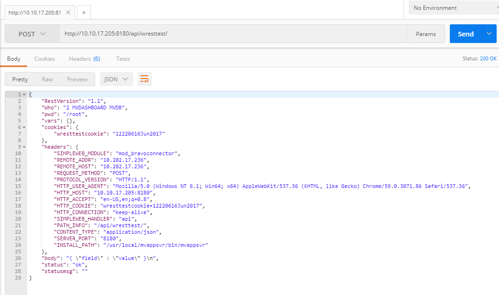
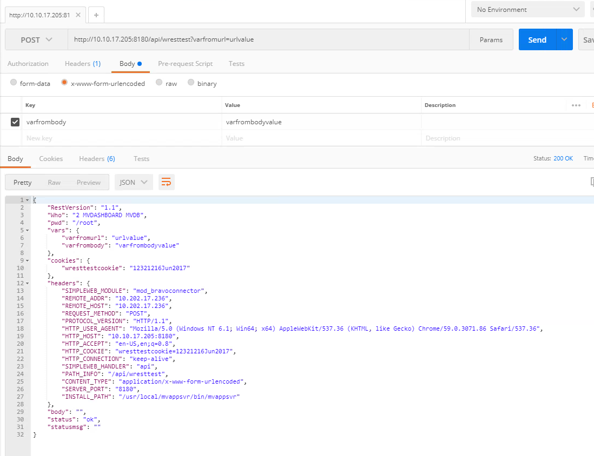
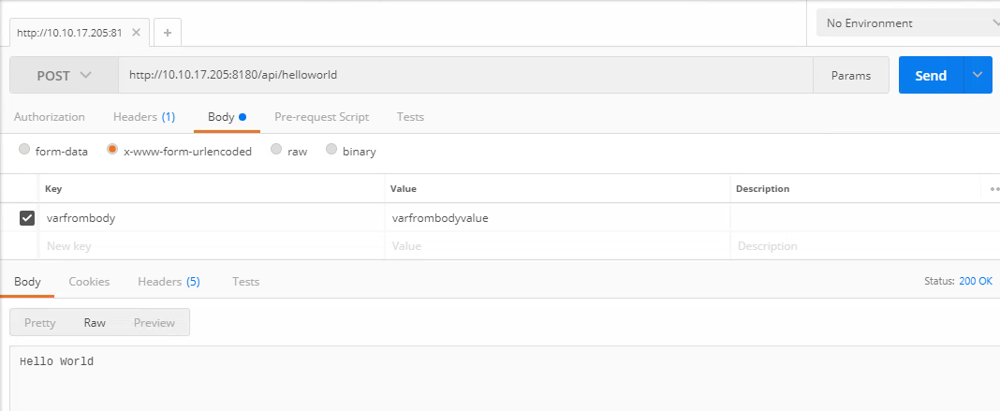

# Get Started

<PageHeader />

**Created At:** 6/20/2017 4:12:39 PM  
**Updated At:** 11/23/2019 12:41:42 AM  
**Original Doc:** [get-started-with-mv-connect](https://docs.zumasys.com/36307-mv-connect/get-started-with-mv-connect)  
**Original ID:** 260514  
**Internal:** No  


## Introduction

Once you have installed MVConnect you are ready to start developing.  MVConnect is a cross-platform Web/Rest platform.  The product includes two main components:

1. A small web server that runs directly on your Pick box.  This is a non-Pick program that listens for web requests and transfers that call into Pick.  Since jBASE 5.6, RESTful Services have been built into jAgent.  On other platforms and prior to jBASE 5.6, we offer MVAppsvr which facilitates getting into Pick via the Pick executable.  Both of these front end web servers are configured a little differently.  Look here for documentation on how to configure MVAppsvr while this [link](https://docs.jbase.com/30312-jagent/introduction-to-jagent "jAgent documentation") describes how to setup jAgent.
2. Pick side library for doing web work.  These library pieces are the same for all versions of Pick.  This allows you to write Web and Rest applications that can easily move to different versions of Pick.


### Info

If you are using jBASE/jAgent then MVConnect and all it's API's are available in any account you are working on.  This is because all the MVConnect API's are included with the core jBASE libraries.  There is no need to set up an account.


## **MV Connect/MVAppsvr**

If you are using MVConnect with MVAppsvr then by default MVConnect installs an MVDB account and that is where your MVConnect code must run from.  You can add Q-pointers from that account to any other accounts you need access to.  MVConnect also will support LOGTO operations (see below) to allow you to switch to other accounts if needed.  This feature is dependent on the MV platform's capabilities here. In advanced setups, MVConnect can be configured to run from existing accounts.


## MV Connect REST API Library

The MVConnect Rest API library is a series of subroutines to work with the web call.  These are the normal functions you would see in other languages, such as working with headers, the body, form vars, return codes, etc.

Click [here](./../mvconnect-api) for MVConnect Rest API Library


## Testing Connectivity with wresttest

A default testing REST service is supplied called wresttest to allow you to test connectivity.  It is recommended you use POSTMAN to test your REST Functions.  POSTMAN is free and is available on Windows and Linux at this [link](https://www.getpostman.com/).

Open up POSTMAN and enter the URL to your Server.  In the example below replace 10.10.17.205 with the IP of your server.  MVConnect is by default installed at port 8180.


This test service grabs some information from your system and outputs it in JSON format.  Many of the functions are Unix specific, therefore if you are on a Windows machine some of the responses will be blank.

The important fields are


| <!----> | <!----> |
| --- | --- |
| Who | What line the Connector processed the request on.   |
| vars | This is a list of vars.  This will include any vars sent on the URL bar plus any x-www-form-urlencoded data |
| headers | This is headers sent by the client.  The MVConnector will limit the headers sent.  If you wish to send more headers to look at the MVConnector config file and add the header name. |
| body | When the post is not x-www-form-urlencoded, the raw body will be sent. |


## Example of Sending REST Data

To send REST Data

Switch the action to POST


Click on the body, change data to raw, adjust output to JSON (application/JSON) and then enter your JSON into the body.


Hit the send button and your raw JSON will now be in the body tag.  Notice also that the CONTENT\_TYPE switched to application/JSON.



You can also test sending form vars the same way.  Go back to Body and change to x-www-form-urlencoding.  You can enter a var directly into the URL bar and/or add items in the key/value area.  The URL bar will always work no matter the encoding.  The MVConnect does not support form-data encoding.

In the vars area, you will see you passed variables.



You are now ready to build your first Application.

First, log into the MVDB account.  First, we will build our first "Hello World" application.

Create a BP file to create your program. This will be platform-specific.  Once you have a BP file create a program as follows

HELLOWORLD

```
CALL WSEND("Hello World")
```

Compile and Catalog your program.  By default, if you are on D3 all the programs are not Flash Compiled.  Therefore do not Flash Compile this program.

We are now ready to expose this program as an API.  The WDB.RESOURCE file is where we store our API Catalog.

```
ED WDB.RESOURCE API*HELLOWORLD
001 P 
002 Hello World 
003 HELLOWORLD 
004  
005 1 
006 1
```

Now go back to POSTMAN and call your program.  Because we just spit out the straight text you need to click on the RAW output button (postman by default expects JSON).



Now lets make it interactive. Change your HELLOWORLD program as follows.

```
001 CALL WSETCONTENTTYPE("application/json") 
002 CALL WGETVAR(NAME,"name") 
003 JSON=\{ "response": "Hello \:NAME:\" }\ 
004 CALL WSEND(JSON)
```

Adjust the POSTMAN configuration as below and resend


You have now created a simple RESTful function.  You can call this function now from any language that supports http calls.  On the top right of POSTMAN you will see a code button.  Click on that button and you can get actual code examples for different languages.

For example here is code for PHP


## Run MV Connect in a Different Account

While it is generally recommended to run your REST service handlers from the MVDB account, it is possible to LOGTO a different account to run the handler program. The name of the account must be configured in the [WDB.RESOURCE](./../../../jbase/jagent/apis/wdb.resource) file. In addition, the target account requires several q-pointers and cataloged programs:


| <!----> | <!----> |
| --- | --- |
| WBPD<br> | contains INCLUDE files, not needed at runtime |
| WREST.BP | catalog all items in target account |
| WOBJ.BP | catalog all items in target account if JSON parser needed |


