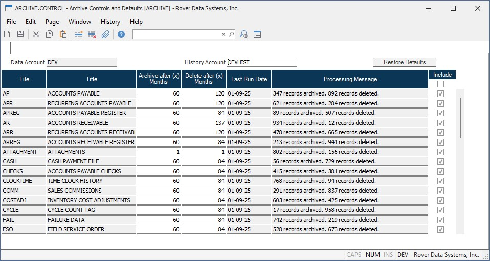

##  Archival Settings (ARCHIVE.CONTROL)

<PageHeader />

##

**Data Account** Enter the name of the data account for which archival and purge settings are being defined. This field is automatically populated and identifies the account containing the operational data files.

**History Account** Enter the name of the history account correlated to the data account. This field is automatically populated and identifies the account where archived records will be stored. If the account does not exist, it will be created and configured upon saving the settings.

**Restore Defaults** Click this button to restore the default archival and purge settings for all files in the account.

**File** Displays the name of the data file for which archival and purge settings are being defined. Each row represents a different file in the system.

**Title** Displays the descriptive title or full name of the associated file.

**Archive after (x) Months** Enter the number of months after which records in this file should be archived to the history account. Records older than the specified number of months will be moved from the data account to the history account when the archival and purge process (ARCHIVE.P1) is executed. Enter 0 to disable archiving for this file.

**Delete after (x) Months** Enter the number of months after which records in this file should be permanently deleted from the history account. Records older than the specified number of months will be removed from the history account when the archival and purge process (ARCHIVE.P1) is executed. This value should typically be greater than the archive threshold to ensure records are archived before deletion. Enter 0 to disable automatic deletion for this file.

**Last Run Date** Displays the date when the archival or purge process was last executed for this file. This field is automatically updated by the ARCHIVE.P1 procedure.

**Processing Message** Displays the results of the last archival or purge operation for this file, including the number of records archived and deleted. This provides a quick summary of the most recent processing activity.

**Include** Check this box to include the file in the archival and purge process. Uncheck the box to exclude the file from automatic archival operations, even if archive and delete thresholds are specified.  
  
  
<badge text= "Version 2025.11.21" vertical="middle" />

<PageFooter />