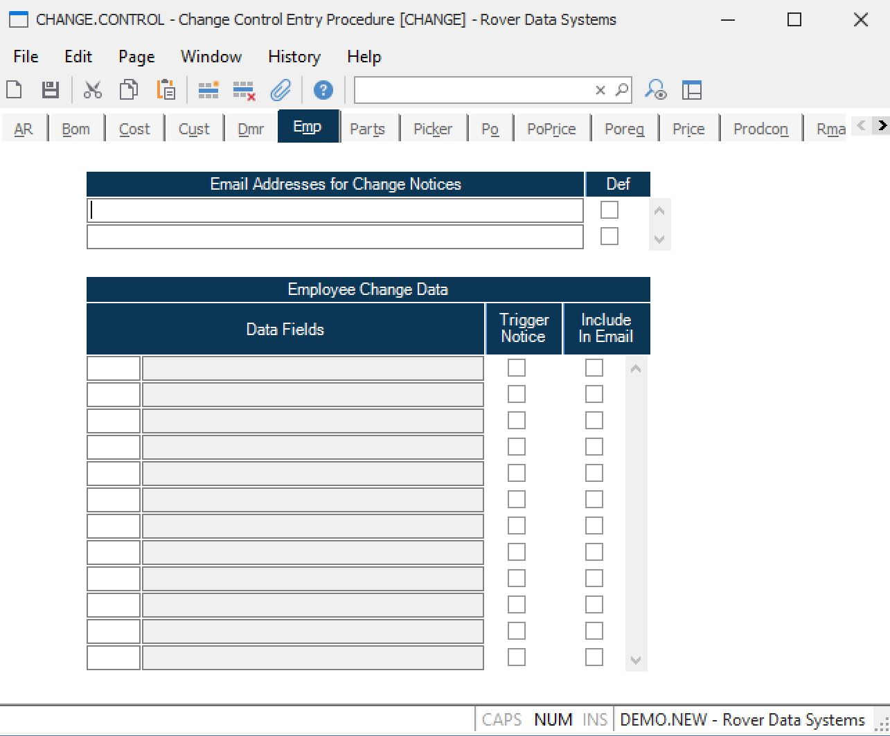

##  Change Control Entry Procedure (CHANGE.CONTROL)

<PageHeader />

##  Emp

**Email Address** Enter the email addresses that will be sent a change notice.
The email addresses will appear in a list when the employee record is saved.
They can optionally be selected or not at that time. The default selection is
controlled with the next field.  
  
**Default Email** When an EMP record is filed and a change notice is
triggered, then the email addresses will appear in a list to optionally be
sent the notice. This field controls whether this email address is always
defaulted to send a notice.  
  
**Emp Field Number** This is the field number in the EMP file. Use the help
option to load in selected fields that when changed will cause a change notice
to be sent and/or will appear on the change notice itself. The fields that
trigger a change notice will also be maintained in an employee change history
log.  
  
**Cust Field Name** This is the field name corresponding with the field number
entered/selected.  
  
**Trigger Change Notice?** If checked, then a change to this field on an
employee record will cause a change notice to be sent and employee history
data to be stored indicating what changed.  
  
**Include in Change Notice?** If checked, then this data will be included in
the change notice. By default, any data field that triggers a change
notice/change history will be included in any email sent.  
  
  
<badge text= "Version 8.10.57" vertical="middle" />

<PageFooter />