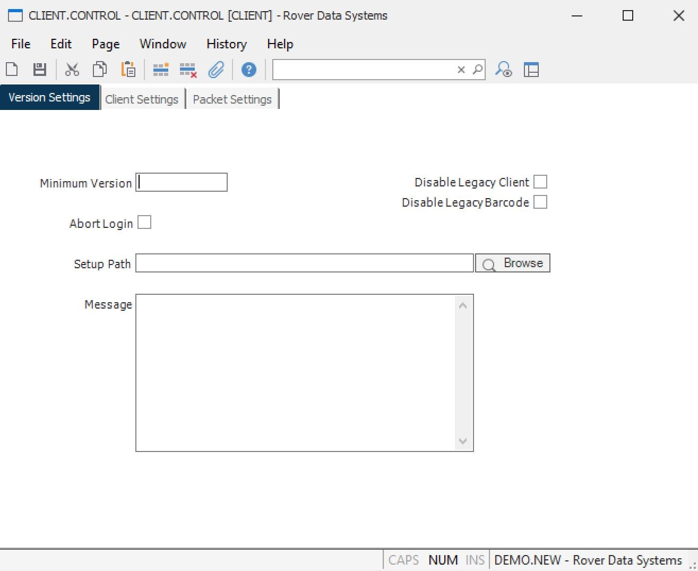

##  CLIENT.CONTROL (CLIENT.CONTROL)

<PageHeader />

##  Version

**Control ID** Automatically loaded with the text "CLIENT". No user entry is
allowed.  
  
**Version** Enter each version of the client for which an action and/or
notification is to be presented.  
  
**Abort** Check this box if the login is to be aborted when the comparison is
true. If an entry is present in the Setup Path field the user will be given
the option to run the client setup or abort the login without running the
setup.  
  
**Setup Path** If the version test does not pass and you want the user to be
prompted to install the client, enter the path to the client setup.exe.  
  
**Browse** Click this button to display a file browser to select the path to
the M3Client setup program.  
  
**Message** Enter the message that is to be displayed when the associated
comparison is true. A message box will not be displayed if this field is
blank.  
  
  
<badge text= "Version 8.10.57" vertical="middle" />

<PageFooter />