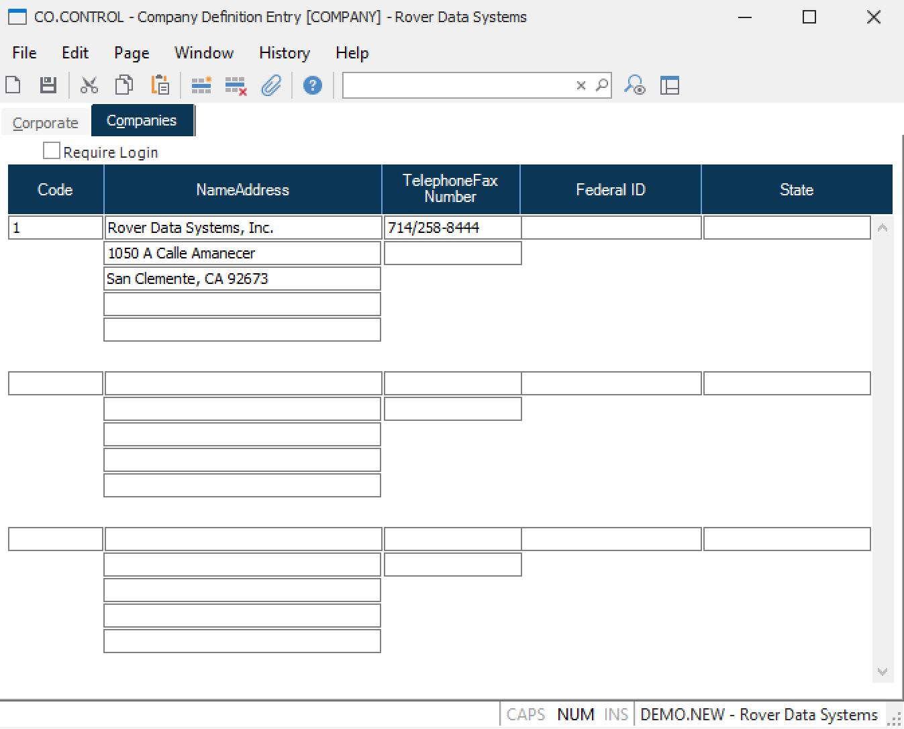

##  Company Definition Entry (CO.CONTROL)

<PageHeader />

##  Companies

**Require Login** Check this box if the user is required to log into a
specific company code before it may be used.  
  
**Code** Enter the codes for each company to be tracked.  
  
**Name** Enter the name of the company identified by the associated code.  
  
**Address** Enter the address of the company idenitifed by the associated
code.  
  
**Telephone** Enter the telephone number for the associated company.  
  
**Fax Number** Enter the fax number for the associated company.  
  
**Federal ID** Enter the federal ID associated with the company.  
  
**State** Enter the state of the associated company.  
  
  
<badge text= "Version 8.10.57" vertical="middle" />

<PageFooter />