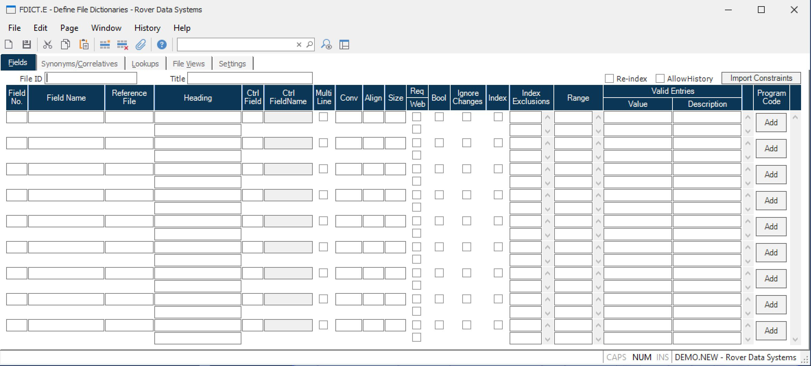

##  Define File Dictionaries (FDICT.E)

<PageHeader />

##  Fields

**File Name** Enter the name of the file for which you are building a
dictionary.  
  
**File Title** Enter the title that describes the file. For example, a file
named SO might have the title Sales  
Order.  
  
**Re-index** Check this box if you want to re-index any fields that were
previously flagged as being indexed. Note: It is not necessary to check this
box for new indexes you have just checked. These will be created regardless of
the setting of this check box.  
  
**Create SQL** Check this box if you want the SQL tables to be created. The
procedure will build the table definition using the SQL-CREATE-TABLE command.  
  
**Field Number** Enter the field number (position e.g. 1).  
  
**Field Name** Enter the ID for this dictionary field (e.g. CUST.NAME)  
  
**Reference File** Enter name of the master file against which the data
entered in this field would normally be validated. Any lookups defined for the
master file will be made available in the right click menu of this field. For
example, if the field being defined is a part number and it will be a
reference to a record in the parts file, then enter PARTS.  
  
**Column Heading Description** Enter the description (column heading).  
  
**Control Field** If the field is a member of a data association, enter the
field number of the controlling field of  
the association. If the field is part of a sub-association, it should
reference the controlling field  
of the sub-association which in turn references the controlling field of the
higher level  
association.  
  
**Control Name** This field displays the name of the controlling field if one
has been defined. This field is for  
reference only and may not be changed.  
  
**Multi Line** Check this box if this is a multi-line field.  
  
**Conversion** Enter the conversion for this field (e.g. D2-)  
  
**Align** Enter the alignment that should be used when sorting based on this
field.  
  
**Length** Enter the field length.  
  
**Index** To obtain better performance on certain reports and lookups you can
enable an index for a field. Check this box if you want an index created for
the associated field. Maintaining indexes involves some amount of overhead for
the system, so be selective in choosing which fields are to be indexed.  
  
**SQL** Check this box if the associated field is to be included when an SQL
table is created for the file.  
  
  
<badge text= "Version 8.10.57" vertical="middle" />

<PageFooter />