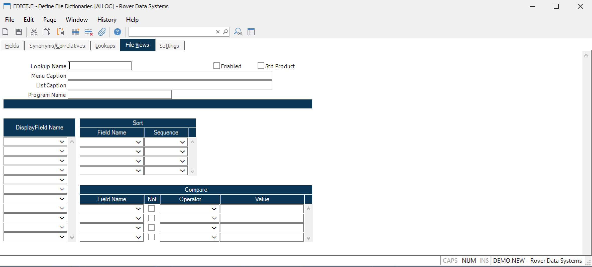

##  Define File Dictionaries (FDICT.E)

<PageHeader />

##  File Views

**Drill Down Name** Enter a name to define the drill down. This entry is not
displayed in the actual drill down dialog box or the pull down menu.  
  
**Menu Caption** Enter the text that is to appear on the pull down menu.  
  
**List Caption** Enter the text that is to appear in the title bar of the
selection list box.  
  
**Program Name** If this drill down is to be executed by a program then enter
the name of the program that is to perform the drill down in this field. If a
program name is entered, the lookup definitions in the subsequent prompts will
be ignored. The program must be a subroutine with one argument which will be
loaded with the existing data value contained in the field from which the
drill down has been activated. The calling program should return the data
value to be loaded into the field in the same argument.  
  
**Enabled** You may specify that the drill down is to be included by checking
this box. If the box is not checked then the drill down will not appear as one
of the options in the right-click menu. This flag is useful in cases where you
want to disable a lookup, such as a standard product drill down, without
deleting the information.  
  
**Std Product** Check this box if this drill down is delivered as part of the
standard product. If you are defining a custom drill down then do not check
this box. You should NOT change the flag on a standard drill down from "Y" to
"N".  
  
**Display Field** Enter the name of each field (column) to be shown on the
drill down. The system will not limit the number of columns you define, so be
careful not to select more fields than will fit across the screen.  
  
**Sort Field** Enter each of the fields you want to use as a criteria for
sorting the data in the drill down. Sorting will be done in the order entered.  
  
**Sort Sequence** Enter the letter "A" to sort the associated field in
ascending sequence, or enter "D" for descending sequence. If no entry is made
the default of "A" is used.  
  
**Compare Field** Enter each of the fields to be compared to a value based on
the operator chosen. For example, if you specify that a field must be equal to
a value, then only items equal to that value will be included in the drill
down.  
  
**Compare Operation** Enter the operator to be used in the comparison. Options are:  
EQ - Equal To  
GT - Greater Than  
LT - Less Than  
GE - Greater Than or Equal To  
LE - Less Than or Equal To  
SW - Starting With  
EW - Ending With  
C - Containing  
NEQ - Not Equal To  
NGT - Not Greater Than  
NLT - Not Less Than  
NGE - Not Greater Than or Equal To  
NLE - Not Less Than or Equal To  
NSW - Not Starting With  
NEW - Not Ending With  
NC - Not  
  
**Compare Value** Enter the value that the associated field is to be compared
to. If you enter a question mark  
(?) in this field the user will be prompted to enter a value for use in the
comparison. The prompt displayed will use the name of the field associated
with the comparison unless you specify your own text. Do this by entering what
you want displayed as a prompt immediately following the question mark, no
spaces in between. Another option available for prompting the user is to place
an at sign (@) in the first character position followed by the name of a
program that is to be called (no spaces between the @ and the program name).
The program must have one argument which should be returned with the value to
be used in the comparison. This approach is useful in cases where you need to
resolve a name the user enters to obtain a customer or vendor number which can
be used in the comparison.  
  
  
<badge text= "Version 8.10.57" vertical="middle" />

<PageFooter />