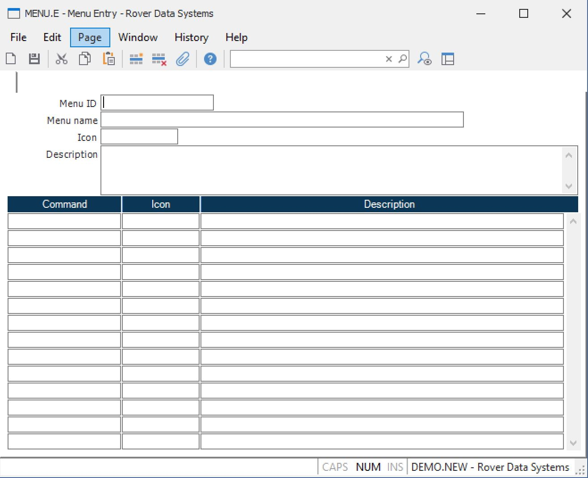

##  Menu Entry (MENU.E)

<PageHeader />

##

**Menu ID** Enter the record ID to be used in identifying this menu record.  
  
**Menu name** Enter a name which describes the contents of this menu and will
be displayed at the top of the menu.  
  
**Menu Icon** Enter the icon, from the the right click menu of valid entries,
to be displayed with the associated item.  
  
**Menu Desc** Enter the text that is to appear in the details section of the
browser when this menu is being displayed.  
  
**Command** Enter the command name to be executed when this menu item is
selected.  
  
**Command Icon** Enter the name of the icon to be displayed with the
associated command.  
  
**Description** Enter a description of the command that will be executed when
this menu item is selected.  
  
  
<badge text= "Version 8.10.57" vertical="middle" />

<PageFooter />