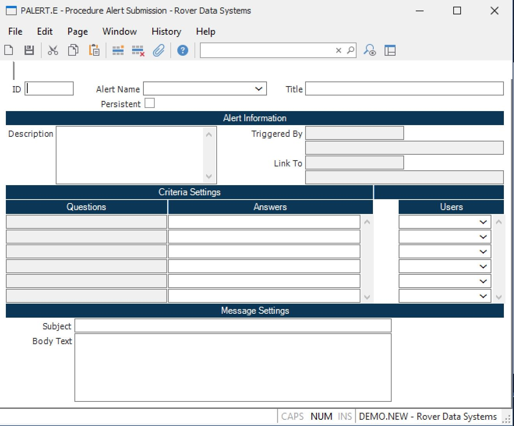

##  Procedure Alert Submission (PALERT.E)

<PageHeader />

##

**PALERT ID** This field contains the record ID to the alert. You may change
or delete an existing procedure alert by entering the ID in this field. If
left blank a number will be assigned when the record is filed.  
  
**Alert Name** Select the alert definition that is to be used.  
  
**Title** Displays the title of the alert.  
  
**Persistent** Check this box if the alert should remain in place after it has
been triggered. If not checked the alert will be removed after being triggered
the first time. For example, if the alert is setup to inform you when a
particular purchase order is received you probably wouldn't check this box
because it's most likely a one time event. If the alert was setup to inform a
user anytime an item with a shortage was received you would want to check this
box so that it will continually inform the user when shortages arrive.  
  
**Description** Displays a description of the alert.  
  
**Triggered By** Displays the name of the file or procedure that triggers the
alert.  
  
**Triggered By** Displays the name of the file or procedure that triggers the
alert.  
  
**Link To** Displays the name of the procedure link that will appear in the
alert sent to the user.  
  
**Link To** Displays the title of the associated procedure link.  
  
**Question** Displays the prompts requesting information from the user.  
  
**Answer** Enter an appropriate response to each of the associated questions.  
  
**Users** Select the login ids of all the users that are to receive the alert.  
  
**Message Subject** Enter the text that is to appear in the subject area of
the message generated by the alert. You may embed information from the data
records (A$RECORD and A$PROMPT) within the text be entering &#nn for data in
A$RECORD where nn is the field number, and &#Tnn for data in A$PROMPT, and
&#Onn for data in the original A$RECORD. If the text following the data
information is anything other than a space you must append another & to the
end of the data information. For example, &#12,1,2&. You also extract the
values entered by the user from the user prompt section by specifying &#Pn
were n is the number representing which prompt in the sequence you want to
use. You may also specify an indirect reference to data in another file. For
example, suppose you were creating an alert based on the AP file and wanted to
extract the vendor's name. Since the AP file does not contain the vendor's
name you must translate it from the VENDOR file using the following syntax
&#<VENDOR,1,&#1> where VENDOR is the name of the file,  1 is the field in
the vendor record to be extracted and &#1 is the data in field number 1 of the
AP record (vendor id). </TD> </TR> <TR> <TD valign="top"
width="155"><b>BodyText</b></TD><TD width="490">Enter the text that is to
appear in the body of the message generated by the alert. You may embed
information from the data records (A$RECORD and A$PROMPT) within the text by
entering &#nn for data in A$RECORD where nn is the field number, and &#Tnn for
data in A$PROMPT, &#nn for data in the original A$RECORD. If the text
following the data information is anything other than a space you must append
another & to the end of the data information. For example, &#12,1,2&. You also
extract the values entered by the user from the user prompt section by
specifying &#Pn were n is the number representing which prompt in the sequence
you want to use. You may also specify an indirect reference to data in another
file. For example, suppose you were creating an alert based on the AP file and
wanted to extract the vendor's name. Since the AP file does not contain the
vendor's name you must translate it from the VENDOR file using the following
syntax &#<VENDOR,1,&#1> where VENDOR is the name of the file, 1 is the
fie ld in the vendor record to be extracted and &#1 is the data in field
number 1 of the AP record (vendor id). </TD> </TR> </TABLE> 
<a href="PALERT-E.htm">Previous</A> </TD> </TABLE> </TD> </TR>
<badge text= "Systems, Inc. All" vertical="middle" />

<PageFooter />