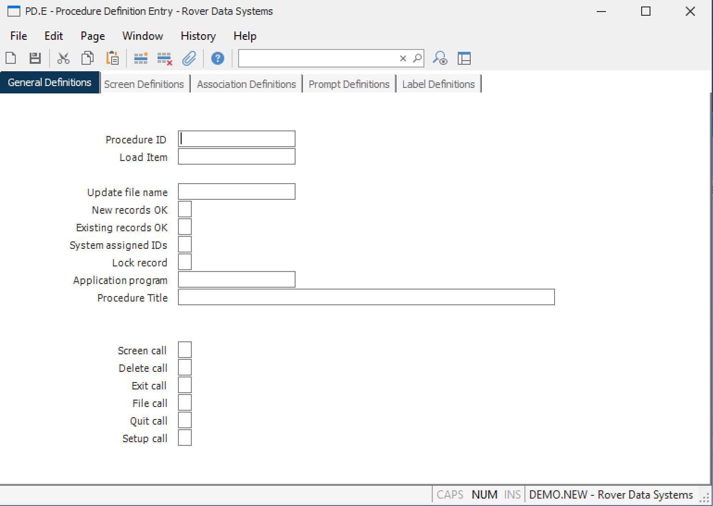

##  Procedure Definition Entry (PD.E)

<PageHeader />

##  General Definitions

**Procedure ID** Enter the name of the procedure you wish to create or update.  
  
**Load Item** If you want to load an existing procedure definition, enter the
name of the procedure here.  
  
**Update file name** Enter the name of the file whose records are updated by
this procedure. A file name is not required if you are creating a procedure
which uses only temporary fields.  
  
**New records OK** Enter Y if new records may be accessed by this procedure.
Otherwise enter N or null.  
  
**Existing records OK** Enter a Y if existing records may be updated by this
procedure. Otherwise enter N or null.  
  
**System assigned IDs** Enter a Y if record IDs on new records will be
assigned by the application program. Otherwise enter N or null.  
  
**Lock record** Enter a Y if the update record accessed by this procedure
should be locked. Otherwise enter N or null.  
  
**Application program** Enter the name of the application program to be called
by this procedure. (optional)  
  
**Procedure Title** Enter the title that is to appear at the top of the form.  
  
**Screen call** Enter a Y if the application program is to be called when the
screen option is selected at the command line.  
  
**Delete call** Enter a Y if the application program is to be called when the
delete option is selected from the command line.  
  
**Exit call** Enter a Y if the application program is to be called when the
exit option is selected from the command line.  
  
**File call** Enter a Y if the application program is to be called when the
file option is selected from the command line.  
  
**Quit call** Enter a Y if the application program is to be called when the
quit option is selected from the command line.  
  
**Setup call** Enter a Y if the application program is to be called when the
procedure is first started.  
  
  
<badge text= "Version 8.10.57" vertical="middle" />

<PageFooter />