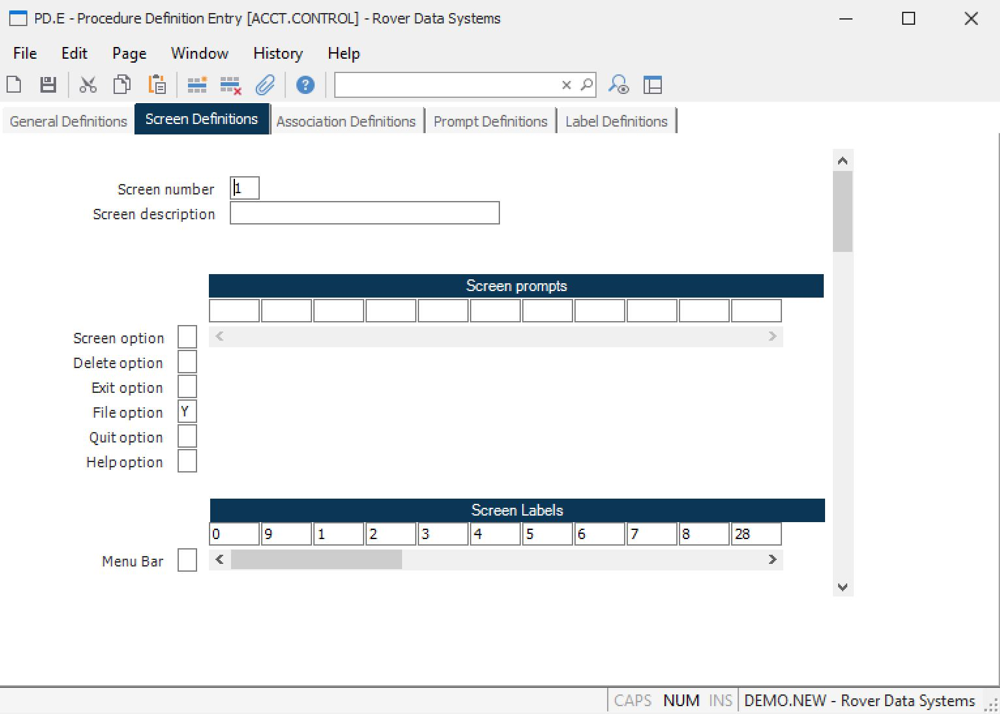

##  Procedure Definition Entry (PD.E)

<PageHeader />

##  Screen Definitions

**Screen number** Enter the number of the screen you wish to define or change.
This is a reference number only. The actual procedure will refer to each
screen as a sequential number in the order they are entered. For consistency
it is recommended that the numbers be entered in sequence.  
  
**Screen description** Enter the description of the screen you are currently
defining. This definition is presented to the user when the branch option is
selected from the command line.  
  
**Screen option** Enter a Y if the screen option is to be included on the
command line for this screen.  
  
**Delete option** Enter a Y if the delete option is to be included on the
command line for the screen.  
  
**Exit option** Enter a Y if the exit option is to be included in the command
line for this screen.  
  
**File option** Enter a Y if the file option is to be included in the command
line for this screen.  
  
**Quit option** Enter a Y if the quit option is to be included in the command
line for this screen.  
  
**Help option** Enter a Y if the help option is to be included in the command
line for this screen.  
  
**Before command call** Enter a Y if the application program is to be called
just prior to display of the command line for this screen.  
  
**Screen prompts** Enter the numbers of all the update record and temporary
fields in the order they are to be prompted. 0 must be the first entry on the
first screen.  
  
**Screen Labels** Enter name of each label that appears on this screen.  
  
  
<badge text= "Version 8.10.57" vertical="middle" />

<PageFooter />