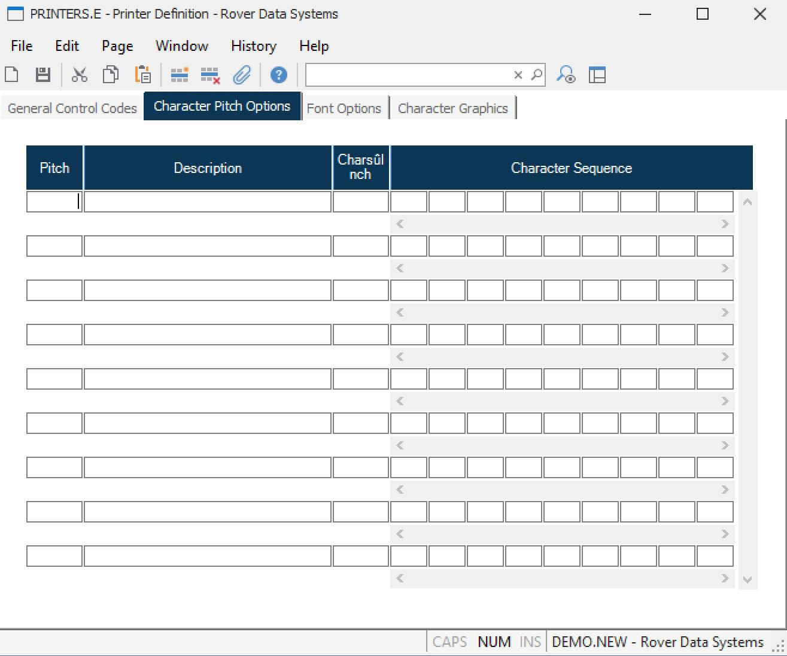

##  Printer Definition (PRINTERS.E)

<PageHeader />

##  Character Pitch Options

**Pitch#** This field contains a sequential number assigned to each available
pitch setting. It should be sequential.  
  
**Pitch Name** Contains the name of the associated pitch size.  
  
**Chars Per Inch** Contains the number of characters per inch which are
printing in the associated pitch.  
  
**Character Sequence Numbers** Enter the decimal numbers which define each of
the ASCII characters to be transmitted to  
the printer to set it to the associated pitch.  
  
  
<badge text= "Version 8.10.57" vertical="middle" />

<PageFooter />