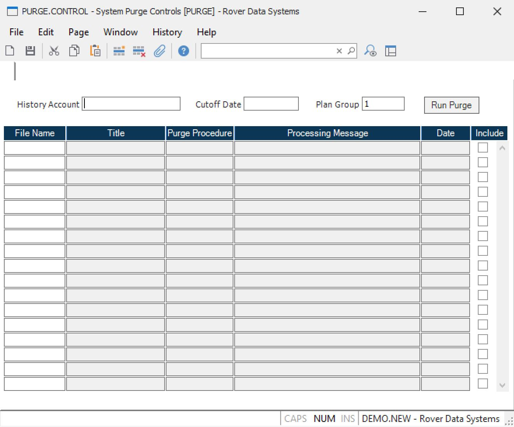

##  System Purge Controls (PURGE.CONTROL)

<PageHeader />

##

** ** The ID "PURGE" is automatically entered and is the only vaild ID for
this procedure.  
  
**History Account** Enter the name of the history account to which the purged
records will be written. This is an optional entry and must exist as a valid
account name.  
  
**Cutoff Date** Enter a cutoff date to be used to run purges for the files
listed below. This date will be retained for reference if the purge(s)
actually were run ("Run Purge" button was pressed.), otherwise it will remain
as it was before entry.  
  
**File Name** Enter the file name which is to be purged with this process or
which is allowed to be purged using the associated purge procedure directly.
Any file not listed here will not be allowed to be purged using the individual
purge procedures.  
  
**Procedure Name** This is the procedure name that will execute the purge for
the associated file. It is for reference only and cannot be changed.  
  
**Message** This is a processing message that will be displayed when the purge
is actually being run to give a status of the purge.  
  
**Purge this file** Check here if you want the associated file to be included
in the current purge run. This is only used in this procedure if the "Run
Purge" button is pressed.  
  
**Process Date** This is the date when the purge was actually run.  
  
**Title** The title of the associated file name.  
  
**Run Purge** Press this button if you want to execute the purge procedures
for the files listed below that are checked for inclusion in this run.  
  
**Plan Group** Enter the plan group which is only needed for running purges
for ID, MS, PB, and SF files.  
  
  
<badge text= "Version 8.10.57" vertical="middle" />

<PageFooter />