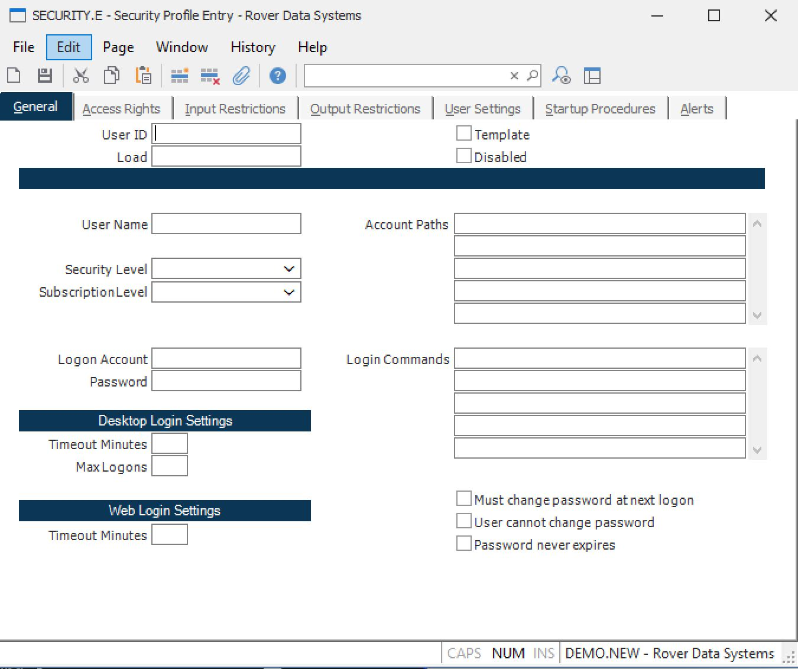

##  Security Profile Entry (SECURITY.E)

<PageHeader />

##  General

**User Id** Enter the identification that will be used to log into the system.  
  
**Load** You may load the contents of an existing security profile by entering
the user ID you wish to load from in this field. All existing data in the
record will be replaced with the item selected.  
  
**Template** Check this box if the security profile being defined is for use
as a template to create other profiles. This prevents a user login from being
created.  
  
**Disabled** Check this box if you want this account disabled to prevent the
user from logging on.  
  
**User Name** Enter the users full name.  
  
**Security Level** Identify the user security level in this field from the
following options:  
  
User  
General user with acces only to commands specified on the Access Rights page.
This is the most common setting. Note: Access is only restricted in those
accounts (databases) that have been defined as secured in the ACCOUNT.CONTROL
procedure. Be sure to secure accounts as appropriate.  
  
Administrator  
Unrestricted access to all commmands.  
  
Programmer  
Unrestricted access to all commands but placed at terminal control level upon
exit from menu.  
  
**Logon Account** If the user is to be automatically directed to a specific
account name upon login, enter the name of the account here.  
  
**Password** Enter the password required when logging in with the user id.
This field will contain an asterisk (*) if there is an existing password. If
there is no asterisk then there is no password defined. If you leave the
asterisk in this field when you save the record the existing password will
remain in effect. To remove the password delete the asterisk. To change the
password overwrite the asterisk with the new password.  
  
**Timeout Minutes** You may setup an automatic timeout by specifying the
number minutes that elapse without user interaction. If the user is logged in
and no activity has occured for the number of minutes specified the user will
be automatically logged out. Leave this field blank if no timeout is desired.  
  
**Max Logons** You may limit the number of concurrent logons the user can have
by entering the maximum number allowed in this field. Leave this field blank
if there is no limit.  
  
**Must Change Password** Check this box if the user is required to change the
password the next time they log in.  
  
**User Cannot Change Password** Check this box if the user is not allowed to
change their password.  
  
**Password Never Expires** Check this box if the password never expires.  
  
  
<badge text= "Version 8.10.57" vertical="middle" />

<PageFooter />