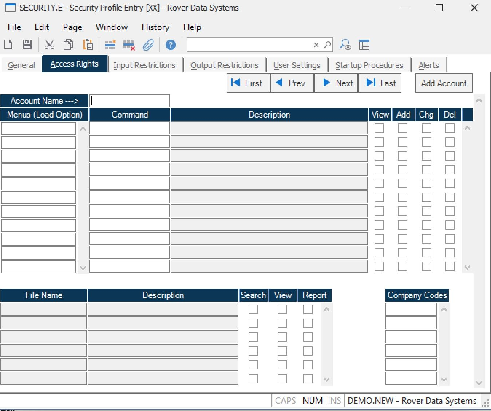

##  Security Profile Entry (SECURITY.E)

<PageHeader />

##  Access Rights

**Account Name** Enter the name of each account the user will be permitted to
access.  
  
**Menus** You may load groups of commands by entering the names of the menus
containing those commands in this field. The right click menu provides an
option for listing the menus.  
  
**Command** Enter the name of each command or menu name to which the user is
to be granted access. Groups of commands can be loaded automatically by
specifying the names of menus in the Menus field.  
  
**Description** Displays the description associated with the command or menu
specified.  
  
**View** Check this box if the user is allowed to execute the associated
command.  
  
**Add** Check this box if the user is allowed to add new records with the
associated command. Note: Some procedures may not allow additions regardless
of the setting defined here.  
  
**Chg** Check this box if the user is allowed to change existing records with
the associated command. Note: Some procedures may not allow changes regardless
of the setting defined here.  
  
**Delete** Check this box if the user is allowed to delete existing records
with the associated command. Note: Some procedures may not allow deletions
regardless of the setting defined here.  
  
**File Name** Enter the name of each file for which the user will be allowed
to to use query tools such as REPORT.E.  
  
**File Description** Displays the description of the associated file.  
  
**Search** If the user is allowed to use the search functions of the
associated file. Lookups are available within the data search option in the
browser and from the right click menus on fields that contain the key to a
file. This check box only controls the lookups available to the user directly
from the browser. If a user has been granted access to a procedure then any
lookups available from within that procedure are available to the user.  
  
**View** Check this box if the user is permitted to access the file views
associated with the file. File views are available within the data search
option in the browser and from the right click menus on fields that contain
the key to a file.  
  
**Report** Check this box if the user is allowed to access the associated file
for the purpose of generating reports through the report writer.  
  
**Company Code** If you are using company codes and require that users log
into a company code to use it then specify all of the company codes that are
valid for the user in the associated account.  
  
**First** Click this button to display the information for the first account
name.  
  
**Prev** Click this button to display the information for the previous account
name.  
  
**Next** Click this button to display the information for the next account
name.  
  
**Last** Click this button to display the information for the last account
name.  
  
**Add Account** Click this button to add a new account name.  
  
  
<badge text= "Version 8.10.57" vertical="middle" />

<PageFooter />