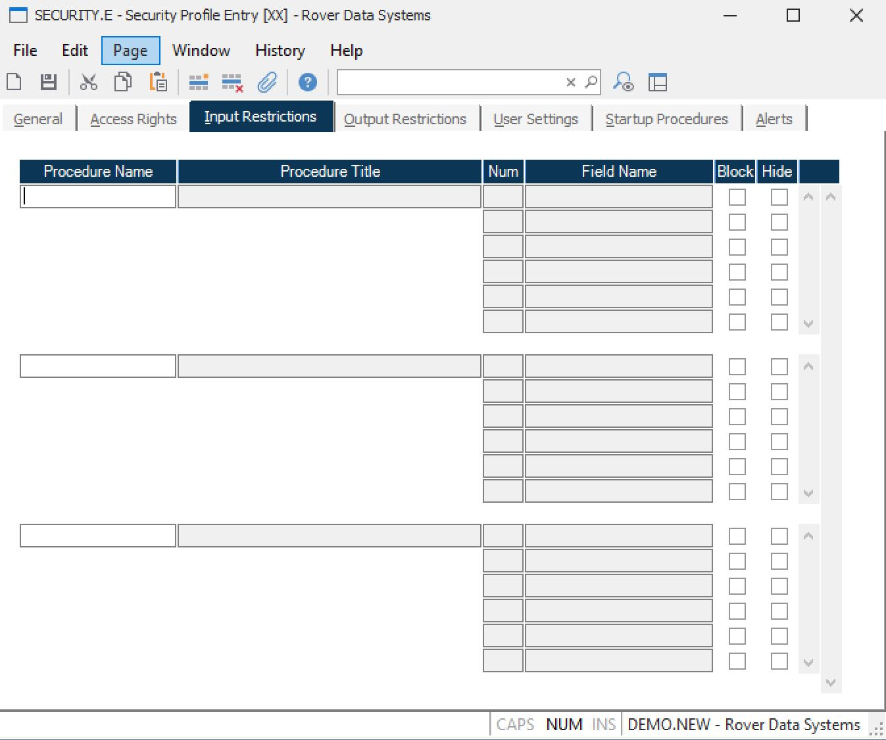

##  Security Profile Entry (SECURITY.E)

<PageHeader />

##  Input Restrictions

**Procedure Name** Enter the name of each procedure to which field update
restrictions are to be applied.  
  
**Procedure Title** Displays the title of the associated procedure.  
  
**Field Number** Displays each of the field numbers in the associated
procedure.  
  
**Field Name** Displays the name of each field in the associated procedure.  
  
**Block Field** Check the box associated with each field where changes are not
to be allowed by the user.  
  
**Hide** Check this box if you want the data hidden from the user. When a
field is hidden it is also assumed to be blocked from update, so there is no
need to check the Block checkbox.  
  
  
<badge text= "Version 8.10.57" vertical="middle" />

<PageFooter />