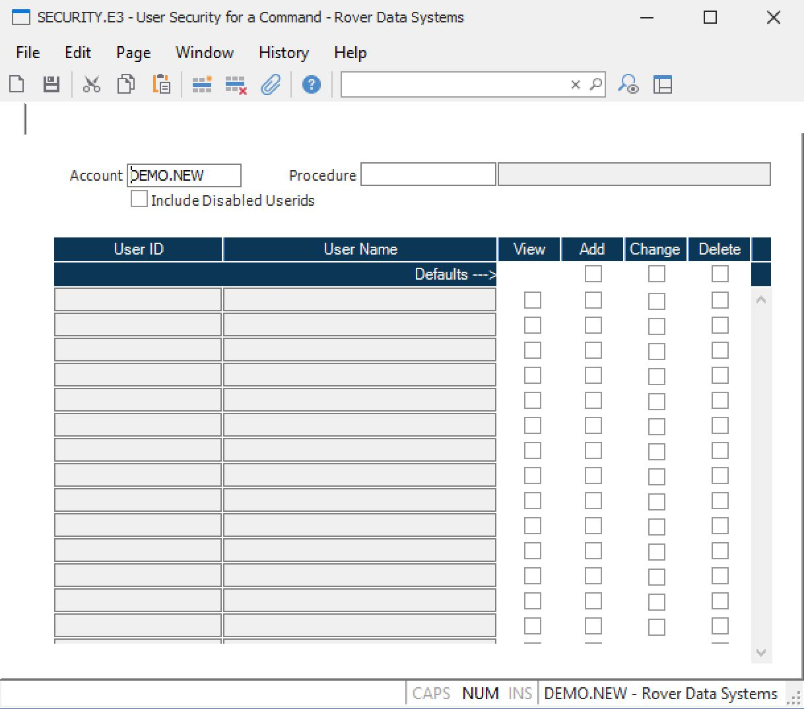

##  User Security for a Command (SECURITY.E3)

<PageHeader />

##

**Control ID**  
  
**Account** Enter the account name for which the security settings are to be
viewed or changed. The name of the current account will be loaded
automatically when the procedure is started. If a procedure name has already
been entered then all of the users will be loaded with their current access
rights, if any, to the procedure.  
  
**Procedure** Enter the name of the procedure whose user access is to be
viewed or changed. If an account name has already been entered then all of the
users will be loaded with their current access rights, if any, to the
procedure.  
  
**Procedure Title** Displays the title of the procedure.  
  
**Include Disabled** Check here if you want to include disabled userids in the
list.  
  
**Add Default** Indicates the default setting to be applied to the Add
checkbox for a user when the associated View check box is changed from
unchecked to checked.  
  
**Change Default** Indicates the default setting to be applied to the Change
checkbox for a user when the associated View check box is changed from
unchecked to checked.  
  
**Delete Default** Indicates the default setting to be applied to the Delete
checkbox for a user when the associated View check box is changed from
unchecked to checked.  
  
**User ID** This field is preloaded with all of the users in the system. You
may not change this field. You designate the type of access the user has to
the procedure by checking or unchecking the associated check boxes for View,
Add, Change, and Delete rights.  
  
**User Name** Displays the name of the user for the associated user id.  
  
**View** If this box is checked the user has the ability to view the
procedure. If you change the box from checked to unchecked the Add, Change and
Delete boxes are automatically unchecked. If changed from unchecked to checked
the default settings specified for Add, Change and Delete are applied to those
check boxes.  
Note: If view is not checked the Add, Change and Delete settings are all
ignored and treated as if they were not checked.  
  
**Add** If this box is checked the user has the ability to add new records
with the procedure.  
  
**Change** If this box is checked the user has the ability to change existing
records with the procedure.  
  
**Delete** If this box is checked the user has the ability to delete existing
records with the procedure.  
  
  
<badge text= "Version 8.10.57" vertical="middle" />

<PageFooter />