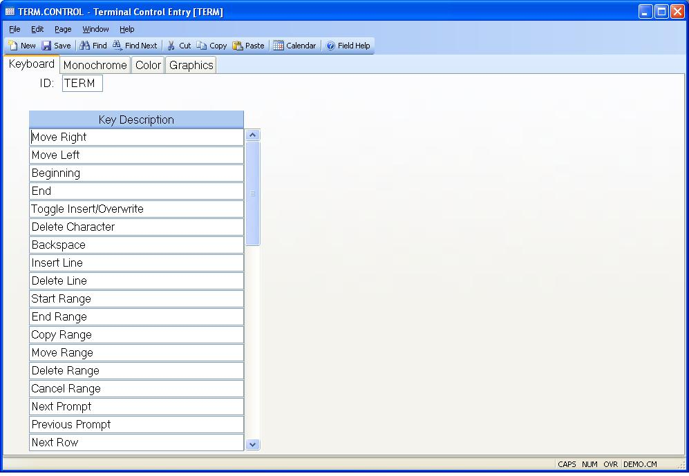

##  Terminal Control Entry (TERM.CONTROL)

<PageHeader />

##  Keyboard

**ID** Contians the word "TERM" which is always loaded as the key to this
record.  
  
**Key Description** Enter the description of the keyboard functions available.  
  
  
<badge text= "Version 8.10.57" vertical="middle" />

<PageFooter />