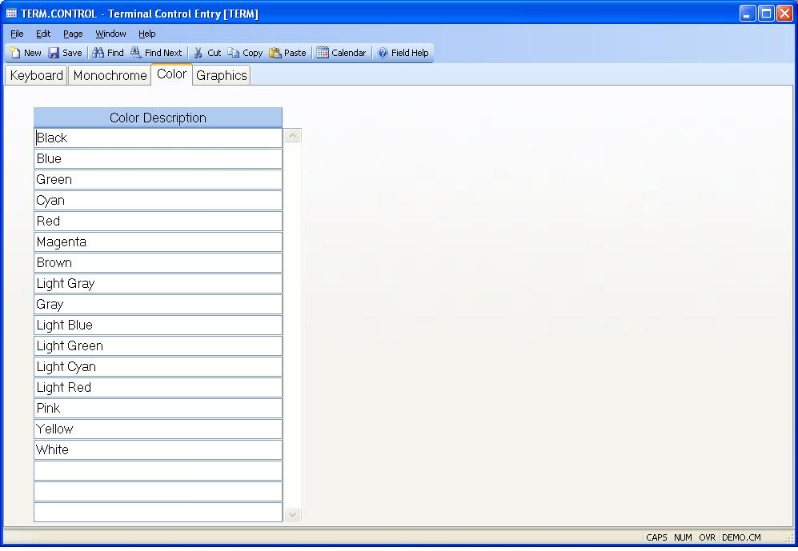

##  Terminal Control Entry (TERM.CONTROL)

<PageHeader />

##  Color

**Color Description** Enter the description of each color attribute that is
available to color terminals.  
  
  
<badge text= "Version 8.10.57" vertical="middle" />

<PageFooter />