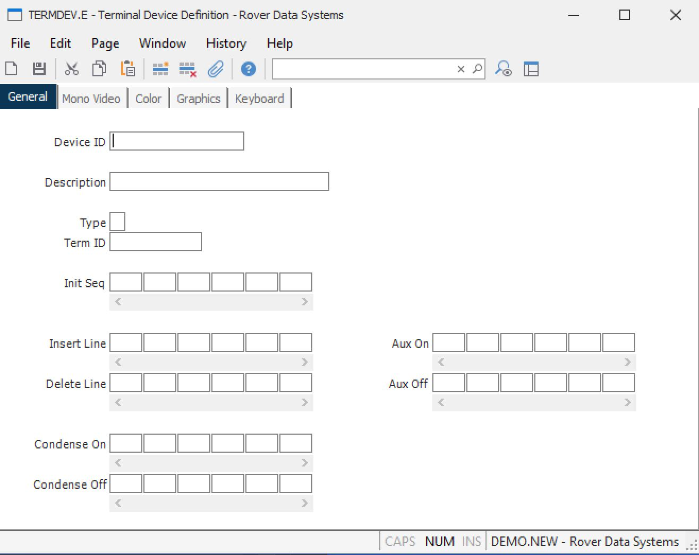

##  Terminal Device Definition (TERMDEV.E)

<PageHeader />

##  General

**Device ID** Enter the identification of the device you want to add to the
file, or change.  
  
**Description** Enter the description of the device being defined.  
  
**Type** Enter one of the following numbers to define the type of device being
defined.  
  
1\. Monochrome with imbedded video  
This defines a dumb terminal that has no  
color capability. Imbedded video indicates  
that video attributes use up a position on  
the screen.  
  
2\. Monochrome  
Same as number 1 except that the video  
attributes do not use up a space on the  
screen  
  
3\. Color  
Defines a device that has color capability  
such as a dumb terminal, or a personal  
computer running a character based terminal  
emulation program.  
  
4\. Graphical  
An intelligent work station with a graphical  
user interface such as Microsoft Windows,  
that has the ACE client software installed.  
  
**Term ID** The terminal ID used by the database manager to identify the
device.  
  
**Init Seq** Enter the decimal representation of the ASCII characters to be
transmitted to the work station upon initialization.  
  
**Insert Line** Enter the decimal representation of the ASCII characters that
will cause the device to insert a new line on the screen.  
  
**Delete Line** Enter the decimal representation of the ASCII characters that
will cause the device to delete a line on the screen.  
  
**Condense On** Enter the decimal representation of the ASCII characters that
will cause the device to condense the characters on the screen.  
  
**Condense Off** Enter the decimal representation of the ASCII characters that
will cause the device to return to a normal character pitch from condensed.  
  
**Aux On** Enter the decimal representation of the ASCII characters that will
cause the device to open the auxiliary port.  
  
**Aux Off** Enter the decimal representation of the ASCII characters that will
cause the device to close the auxiliary port.  
  
  
<badge text= "Version 8.10.57" vertical="middle" />

<PageFooter />