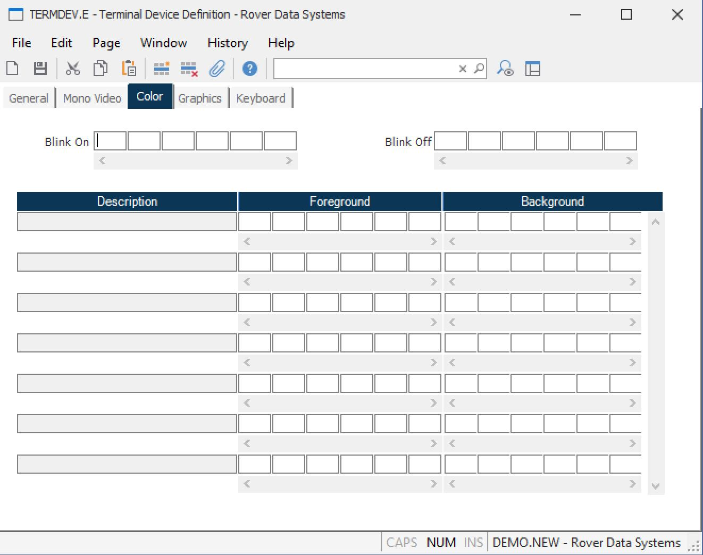

##  Terminal Device Definition (TERMDEV.E)

<PageHeader />

##  Color

**Blink On** Enter the decimal representation of the ASCII characters that
cause the screen to blink.  
  
**Blink Off** Enter the decimal representation of the ASCII characters that
cause the screen to stop blinking.  
  
**Description** Contains the description of the color that will appear on the
screen when the associated character sequence is transmitted.  
  
**ASCII Foreground** Enter the decimal representation of the ASCII characters
that produce the associated color  
in the foreground.  
  
**ASCII Background** Enter the decimal representation of the ASCII characters
that produce the associated color  
in the background.  
  
  
<badge text= "Version 8.10.57" vertical="middle" />

<PageFooter />