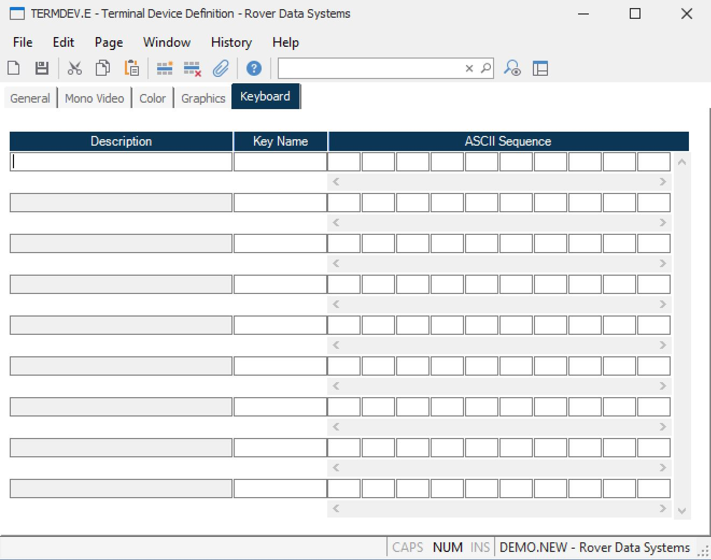

##  Terminal Device Definition (TERMDEV.E)

<PageHeader />

##  Keyboard

**Description** Contains the description of the function performed by the
associated key on the keyboard.  
  
**Key Name** Enter the identification for the key that performs the associated
function.  
  
**ASCII Trans. Chars.** Enter the decimal representation of the ASCII
characters that are transmitted to the host when the associated key is
pressed.  
  
  
<badge text= "Version 8.10.57" vertical="middle" />

<PageFooter />