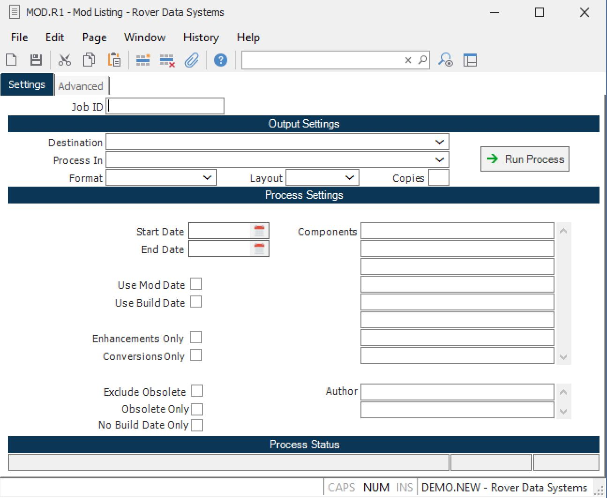

##  Mod Listing (MOD.R1)

<PageHeader />

##

**Job ID** Enter a unique ID if you wish to enter and save the parameters to
this procedure for future use. If you only need to run the procedure and do
not want to save your entry then you may leave this field empty.  
  
**Destination** Select the destination for the output from this procedure.  
  
**Process** Select the method to be used for processing the report. Foreground
is always available and must be used when output is directed to anything other
than a system printer (i.e. printers spooled through the database on the host
computer.) Depending on your setup there may be various batch process queues
available in the list that allow you to submit the job for processing in the
background or at a predefined time such as overnight. A system printer must be
specified when using these queues.  
  
**Format** Select the format for the output. The availability of other formats
depends on what is allowed by each procedure. Possible formats include Text,
Excel, Word, PDF, HTML, Comma delimited and Tab delimited.  
  
**Layout** You may indicate the layout of the printed page by specifying the
appropriate setting in this field. Set the value to Portrait if the page is to
be oriented with the shorter dimension (usually 8.5 inches) at the top or
Landscape if the longer dimension (usually 11 inches) is to be at the top.
Portrait will always be available but Landscape is dependent on the output
destination and may not be available in all cases.  
  
**Copies** Enter the number of copies to be printed.  
  
**Run Process** Click on the button to run the process. This performs the save
function which may also be activated by clicking the save button in the tool
bar or pressing the F9 key or Ctrl+S.  
  
**Start Date** Enter the start date for the range of Mod records you wish to
print. Leave this field null to print from the first record.  
  
**End Date** Enter the ending date for the range of Mod records you wish to
print.  
  
**Use Mod Date** Check this box to use the mod date against the date range
criteria.  
  
**Use Build Date** Check this box to use the build date against the date range
criteria.  
  
**Enhancements Only** Check this box if only mod records marked as
enhancements are to be included in the report.  
  
**Conversions Only** Check this box if only mod records with items marked as
conversions are to be included in the report.  
  
**Components** You may limit the records included in the report to those that contain specific software components. You would enter each item to include in this field. For example, if you wanted to include any records that referenced the FDICT record for the parts file you would enter "PARTS". For a procedure you would enter a procedure name such as [ PARTS.E ](../../../../../rover/AP-OVERVIEW/AP-ENTRY/ACCT-CONTROL/ACCT-CONTROL-1/ar-e/PARTS-E) . For a program you would enter a program name such as P$PARTSE.   
  
**Last Status Message** Contains the last status message generated by the
program.  
  
**Last Status Date** The date on which the last status message was generated.  
  
**Last Status Time** The time at which the last status message was generated.  
  
  
<badge text= "Version 8.10.57" vertical="middle" />

<PageFooter />