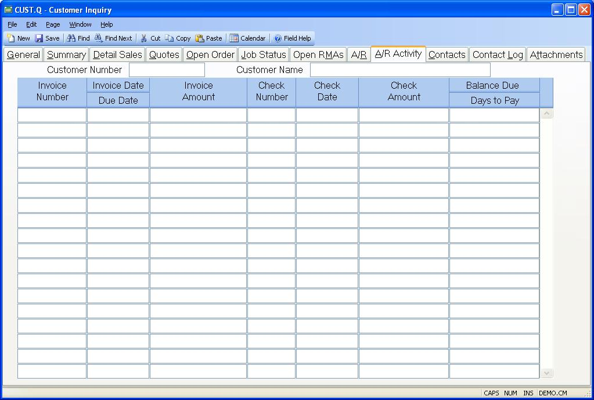

##  Customer Inquiry (CUST.Q)

<PageHeader />

##  A/R Activity

**Customer Number** The customer number.  
  
**Customer Name** The customer name.  
  
**Invoice** The invoice number of the associated item.  
  
**Invoice Date** The date of the associated invoice.  
  
**Invoice Amount** The amount of the original invoice.  
  
**Check#** The numbers of each check posted against the invoice.  
  
**Check Date** The date on which the check was posted.  
  
**Check Amount** The amount posted from the associated check.  
  
**Balance Due** The remaining balance of the invoice after subtracting posted
checks.  
  
  
<badge text= "Version 8.10.57" vertical="middle" />

<PageFooter />