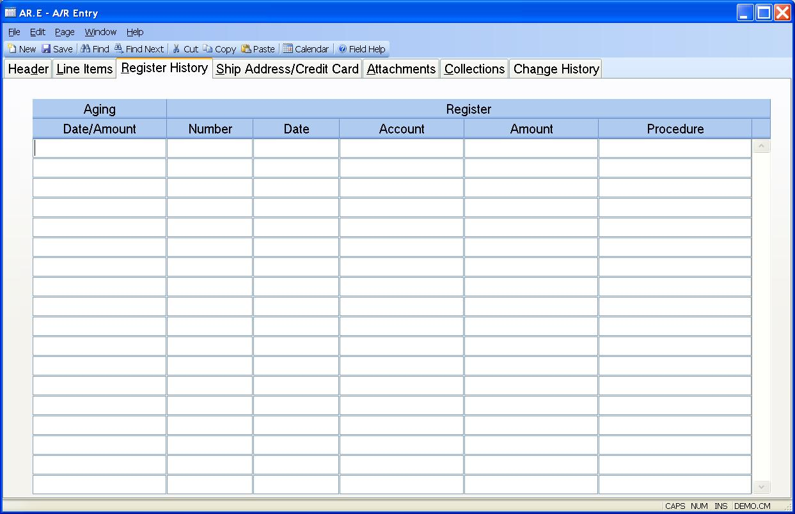

##  A/R Entry (AR.E)

<PageHeader />

##  Register History

**Date/Amount** Contains the date and amount of each change made to the AR
record.  
  
**Register Number** The register numbers recorded for every posting to the AR
record.  
  
**Register Date** The date on which each register is applied to the general
ledger when interfaced.  
  
**Register Account** The account number associated with each register.  
  
**Register Amount** The amount associated with each register.  
  
**Register Procedure** The name of the procedure that created the register
record.  
  
  
<badge text= "Version 8.10.57" vertical="middle" />

<PageFooter />