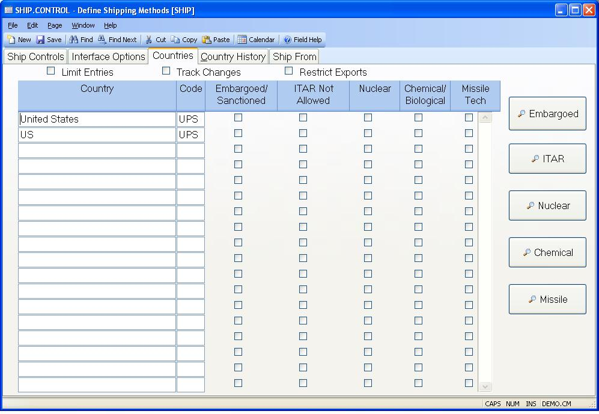

##  Define Shipping Methods (SHIP.CONTROL)

<PageHeader />

##  Countries

**Country** Enter the name of the country you will be making shipments to.  
  
**Country Code** Enter the international two digit country code. This code
will be picked up by the shipping procedures used to import/export data
to/from the software used by the freight carrier. For example, UPS requires
that a two digit country code (not the country name itself) be passed to their
software. When the import procedure is run for UPS, it will extract this code
based on the name input into the country field in the ship record.  
  
**Embargoed** Check this box if shipments to this country are not allowed.  
  
**No ITAR** Check this box if shipments are not allowed to this country for
ITAR designated parts.  
  
**Nuclear** Check this box if shipments to this country are a concern for
nuclear products.  
  
**Chemical** Check this box if shipments to this country are a concern for
chemical or biological products.  
  
**Missile** Check this box if shipments to this country are a concern for
missile technology products.  
  
**Limit Entries** Check this box if you wish to limit the entry of countries
in the sales order, customer, soquote and shipping procedures to those found
in this record. If you will be importing/exporting data with the freight
carrier, this box should be checked as the country code and not the name of
the country is used by the freight carrier.  
  
**Change Tracking** Check here if you want to track changes to all of the
country fields on this tab. The change history will be displayed on the
country change history tab.  
  
**Export Restrictions** Check this box to enable export restrictions. This will enable certain edits in [ CUST.E ](../../../../../../../../../../rover/AP-OVERVIEW/AP-ENTRY/ACCT-CONTROL/ACCT-CONTROL-1/ar-e/CUST-E) , [ SO.E ](../../../../../../../../../../rover/AP-OVERVIEW/AP-ENTRY/AP-E/AP-E-1/CURRENCY-CONTROL/SO-E) and shipping regarding the customer export flag and the ship to country and end user country. The limit entries box must also be checked.   
  
**List Embargoed** Press this button to display a list of embargoed/sanctioned
countries.  
  
**ITAR** Press this button to display a list of ITAR not allowed countries.  
  
**Nuclear** Press this button to display a list of countries of nuclear
concern.  
  
**Chemical** Press this button to display a list of countries of
chemical/biological concern.  
  
**Missile** Press this button to display a list of countries with missile
technology concern.  
  
  
<badge text= "Version 8.10.57" vertical="middle" />

<PageFooter />