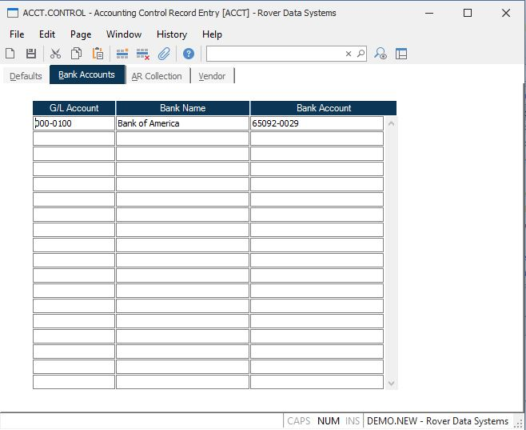

##  Accounting Control Record Entry (ACCT.CONTROL)

<PageHeader />

##  Bank Accounts

**G/L Account Number** Enter the g/l account number that is used for banking transactions. The banking name and account number will appear on the deposit slip that is generated via [ CASH.F1 ](../../../../AR-OVERVIEW/AR-REPORT/CASH-F1/README.md) and can be submitted to the bank along with the checks.   
  
**Bank Name** Enter the name of the bank for the associated g/l account.  
  
**Bank Account** Enter the bank account number for the associated g/l account.  
  
  
<badge text= "Version 8.10.57" vertical="middle" />

<PageFooter />