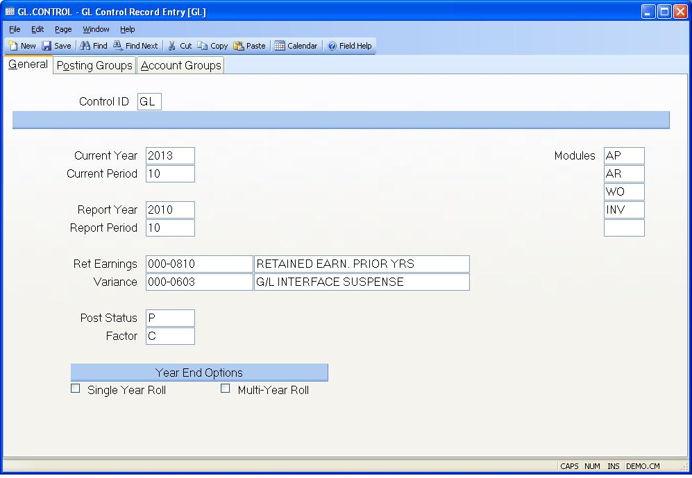

##  GL Control Record Entry (GL.CONTROL)

<PageHeader />

##  General

**Control.ID** "GL" will be automatically entered as the key to this record in
the CONTROL file. This record contains the fiscal and reporting dates, as well
as default account numbers.  
  
**Current year** This is a four (4) digit year identifying the current posting year. After the initial loading of the General Ledger system, when transactions have been posted, this field is under system control and will be updated automatically if you are running [ FY.P1 ](FY-P1/README.md) .   
  
**Current per** The one or two digit period number identifying the period within current year to which G/L journal entries (transactions) are being posted. After the initial loading of the General Ledger module, when transactions have been posted, this field is under system control and will be updated automatically if running [ FY.P1 ](FY-P1/README.md) .   
  
**Report.year** Enter the fiscal year against which the financial report will
be run. This field can be set to report on periods other than the current
period. When a financial report is run using the GLRPT report structures, this
field will control the period being reported.  
  
**Report per** The period for which the financial reports will be processed.
This can be different than the current period.  
  
**Ret Earnings** The account number of the prior year Retained Earnings. This
will be used by the year end procedure to summarize all Income Statement
accounts.  
  
**Variance** The account number of the Variance account. This will be used by
the posting program in the event an error occurs which causes an imbalance in
a transaction.  
  
**Post status** This defines the status of on-line posting of transactions. A "P" in this field will cause all transactions to be posted when filed. An "H" in this field will file the transaction, but will require that the [ GLTRANS.P1 ](GLTRANS-P1/README.md) procedure be run to post all records in batch mode.   
  
Please note that the interface procedure, [ GLINT.P1 ](GLINT-P1/README.md) , that is used to create journal entries from the register files does not post those journal entries based on this field. Those journal entries can be posted via [ GLTRANS.P1 ](GLTRANS-P1/README.md) . However, if this field is set to "P" and the journal entry is opened and saved in [ GLTRANS.E ](GLTRANS-E/README.md) , the journal entry will post at that time.   
  
**Factor** Enter a factor code which will determine how amounts will be
displayed on the user-defined financial reports.  
  
**Modules** Enter the identification of any modules which will be automatically interfaced to the General Ledger. When the [ GLINT.P1 ](GLINT-P1/README.md) procedure is run, these names will be loaded as defaults.   
  
**Account Description** This field contains the name of the account found in
the GLCHART file.  
  
**Account Description** This field contains the description of the variance
account, as found in the GLCHART file.  
  
**Single Year Roll** When a fiscal year is closed, the totals are rolled
forward. Until the fiscal year is finalized, journal entries may be posted to
the year. This option should be selected if you only wish to roll the totals
forward to the year immediately following the fiscal year for which the
journal entry was created. If you wish to roll the totals forward to all
future years, select the MULTI-YEAR ROLL option. Please read the procedure
help for more information.  
  
**Multi-Year Roll** When a fiscal year is closed, the totals are rolled
forward. Until the fiscal year is finalized, journal entries may be posted to
the year. This option should be selected if you wish to roll the totals
forward to all future years. Select the SINGLE YEAR ROLL option if you only
wish the totals to roll forward to the year immediately following the fiscal
year for which the journal entry was created. Please read the procedure help
for more information.  
  
  
<badge text= "Version 8.10.57" vertical="middle" />

<PageFooter />