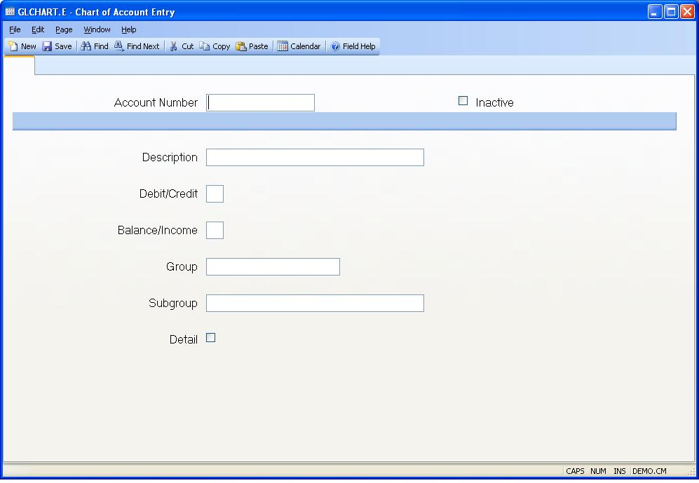

##  Chart of Account Entry (GLCHART.E)

<PageHeader />

##

**Acct#** Enter the General Ledger account number. This number can be any
combination of numeric  
and/or special characters such as period (.) or dash (-). The asterisk (*)
cannot be used as  
part of the account number due to it's use as connectors in file keys such as
the GLBAL file.  
  
**Inactive** Check this field if the account number is no longer considered active. This will prevent the account number from being used on any new transaction. Transactions that already reference the account number are not affected. There is a report called [ GLCHART.R2 ](GLCHART-R2/README.md) that will tell you which 'inactive' accounts are used on the control, stax, invloc, etc. records. It is recommended that you run this report in order to prevent an inactive account from being loaded into a new sales order, purchase order, etc.   
  
**Acct.name** Enter the descriptive name of this account number. This can be
entered as any combination of alpha and/or numeric characters, but it is
important to remember that the description entered here also appears on the
financial reports. If you wish to have them printed in upper and lower case on
those reports, they should be entered that way in this procedure.  
  
**Type** Enter "D" if this is normally a debit account, else enter "C" for a
credit account.  
  
**Bal/Inc** Enter a "B" if this is a Balance Sheet account (carry balances
into next year), or "I" if an Income Statement account (roll balances into
Retained Earnings).  
  
**Group** Enter the group to which this account number is assigned, (e.g. ASSETS, LIABILITIES, etc.) This group ID is initially identified in the [ GL.CONTROL ](GL-CONTROL/README.md) screen and can be assigned to account numbers via the [ GLCHART.P2 ](GLCHART-P2/README.md) procedure.   
  
**Subgroup** Enter the sub group to which this account number is assigned, (e.g. CASH, AR, etc.) This sub group ID is initially identified in the [ GL.CONTROL ](GL-CONTROL/README.md) screen and can be assigned to account numbers via the [ GLCHART.P2 ](GLCHART-P2/README.md) procedure.   
  
**Detail** This field is used to control the level of detail you list on the
Detailed G/L Report. If you select the "Detail" option on the report and this
field is set to "Y", the report will list all of the register detail that
accumulated to the journal entry line total.  
  
  
<badge text= "Version 8.10.57" vertical="middle" />

<PageFooter />