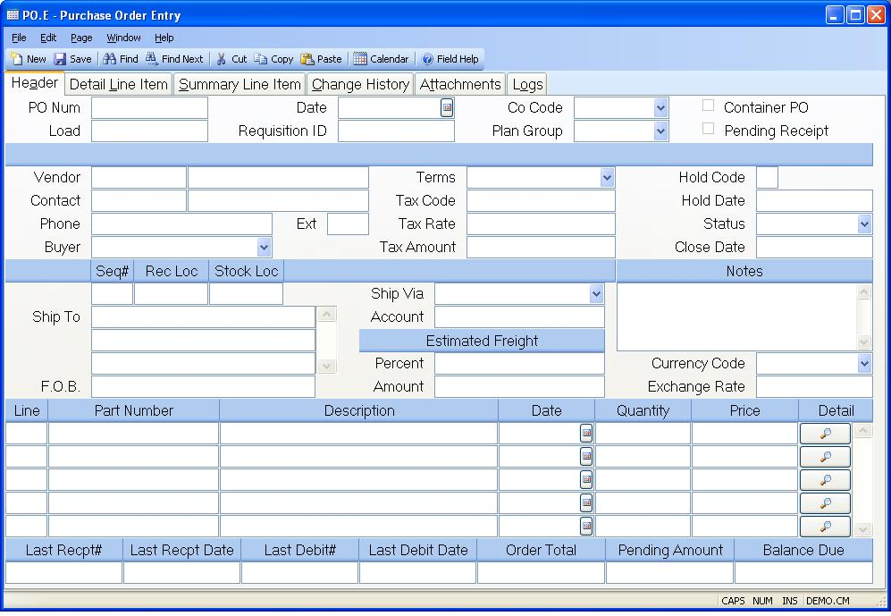

##  Purchase Order Entry (PO.E)

<PageHeader />

##  Header

**PO Number** Enter the number of the purchase order you wish to update or add
to the purchase order file. You may elect to have the system assign new
purchase order numbers automatically by leaving the PO number blank.  
  
**Load** If you wish to create a new purchase order from an existing order,
enter the existing p.o. number here. This function can only be used with new
records.  
  
**PO Date** Enter the date on which this purchase order was initiated.  
  
**Requisition ID** If you want to load the purchase order from a requisition,
then enter the number of the requisition to be loaded in this field. Only line
items that have not been previously applied to a purchase order will be
loaded. You may also skip this prompt and load individual line items at the
line items tab.  
  
**Co Code** Enter the company code this purchase order should be issued to.
The company code must be predefined in the CO.CONTROL procedure. If only one
company code exists it will automatically be inserted into this procedure for
you.  
  
**Plan Group** Enter the planning group for which this purchase order is being entered. This field will be verified against the planning group(s) entered in [ PLAN.CONTROL ](PLAN-CONTROL/README.md) . If you have only one planning group this field will be defaulted and skipped. This field will be used to default the inventory location in the line items.   
  
**Container Created PO** If this PO was created by the container receipts procedure ( [ CONTAINER.E ](CONTAINER-E/README.md) ), this box will be checked.   
  
**Pending Receipt** If there is a receipt pending (not approved) against the
purchase order then a check will apeear in this box.  
  
**Vendor Number** Enter the number of the vendor supplying the items on this
purchase order. If you do not know the vendor number there is an option
available through the help menu for this prompt which allows you to do a
lookup by vendor name.  
  
**Vendor Name** This field contains the name of the vendor associated to the
vendor number entered. The name is retrieved from the VENDOR file and may not
be changed.  
  
**Contact Id** Enter the contact ID you wish to use to load the name.  
  
**Vendor Contact** Enter the name of person at the vendor who is to be
contacted regarding this purchase order.  
  
**Vendor Phone#** Contains the telephone number of the vendor specified from
the vendor file and may not be changed.  
  
**Vendor Telephone Ext.** Contains the telephone number of the vendor
specified from the vendor file and may not be changed.  
  
**Buyer** Enter the name of the buyer who placed this purchase order This will
be defaulted from the vendor if the vendor has a buyer associated with it.
There is a help lookup to display buyers.  
  
**Terms** Select the terms of payment to be used with this purchase order.  
  
**Tax Code** Enter the sales tax code to be used for this order. This code is
originally defaulted from the vendor file. It may be changed manually, as
required.  
  
**Tax Rate** This is the tax rate associated with the sales tax code. It will
be defaulted from the PTAX file based on the tax code entered, but may be
changed manually if needed.  
  
**Tax Amt** This is the total sales tax liability for this purchase order.
This is calculated based on the tax rate and the taxable flag on the line
items.  
  
**Hold Code** Enter a user defined hold code in this field if this purchase
order is to be placed on hold. For example you might use the code "E" when the
order has been placed on hold because of engineering. If a hold code is set
then receipts will not be permitted against the purchase order.  
  
**Hold Date** Enter the date on which this purchase order was placed on hold.  
  
**Status** The status code is normally controlled by the system and is set to
either...  
New - no receipts  
Backordered - at least one receipt  
Closed - no open balance  
The status may be manually set to Closed before all items have received to
close the order.  
  
**Date Closed** Enter the date on which this purchase order was closed. This
date will be set by the system when all quantities have been received. The
only time you should need to set this date is when you manually close the
purchase order.  
  
**Ship To Seq** Enter the shipping seq# as defined on [ PO.CONTROL ](PO-CONTROL/README.md) which will determine the ship to address and default receipt and stock locations. This will be defaulted from [ PO.CONTROL ](PO-CONTROL/README.md) using the seq# specified as default.   
  
**Default Rec Loc** Enter the receipt location to be defaulted to each line item on the purchase order. This will be defaulted from [ PO.CONTROL ](PO-CONTROL/README.md) for the associated ship-to seq#. If not entered, the part's receipt location will be used or the general receipt location default in [ PO.CONTROL ](PO-CONTROL/README.md) .   
  
**Default Stock Loc** Enter the stock location to be defaulted to each line item on the purchase order. This will be defaulted from [ PO.CONTROL ](PO-CONTROL/README.md) for the associated ship-to seq#. If not entered, the part's stock location will be used or the general stock location default in [ PO.CONTROL ](PO-CONTROL/README.md) .   
  
**Ship To** Enter the name and address where the items on the purchase order are to be shipped. The shipping address specified on [ PO.CONTROL ](PO-CONTROL/README.md) is defaulted.   
  
**F.O.B.** Enter the "Free-On-Board" location associated with this purchase
order.  
  
**Ship Via** Enter the method of shipment to be used for this purchase order.
This is usually the name of some preferred carrier or method of shipment.  
  
**Frt Account** Enter the account number for the appropriate freight carrier that should be charged when the freight charges will paid directly to the frt. carrier and not to the vendor. You can pre-define these account numbers in the [ po.control ](po-control/README.md) record by company code. There is "default" check box for each account number in [ po.control ](po-control/README.md) . If it is checked, po.e will attempt to load in the appropriate account number for you. However, it can be changed as required. These account numbers will print on the purchase order form, [ po.f3 ](po-f3/README.md) .   
  
**Est Freight Pct** Enter the estimated freight percent which will be applied to the total PO value to calculate the total estimated freight amount. Upon receipt, the estimated freight will be prorated to all inventory line items on the PO according to the parameters specified in [ PO.CONTROL ](PO-CONTROL/README.md) . For average and lot costing methods, it will be added to the unit price on a per item basis to calculate the new average inventory cost and/or the lot cost. For standard costing the estimated freight will be compared to the std unit freight on the cost record and a variance will be calculated and posted to the freight variance account on [ AP.CONTROL ](../../../../../../../../rover/AP-OVERVIEW/AP-ENTRY/AP-E/CHECKS-E/AP-CONTROL) . For both costing methods the estimated freight amount will be posted to the estimated freight account on [ AP.CONTROL ](../../../../../../../../rover/AP-OVERVIEW/AP-ENTRY/AP-E/CHECKS-E/AP-CONTROL) .   
  
**Estimated Freight** Enter the total estimated freight amount. Upon receipt, the estimated freight will be prorated to all inventory line items on the PO according to the parameters specified in [ PO.CONTROL ](PO-CONTROL/README.md) . For average and lot costing methods, it will be added to the unit price on a per item basis to calculate the new average inventory cost and/or the lot cost. For standard costing the estimated freight will be compared to the std unit freight on the cost record and a variance will be calculated and posted to the freight variance account on [ AP.CONTROL ](../../../../../../../../rover/AP-OVERVIEW/AP-ENTRY/AP-E/CHECKS-E/AP-CONTROL) . For both costing methods the estimated freight amount will be posted to the estimated freight account on [ AP.CONTROL ](../../../../../../../../rover/AP-OVERVIEW/AP-ENTRY/AP-E/CHECKS-E/AP-CONTROL) .   
  
**Notes** Enter any notes associated with this purchase order. If there is
predefined purchase order notes available, the user may load them by selecting
the appropriate option from the help  
menu for this prompt.  
  
**Currency Code** If the order is to be placed in a foreign currency, enter the currency code here. That will load the exchange rate defined in [ CURRENCY.CONTROL ](../../../../../../../../rover/AP-OVERVIEW/AP-ENTRY/AP-E/AP-E-1/CURRENCY-CONTROL) .   
  
**Exchange Rate** This is the exchange rate associated with the currency code as defined in [ CURRENCY.CONTROL ](../../../../../../../../rover/AP-OVERVIEW/AP-ENTRY/AP-E/AP-E-1/CURRENCY-CONTROL) . It can be changed as needed.   
  
**Header Line** Enter the line item number for the associated item. If you are
using sequential line numbers you may enter the letter "N" in this field to
cause the next sequential line number to be calculated and entered. If you
enter the letter "N" on an existing line a new line number will be added to
the end of the list.  
  
**Parts Number** Enter the part number to be purchased or leave blank and
describe in the description field if purchasing non-inventory iterms.  
  
**Description** If you entered a part number in the previous field then the
description from that part will be loaded into this field. Otherwise, enter a
description of the item being purchased.  
  
**Schedule Date** Enter the date on which the associated item is to be
received. Note: If the line item already exists and more than one schedule
date has been defined for the line on the detail page then the word "Multiple"
will appear in this field and you will not be allowed to change the date using
this field. You will need to use the detail page instead.  
  
**Quantity** Enter the quantity of the item being ordered. This field always
displays the total quantity ordered for the line item. If multiple schedule
dates and quantities were entered on the detail page then you will not be
allowed to change the quantity in this field. You will need to make your
changes on the detail page.  
  
**Price** Enter the price to be paid for the associated item.  
  
**** Click this button to jump to the detail page of the associated item.  
  
**Last Receipt#** Contains the number of the last receipt made against this
purchase order. It may not be changed manually.  
  
**Last Receipt Date** Contains the date on which the last receipt against this
purchase order was made. It may not be manually changed.  
  
**Last Debit#** Contains the number of the last debit memo made against this
purchase order. It may not be changed manually.  
  
**Last Debit Date** Contains the date on which the last debit memo was made
against this purchase order. It may not be changed manually.  
  
**Total Value** Contains the total value of this purchase order.  
  
**Pending** Displays the dollar value of any receipts that have been entered
but not released.  
  
**Balance Due** Contains the balance of the total value remaining to be
received.  
  
  
<badge text= "Version 8.10.57" vertical="middle" />

<PageFooter />