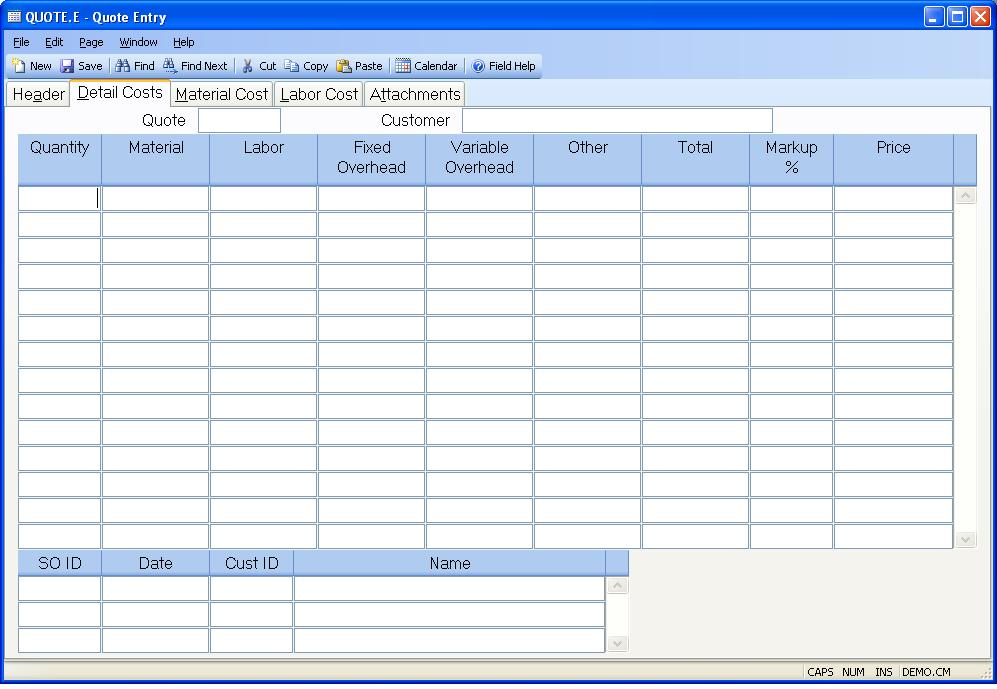

##  Quote Entry (QUOTE.E)

<PageHeader />

##  Detail Costs

**Quote** The quote number is displayed for reference.  
  
**Customer** The customer name is displayed for reference.  
  
**Qty** The quantity breaks to use for this quote. This field is originally defaulted from the [ QUOTE.CONTROL ](../../../../../../../../../../../../rover/AP-OVERVIEW/AP-ENTRY/AP-E/AP-E-1/CURRENCY-CONTROL/SO-E/MRK-CONTROL/MRK-CONTROL-1/SOQUOTE-E/SOQUOTE-E-1/QUOTE-CONTROL) record and may be changed as needed.   
  
**Material Cost** The total unit material cost as calculated from the bill of
material defined.  
  
**Labor Cost** The total unit labor cost as calculated from the routing
identified.  
  
**Fixed Overhead** The unit fixed overhead calculated.  
  
**Variable Overhead** The unit variable overhead calculated.  
  
**Other** The total of all other unit costs identified on screen 1.  
  
**Total Cost** The total of all costs for this quantity.  
  
**Markup Pct** The markup percentages for each quantity break. This field is originally defaulted from the [ QUOTE.CONTROL ](../../../../../../../../../../../../rover/AP-OVERVIEW/AP-ENTRY/AP-E/AP-E-1/CURRENCY-CONTROL/SO-E/MRK-CONTROL/MRK-CONTROL-1/SOQUOTE-E/SOQUOTE-E-1/QUOTE-CONTROL) record and may be changed as needed.   
  
**Price** This field represents the total unit price as calculated from all
available information. This field may be manually altered as needed.  
  
**SO.Ids** This field contains a list of all sales orders on which this quote
has been used.  
  
**SO.Dates** The sales order dates on which this quote was used.  
  
**Cust** The customer number for which the sales order was processed.  
  
**Cust Name** The customer name for which the sales order was processed.  
  
  
<badge text= "Version 8.10.57" vertical="middle" />

<PageFooter />