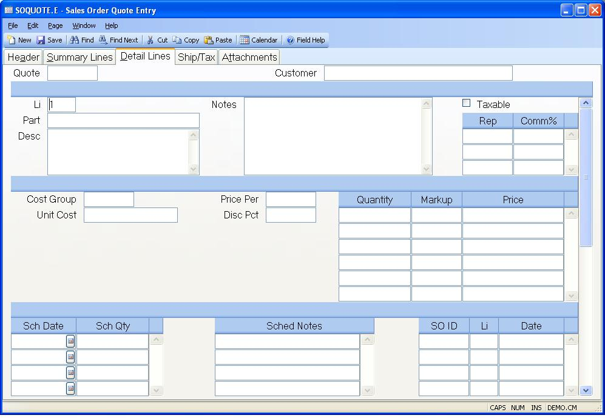

##  Sales Order Quote Entry (SOQUOTE.E)

<PageHeader />

##  Detail Lines

**Li** This is the line item number of the quote for the part being quoted.
Enter "N" to assign the next sequential number.  
  
**Part** The part number being quoted on this line. If the part number exists
in the Parts file, the description will be loaded automatically.  
  
**Wrap Desc** The description of the part being quoted.  
  
**Line Notes** Enter any miscellaneous notes associated with this line item.  
  
**Taxable** If this line item is to be taxable, check this box.  
  
**Li.Rep** This field contains the sales rep which is going to get commission
for this line item. The field is originally defaulted from the header list of
reps and may be changed as required.  
  
**Li.Comm** Enter the commission percent which is to be applied to this line
item for the associated rep. This field originally defaults to the commission
percent found in the Rep file and may be changed as required.  
  
**Cost Group** Enter the cost group which will be validated against [ INV.CONTROL ](../../../../../../../../../../../rover/AP-OVERVIEW/AP-ENTRY/AP-E/AP-E-2/INV-CONTROL) . The cost group is used to define the costing method for this SOQUOTE item.   
  
**Cost** The cost calculated for the associated cost type.  
  
**Price Per** Enter the price per factor to be used in conjunction with the unit price. For example, if the material being ordered is priced "per hundred", then 100 should be entered into this field. If this line item has a part number, the price per will default based on the part's unit of measure. The price per is entered for the unit of measure in the [ UM.CONTROL ](../../../../../../../../../../../rover/AP-OVERVIEW/AP-ENTRY/AP-E/AP-E-1/MSHIP-E/MSHIP-E-2/Parts-E/PARTS-E-1/UM-CONTROL) procedure.   
  
**Disc.Pct** Enter the percentage discount to be applied to this line item.  
  
**Qty** The quantity of the part being quoted. Multiple quantities and prices
may be entered to reflect price breaks.  
  
**Markup** Enter the markup percentage to be used to calculate the price based
upon the cost. Leave this field empty to assign a manual price.  
  
**Price** The price for the associated quantity.  
  
**Sched Date** Enter the schedule date(s) on which the associated quantities
are to be delivered. This field is optional.  
  
**Sched.Qty** Enter the quantity to be delivered on the associated schedule
date.  
  
**Sched Notes** Enter any schedule notes required. This field is most commonly
used when a specific delivery date is not known, but a note about lead time is
required. For example, if the delivery time for the part is 2 to 3 weeks, the
phrase "2 to 3 week delivery" could be entered.  
  
**SO.Ids** This field contains a list of the sales order numbers to which this
line of the quote has been loaded.  
  
**SO.Lis** This field contains a list of the line items of the associated
sales order numbers.  
  
**SO.Dates** This field contains a list of the sales order dates for the
associated sales orders.  
  
**Quote#** This field contains the quote number and is used for display
purposes only.  
  
**Customer Name** This field contains the customer name and is used for
display purposes only.  
  
  
<badge text= "Version 8.10.57" vertical="middle" />

<PageFooter />