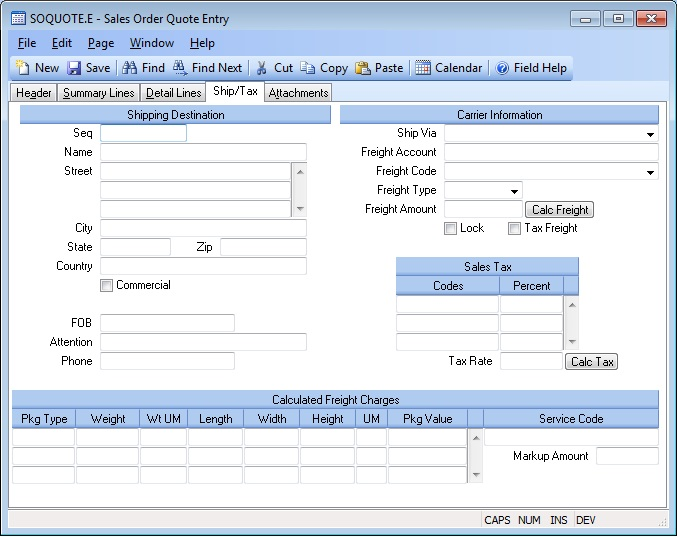

##  Sales Order Quote Entry (SOQUOTE.E)

<PageHeader />

##  Ship/Tax

**Seq** This field contains the ship address sequence number. It is originally defaulted from the customer file. If the customer has multiple ship addresses, use the help key to load the correct ship address. Associated sales tax codes will be loaded with the ship address, if they have loaded in the customer entry procedure ( [ CUST.E ](../../../../../../../../../../../rover/AP-OVERVIEW/AP-ENTRY/ACCT-CONTROL/ACCT-CONTROL-1/ar-e/CUST-E) ).   
  
**Ship Name** Enter the name of the company to which the order will be
shipped.  
  
**Ship Address** Enter the ship to address for this order.  
  
**Ship City** Enter the city to which the order will be shipped.  
  
**Ship State** Enter the state to which the order will be shipped.  
  
**Ship Zip** Enter the zip code to which the order will be shipped.  
  
**Ship Country** Enter the country to which the order will be shipped. Please note that you may be required to entrer the country name as it has been entered in the [ SHIP.CONTROL ](../../../../../../../../../ACCT-CONTROL/ACCT-CONTROL-1/ar-e/CUST-E/CUST-E-8/ship-control) procedure. For example, instead of entering U.S.A. you may need to enter United States. If this requirement has been applied to your account, an error message will be displayed if the entry made into this field does not match the entry found in [ ship.control ](../../../../../../../../../../../rover/AP-OVERVIEW/AP-ENTRY/ACCT-CONTROL/ACCT-CONTROL-1/ar-e/CUST-E/CUST-E-8/ship-control) .   
  
**Commercial?** Check this box if the shipment is being sent to a commercial
address. If not checked, it is considered a residential shipment.  
  
**FOB** Enter the FOB point assigined to this quote.  
  
**Ship Attn** Enter the name of the person or contact to which this order is
being shipped.  
  
**Ship Phone** Enter the phone number for this ship address.  
  
**Ship Via** Enter the method of shipment to be used. If [ SHIP.CONTROL ](../../../../../../../../../ACCT-CONTROL/ACCT-CONTROL-1/ar-e/CUST-E/CUST-E-8/ship-control) has been used to define valid shipment methods, this entry will be validated.   
  
**Freight Acct** If the order will be billed collect or to a third party,
enter the freight account the freight should be billed to.  
  
**Freight Code** Select one of the following options:  
  
Prepaid - Freight charges on shipments against the sales order are to be
prepaid  
Collect - Frieght charges are to collected from the customer by the freight
carrier  
Freight Free - No freight will be charged to the customer.  
Third Party - Freight charges are to be paid by a third  
  
**Freight Type** This field controls the way in which the data in the freight amount field is interpreted. On new orders the contents of this field are defaulted based on the settings in the [ SHIP.CONTROL ](../../../../../../../../../ACCT-CONTROL/ACCT-CONTROL-1/ar-e/CUST-E/CUST-E-8/ship-control) procedure. The possible entries are:   
  
Estimated - The freight amount entered on the order is only an estimate, the amount incurred will be used on the invoice. The amount will be calculated based on the parameters in the [ SHIP.CONTROL ](../../../../../../../../../ACCT-CONTROL/ACCT-CONTROL-1/ar-e/CUST-E/CUST-E-8/ship-control) procedure.   
  
Actual - The freight amount entered on the order is the amount that will appear on the invoice, not the amount actually incurred. The amount will be calculated based on the parameters in the [ SHIP.CONTROL ](../../../../../../../../../ACCT-CONTROL/ACCT-CONTROL-1/ar-e/CUST-E/CUST-E-8/ship-control) procedure.   
  
TBD - The amount is ignored and the actual freight charges incurred will be
used.  
  
**Freight Amount** Depending on the setting in the Freight Type field the
amount entered in this field will represent either an estimate of freight
charges or the amount that will actually be charged on the invoice. The amount
may be calculated automatically based on the parameters in the FREIGHT.CONTROL
procedure but may be set manually as well.  
  
**Freight Lock** Check this box if the amount entered in the freight amount field is being set manually and is not to be calculated based on the parameters in the [ SHIP.CONTROL ](../../../../../../../../../ACCT-CONTROL/ACCT-CONTROL-1/ar-e/CUST-E/CUST-E-8/ship-control) procedure.   
  
**Tax Freight** Check this box if freight charges are to be taxed.  
  
**Calc Freight** Press this button to recalculate the freight. This only applies if the parameters are set in [ SHIP.CONTROL ](../../../../../../../../../ACCT-CONTROL/ACCT-CONTROL-1/ar-e/CUST-E/CUST-E-8/ship-control) for the freight carrier associated to the Ship Via to access the carrier's rating system.   
  
**Tax Rate** This field contains the total sales tax rate, as calculated from
the sales tax codes.  
  
**Tax Code** Enter the sales tax code which will be used to calculate the
sales tax rate for this quote.  
  
**Tax Pct** This field contains the sales tax rate, as read from the STAX
record for the associated tax code.  
  
**Calc Tax** Click this button to recalculate the tax rate.  
  
**Pkg Type Code**  
  
**Pkg Weight**  
  
**Pkg Weight Uom**  
  
**Pkg Length**  
  
**Pkg Width**  
  
**Pkg Height**  
  
**Pkg Dim Uom**  
  
**Pkg Value**  
  
**Frt Markup Amt** This is the markup amount based on the parameters specified in [ SHIP.CONTROL ](../../../../../../../../../ACCT-CONTROL/ACCT-CONTROL-1/ar-e/CUST-E/CUST-E-8/ship-control) for the carrier. It is included in the freight amount.   
  
**Frt Serv Code** This is the service code for the ship via for the carrier
that was used to determine the calculated freight.  
  
  
<badge text= "Version 8.10.57" vertical="middle" />

<PageFooter />