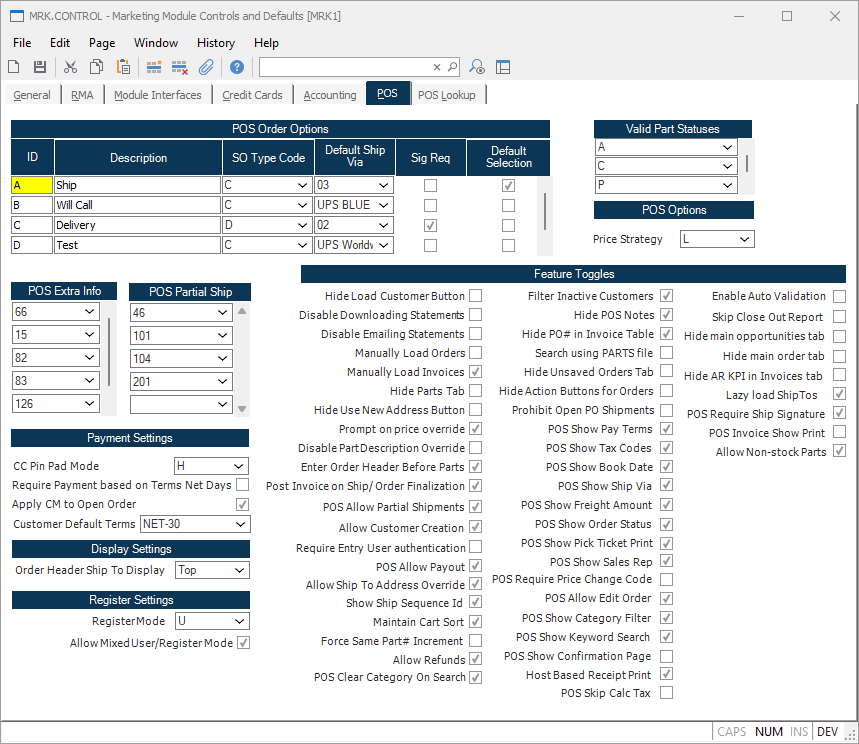

## Marketing Module Controls and Defaults (MRK.CONTROL)

<PageHeader />

## POS

## Overview

These controls are used to configure the Rover Web POS module.

### POS Order Options

This control is a used a way to combine multiple `SO` fields into one option in POS.

**ID** This is the ID of the option.

**Description** This is the description of the option.

**SO Type Code** This defaults the `TYPE` field in `SO`.

**Default Ship Via** This defaults the `SHIP.VIA` field in `SO`.

**Sig Req** Checking this box requires a signature when creating an order.

**Default Selection** This is the default selection for the option.

### Payment Settings

**CC Pin Pad Mode** Select the mode of the pin pad...

**Require Payment based on Terms Net Days** Check this box...

**Apply CM to Open Order** Check this box...

### POS Extra Info

This table allows you to specify fields defined in `SO FDICT` to be displayed in the POS Order Information section. This is useful for adding custom fields to the POS Order Information section.

### POS Partial Ship

This table allows you to specify fields defined in `SO FDICT` to be displayed in the POS Partial Ship section. This is useful to add additional fields in the table as well as hide Ship Quantity, Vendor, or PO Number.  

> Default behavior when no fields are selected is to show Ship Quantity (46), Vendor (101), and PO Number (103). If you want to show any of the default fields, you must specify 46, 101 and/or 103 in the table.

[Integrations](../../../../../../../../business-suite/integrations/pos/README.md#pos-partial-ship-fields)

### Feature Toggles

**Hide Load Customer Button** Checking this box will hide the load customer button in the main customer search screen.

**Disable Downloading Statements** Checking this box will hide the download statement button in the invoices tab.

**Disable Emailing Statements** Checking this box will hide the email statement button in the invoices tab.

**Manually Load Orders** Checking this box will prevent orders from being automatically loaded when navigating the orders tab.

**Manually Load Invoices** Checking this box will prevent invoices from being automatically loaded when navigating the invoices tab.

### POS Show New Customer Button

Checking this box will display a button to show a dialog to create a new customer in the main customer search screen.

### POS Require Ship Signature

Checking this box will require a signature when finalizing an order.

### Allow Non-stock Parts

Checking this box will allow non-stock items to be added via the cart view in Point of Sale.

<badge text= "Version 1.7.19.0" vertical="middle" />

<PageFooter />
