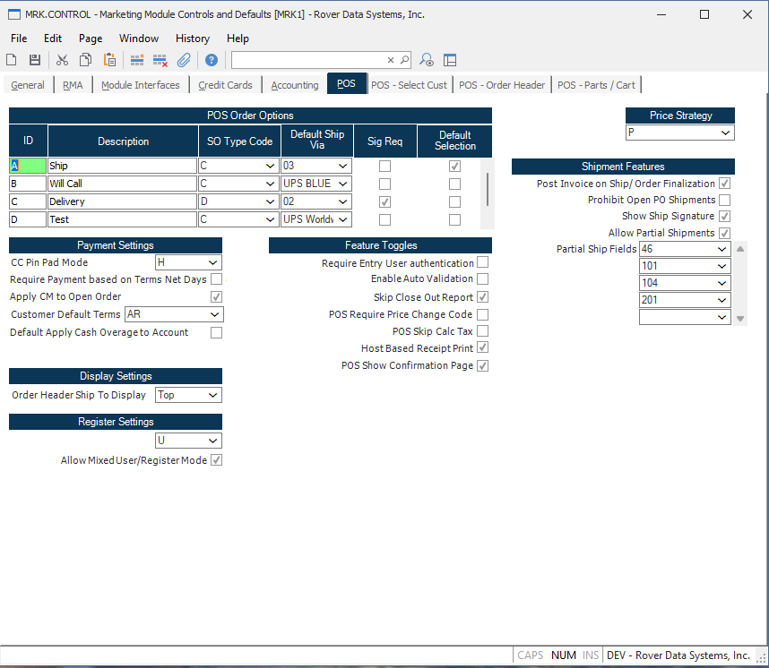

##  Marketing Module Controls and Defaults (MRK.CONTROL)

<PageHeader />

##  POS

## Overview

These controls are used to configure the Rover Web POS module.

### POS Order Options
 This control is a used a way to combine multiple `SO` fields into one option in POS.

**ID** This is the ID of the option.

**Description** This is the description of the option.

**SO Type Code** This defaults the `TYPE` field in `SO`.

**Default Ship Via** This defaults the `SHIP.VIA` field in `SO`.

**Sig Req** Checking this box requires a signature when creating an order.

**Default Selection** This is the default selection for the option.

### Payment Settings

**CC Pin Pad Mode** Select the mode of the pin pad...

**Require Payment based on Terms Net Days** Check this box...

**Apply CM to Open Order** Check this box...

### POS Extra Info

This table allows you to specify fields defined in  `SO FDICT` to be displayed in the POS Order Information section. This is useful for adding custom fields to the POS Order Information section. 

### Feature Toggles

**Hide Load Customer Button** Checking this box will hide the load customer button in the main customer search screen.

**Disable Downloading Statements** Checking this box will hide the download statement button in the invoices tab.

**Disable Emailing Statements** Checking this box will hide the email statement button in the invoices tab.

**Manually Load Orders** Checking this box will prevent orders from being automatically loaded when navigating the orders tab.

**Manually Load Invoices** Checking this box will prevent invoices from being automatically loaded when navigating the invoices tab.
  
  
<badge text= "Version 1.7.19.0" vertical="middle" />

<PageFooter />